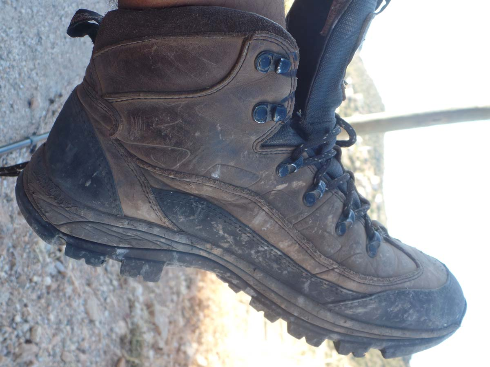

2014’de Hepsiburada’dan 75Tl’ye aldığım bu botları halen daha kullanıyorum. 75 tl kısmı biraz olaylı tabi. Bu fiyata nasıl aldığımın ayrı bir hikayesi var, özetle bir kampanyaya denk gelmiştim ve geldiğim anda da kaçırmayıp aldım. Hatta bugün keşke 2 tane alsaymışım deyip duruyorum.

İlk trekking botum yani ilk gözağrım. Şimdilerde giymeye devam ediyorum ancak çok bitkin bir durumda. Bu botlarla şimdiye kadar 400 km civarı yürümüşümdür. Biraz bitik bir durumda ama sorumlusu benim. Yoksa bir bot bu kmlerde kendini bırakmaması gerekir. Cahillik diyelim, bir kaç defa botum kirlendiğinde elde yıkama modunda çamaşır makinasına attım. Elde yıkamada ne olabilirki diye düşünüyordum ki bugün botun su geçirmezlik özelliği kalmadı. Bunun nedeni tabanının biraz açılmış ve oradan su geçiriyor olması. Yapıştırdık ama yine de zaman zaman su geçiriyor. Ayakkanının tabanıda çokca eridi. İlk zamanlarla arasında epey fark var yine de bir 300 km götürür gibi. Botlarımı yine aynı rahatlık ve aynı konforu hissederek giyiyorum. Tek eksik kaldığı nokta yağmurlar ve dere geçişleri. Eskiden hiç bir şey olmazdı lambur gümbür geçer giderdim. Şimdilerde ise sulardan kaçar oldum.

Çok sevdiğim ve çok memnun kaldığım bir bot ve almak isteyene kesinlikle tavsiye ederim. Bunları giydiğimde sanki ayaklarıma hiç bir şey olmayacakmış gibi, bileklerim çok güçlüymüş gibi hissediyorum. Hatta uzun bir süre giymeyip botlarımı giydiğimde ohhh be özlemişim diyorum. Ben de bu yıl yeni bir bot alacağım ama henüz karar veremedim. Yine bu bottan alırım ancak farklı bir trekking botu denemek için başka markalara bakınıyorum. Tabi biraz da bütçe meselesi. Bir bot için çat diye 500-600 tl vermek biraz zorluyor. 75 tlye bulabilirsem o zaman başka tabi. Öyle olursa 5 tane alırım :)

[Trekking Ayakkabısı Nasıl Olmalıdır?](/trekking-ayakkabisi-nasil-olmali/) ‘a da göz atabilirsiniz.

