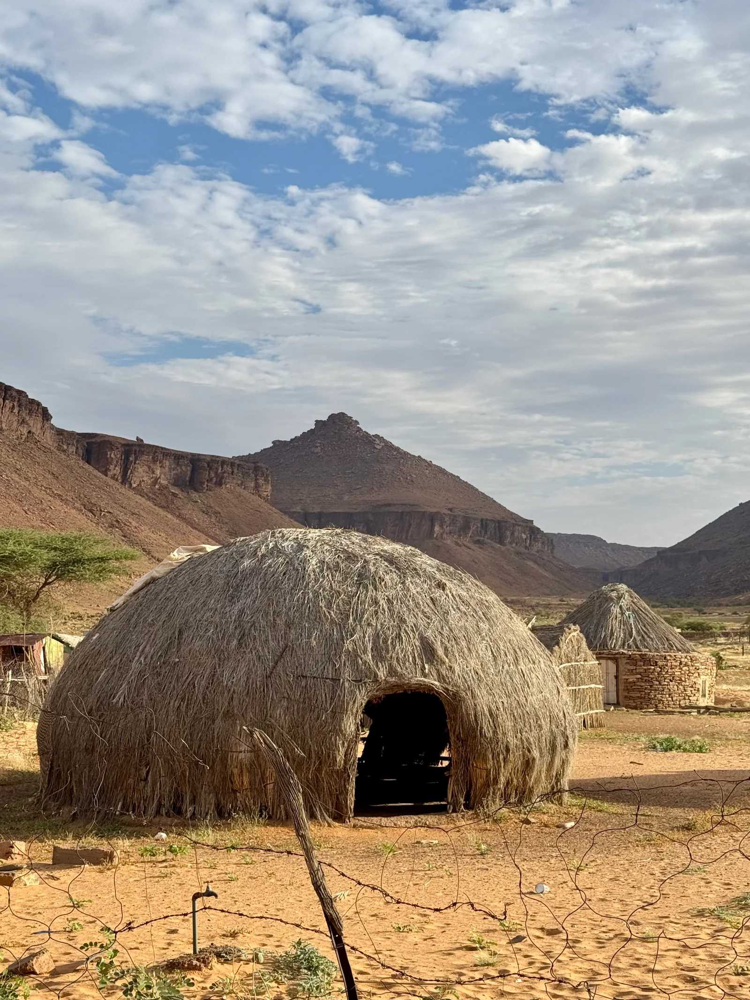

Bugün iki kilogramın altındaki çadırları, avuç içine sığan ocakları ve sıcaklık derecesi laboratuvarda ölçülmüş uyku tulumlarını sıradan karşılıyoruz. Oysa kamp ekipmanlarının tarihi, bir mağazanın rafında değil; insanın kuru kalma, sıcak uyuma ve barınağını yanında taşıma ihtiyacıyla başladı.

Değişen yalnızca malzemeler oldu. Temel sorular hâlâ aynı:

- Geceyi nerede geçireceğiz?
- Yağmurdan ve rüzgârdan nasıl korunacağız?
- Taşıdığımız yükü nasıl azaltacağız?
- Sabah donmadan nasıl uyanacağız?

Geçmişte bu sorulara hayvan derisi, keçe, yün ve ahşapla cevap veriliyordu. Bugün naylon kumaşlar, alüminyum direkler, şişirilebilir matlar ve teknik dolgular kullanıyoruz. Yani kamp ekipmanı dediğimiz şey, binlerce yıldır devam eden bir “Daha hafifini yapamaz mıyız arkadaş?” arayışının sonucu.

_Kamp ekipmanları değişse de barınma, sıcaklık ve taşınabilirlik ihtiyacı aynı kaldı._

## Kamp ekipmanları neden sürekli değişti?

İlk barınaklar keyifli bir hafta sonu geçirmek için yapılmıyordu. İnsanlar seyahat ederken, avlanırken veya yaşadıkları yeri değiştirirken geceyi güvenli geçirebilmek zorundaydı. Barınak bu yüzden konfor ürünü değil, doğrudan hayatta kalma aracıydı.

Moritanya’da çektiğim bu fotoğraf, kamp ekipmanına başka bir açıdan bakmam gerektiğini hatırlatıyor. Bizim hobi için kullandığımız, ağırlığını ve paket hacmini uzun uzun konuştuğumuz ekipmanlar; bazı insanlar için lüks sayılabilecek bir yaşam alanı anlamına gelebilir. Fotoğraftaki saz ve dallarla kurulmuş yapılar birkaç gecelik kamp barınağı değil, gündelik hayatın kendisi.

_Moritanya’da çektiğim bu kare, kamp için kullandığımız barınma teknolojilerinin başka hayatlarda bambaşka bir anlam taşıyabileceğini hatırlatıyor._

Bunu yoksulluğu uzaktan romantikleştirmek için söylemiyorum. Tam tersine, kamp ekipmanlarının evrimini anlatırken güvenli barınmaya ve teknolojiye erişimin dünyanın her yerinde aynı olmadığını unutmamak gerekiyor. Biz katalogda birkaç yüz gramın hesabını yaparken başka biri elindeki yerel malzemelerle kalıcı bir yaşam alanı kuruyor.

Zamanla ihtiyaçların yanına yeni beklentiler eklendi:

- Daha hızlı kurulum
- Daha düşük ağırlık
- Yağmur ve rüzgâra karşı daha iyi koruma
- Daha küçük paket hacmi
- Farklı mevsimlere uygun kullanım
- Daha öngörülebilir performans

Kampın zorunluluktan dinlenme ve keşif etkinliğine dönüşmesi de ekipmanı değiştirdi. Artık yalnızca geceyi atlatmak istemiyoruz. Rahat uyumak, eşyalarımızı düzenlemek, çadırı birkaç dakikada kurmak ve bütün bunları mümkünse iki büklüm olmadan taşımak istiyoruz.

İnsan bir kere konforu görünce keçeden barınağa dönmeye pek hevesli olmuyor.

## Çadır bir barınaktan taşınabilir eve nasıl dönüştü?

İlk çadırın tam olarak ne zaman ve nerede ortaya çıktığını söylemek kolay değil. Deri, ahşap ve bitki gibi organik malzemeler zamanla yok olduğu için arkeolojik kayıt eksik. Fakat insanların çok uzun zamandır deri, kemik, dal ve benzeri malzemelerle geçici barınaklar kurduğunu biliyoruz.

Göçebe toplulukların kullandığı yurt ve benzeri yapılar önemli bir değişimi temsil ediyordu. Bunlar yalnızca barınak değildi; sökülüp başka bir yerde yeniden kurulabilen taşınabilir yaşam alanlarıydı. Ahşap iskelet sağlamlık sağlıyor, keçe ve deri örtüler ise hava koşullarına karşı koruma ve yalıtım sunuyordu.

Buradaki temel fikir bugün de değişmedi: Sağlam bir iskelet kur, dışarıdaki havayı durduracak bir katman ekle ve içeride yaşanabilir bir alan bırak.

1856 yılında Henry Hopkins Sibley adına alınan konik çadır patenti, çok sayıda taşıyıcı yerine merkezde tek ana direk kullanılan bir yapı tarif ediyordu. Bu tasarım daha az parçayla geniş bir alan oluşturmayı kolaylaştırdı. Askerî kullanım için geliştirilen benzer çadır biçimlerini bugün kamp alanlarında ve hatta glamping tesislerinde görmek mümkün.

_Kanvas ve ahşabın yerini zamanla sentetik kumaşlar ile hafif metal direkler aldı._

## Kamp ne zaman bir boş zaman etkinliğine dönüştü?

İnsanlar elbette çok daha önce doğada konaklıyordu. Ancak modern eğlence ve keşif amacıyla yapılan kampın yaygınlaşması, özellikle 19. yüzyılın sonları ile 20. yüzyılın başlarında hızlandı.

İngiltere’de hafif kampçılığın öncülerinden sayılan Thomas Hiram Holding, bisiklet ve kamp yolculukları üzerine yazılar yayımladı. 1901 yılında kurulan bisikletli kampçılar topluluğu da kampın yalnızca kâşifler, askerler veya uzun yolculuk yapanlar için olmadığını gösteriyordu.

İnsanlar kamp yapmak için yola çıkmaya başladıkça ekipmanın da değişmesi gerekti. Ağır kanvas çadırı ve ahşap direkleri bisikletin arkasında ya da sırtınızda taşımak pek olası görünmüyor. Daha hafif kumaşlar, katlanabilir direkler ve küçük paketler artık bir rahatlık değil, gereklilikti.

> Kamp ekipmanındaki büyük dönüşüm, doğanın değişmesinden değil; insanların doğaya daha kolay ulaşmak istemesinden doğdu.

## Modern çadırı mümkün kılan asıl değişim neydi?

20. yüzyılın ortalarında sentetik kumaşların ve hafif metal direklerin yaygınlaşması çadır tasarımını ciddi biçimde değiştirdi.

Kanvas çadırlar dayanıklı ve uygun koşullarda oldukça konforluydu. Fakat ağırdılar, ıslandıklarında daha da ağırlaşıyorlardı ve saklanmadan önce dikkatlice kurutulmaları gerekiyordu. Ahşap direkler de sağlam olmalarına rağmen taşıma yükünü artırıyordu.

Sentetik kumaşlar ve alüminyum direkler sayesinde:

- Çadırların ağırlığı ve paket hacmi azaldı.
- Islanan kumaşların kuruması kolaylaştı.
- Rüzgâr altında esneyebilen direk sistemleri geliştirildi.
- İç çadır ile dış tente birbirinden ayrılabildi.
- Havalandırma ve yoğuşma daha iyi yönetilmeye başlandı.
- Farklı kullanım biçimlerine özel çadırlar üretilebildi.

Bugün aile kampı, trekking, bisiklet yolculuğu, yüksek irtifa veya hızlı kurulum için birbirinden tamamen farklı çadırlar bulunuyor. Fakat modern malzeme kullanılması, her çadırın her koşula uygun olduğu anlamına gelmiyor.

Hafif trekking çadırı çantanızı rahatlatabilir ama geniş bir aile çadırının yaşam alanını sunmaz. Şişirilebilir direkler kurulumu kolaylaştırabilir ama paket ağırlığını artırabilir. İnce kumaşlar gram kazandırırken kullanım sırasında daha fazla özen isteyebilir.

Çadırın tarihini bilmek güzel; satın alma aşamasında ise asıl önemli olan kullanım biçiminizdir. Bunun için [çadır alırken nelere dikkat edilmeli?](/cadir-alirken-nelere-dikkat-edilmeli/) rehberindeki kapasite, ağırlık, zemin ve mevsim ölçütlerini kullanabilirsiniz.

## Uyku tulumundan önce insanlar nasıl uyuyordu?

Uyku ekipmanlarının hikâyesi çadırdan bile daha eski olabilir. Güney Afrika’daki Border Cave kazılarında yaklaşık 200 bin yıl öncesine tarihlenen ot katmanları bulundu. Bu bitkilerin insanların uyuduğu ve çalıştığı daha rahat yüzeyler oluşturmak için kullanıldığı düşünülüyor.

Otların altında kül tabakaları da vardı. Araştırmacılar külün zemini temiz tutmaya ve sürünen böcekleri azaltmaya yardımcı olmuş olabileceğini belirtiyor. Bugünün şişme matıyla yan yana koyduğunuzda biraz mütevazı kalıyor olabilir; fakat mantık yine aynı: daha sıcak ve rahat bir zeminde uyuma.

_Ot katmanı konfor sağlarken altındaki külün böceklere karşı yardımcı olmuş olabileceği düşünülüyor._

Günümüzde bu görevi kamp matı üstleniyor. Mat yalnızca taşları ve kökleri daha az hissetmemizi sağlamıyor; vücut ile soğuk zemin arasında yalıtım katmanı oluşturuyor. Bu yalıtımın nasıl karşılaştırıldığını [kamp matlarında R değeri](/r-degeri-nedir/) yazısında daha ayrıntılı bulabilirsiniz.

## Uyku tulumu bugünkü biçimine nasıl kavuştu?

İnsanlar yüzyıllar boyunca gece sıcak kalmak için deri, yün, saman, ot ve battaniye gibi ulaşabildikleri malzemeleri kullandı. Bugünkü uyku tulumuna benzeyen, insanın çevresini sarabilen ticari tasarımlar ise 19. yüzyılda ortaya çıktı.

1876’da Pryce Pryce-Jones tarafından patenti alınan Euklisia Rug, yünlü ve katlanabilir bir uyku sistemi olarak biliniyor. Tam olarak bugünkü mumya biçimli tulumlara benzemiyordu; daha çok kişinin çevresine sarılıp sabitlenebilen bir battaniyeydi. Yine de taşınabilir, kişisel ve kapatılabilir bir uyku ekipmanı fikrini görünür hâle getirdi.

Daha sonraki tasarımlarda kuş tüyü ve farklı bitkisel dolgular kullanıldı. 20. yüzyılda sentetik yalıtımın yaygınlaşmasıyla uyku tulumları daha geniş bir kullanıcı kitlesine ulaştı.

Bugün temel seçim hâlâ iki dolgu türü arasında yapılıyor:

- **Kuş tüyü:** Ağırlığına göre yüksek sıcaklık sağlar ve küçük hacme sıkıştırılabilir. Islandığında yalıtım gücü azalabilir ve kuruması uzun sürebilir.
- **Sentetik dolgu:** Nemli koşullarda performansını daha iyi koruyabilir, daha hızlı kurur ve genellikle daha uygun fiyatlıdır. Benzer sıcaklık düzeyinde kuş tüyünden ağır ve hacimli olabilir.

_Modern uyku tulumu, taşınabilir yalıtım fikrinin malzeme ve biçim açısından geliştirilmiş hâli._

Biçim de en az dolgu kadar önemli. Dikdörtgen tulumlar geniş hareket alanı sunarken mumya biçimli tulumlar ısıtılması gereken boşluğu azaltır. Günümüzde yetişkinler için üretilen birçok tulumun sıcaklık performansı standart test yöntemleriyle değerlendirilir. Yine de etiketteki sayı tek başına bütün geceyi garanti etmez; mat, kıyafet, nem, rüzgâr ve kişisel soğuk hassasiyeti sonucu değiştirir.

Konfor, limit ve ekstrem değerler arasındaki farkı [uyku tulumu nasıl kullanılır?](/uyku-tulumu-nasil-kullanilir/) rehberinde ayrıca ele aldım.

## Yeni kamp ekipmanı her zaman daha iyi mi?

Yeni ekipman genellikle daha hafif, küçük ve teknik olabilir. Fakat “yeni” ile “bana uygun” aynı şey değildir.

Ultralight bir çadır kilometrelerce yürüyen biri için büyük avantaj sağlar. Otomobille kamp yapan bir aile içinse daha ağır ama geniş, dik durulabilen ve büyük girişli bir çadır daha kullanışlı olabilir.

Aynı durum uyku tulumunda da geçerli. Kuru ve soğuk koşullarda uzun mesafe yürüyecekseniz kuş tüyünün ağırlık avantajı değerli olabilir. Nemli bir bölgede kamp yapıyor ve yükü otomobille taşıyorsanız sentetik tulumun daha hızlı kuruması sizin için daha önemli olabilir.

Ekipman tarihinin verdiği en güzel ders şu: Her gelişme bir sorunu çözerken yanında yeni bir tercih getiriyor.

Hafiflik arttıkça dayanıklılık azalabilir. Konfor arttıkça paket hacmi büyüyebilir. Teknik malzeme performansı yükseltirken bakım ihtiyacını ve fiyatı artırabilir. Dolayısıyla doğru ekipman, katalogda en yüksek rakama sahip olan değil; sizin kullanım biçiminizde en az sorun çıkarandır.

## Kamp ekipmanlarının geleceğinde ne var?

Outdoor ekipmanındaki bir sonraki büyük değişim yalnızca daha hafif ürünler olmayabilir. Geri dönüştürülmüş kumaşlar, daha kolay onarılabilen parçalar, değiştirilebilir direk bölümleri ve uzun kullanım ömrü giderek daha önemli hâle geliyor.

Burada küçük bir çelişki var: Doğayı görmek için aldığımız ekipmanın kısa sürede çöpe dönüşmesini istemeyiz. Sırf birkaç gram hafif diye dayanıksız ürün almak veya çalışan ekipmanı her yeni model çıktığında değiştirmek pek anlamlı değil.

Geleceğin iyi ekipmanı bana kalırsa üç işi birlikte yapmalı:

- Taşıması ve kullanması kolay olmalı.
- Tasarlandığı koşullarda güvenilir çalışmalı.
- Tamir edilerek uzun süre kullanılabilmeli.

_Geleceğin kamp ekipmanında hafiflik kadar dayanıklılık ve onarılabilirlik de önemli olacak._

## Bu tarih bugün doğru ekipman seçmeye nasıl yardım eder?

Kamp ekipmanlarının binlerce yıllık gelişimine bakınca ürünler değişse de karar verme yöntemi oldukça sade kalıyor.

Önce temel ihtiyacınızı belirleyin:

1. Hangi mevsimde kullanacaksınız?
2. Ekipmanı sırtınızda mı, araçta mı taşıyacaksınız?
3. Yağmur, rüzgâr ve gece sıcaklığı nasıl olacak?
4. Ağırlık mı, yaşam alanı mı daha önemli?
5. Ürünü kurutma, temizleme ve tamir etme imkânınız var mı?

Ardından her parçayı tek başına değil, bir sistemin parçası olarak düşünün. Çadır yağmuru durdurur, tulum vücut ısısını korur, mat zeminden gelen ısı kaybını azaltır. Birindeki eksikliği diğer parçanın pahalı olması tamamen kapatmaz.

İlk kamp düzeninizi kuruyorsanız bütün mağazayı çantaya doldurmadan önce [ilk kamp için gerekli malzemeler](/ilk-kamp-icin-gerekli-malzemeler/) listesindeki barınma, uyku, su ve güvenlik ihtiyaçlarından başlayabilirsiniz.

Kamp ekipmanları çok değişti. Bizim beklentilerimiz de değişti. Fakat gecenin bir yarısı yağmur çadırın üzerine vururken istediğimiz şey hâlâ binlerce yıl öncekiyle aynı: Kuru, sıcak ve mümkünse rahat kalmak.

Sizin hâlâ kullandığınız en eski kamp ekipmanı hangisi? Yaklaşık yaşını, hangi koşullarda kullandığınızı ve yeni modeller çıkmasına rağmen neden değiştirmediğinizi yorumlara yazarsanız ekipmanın gerçek ömrü hakkında güzel bir arşiv oluşturabiliriz.

## Bu yazının kaynakları neler?

- [The Evolution of Camping Kit — Blacks](https://www.blacks.co.uk/blogs/article/the-evolution-of-outdoor-kit)
- [Henry Hopkins Sibley'nin 1856 tarihli konik çadır patenti — Google Patents](https://patents.google.com/patent/US14740A/en)
- [Thomas Hiram Holding ve Association of Cycle Campers — The Camping and Caravanning Club](https://www.campingandcaravanningclub.co.uk/about-us/club-history/)
- [Border Cave'deki 200 bin yıllık ot ve kül yatağı araştırması — Science](https://doi.org/10.1126/science.abc7239)
- [Pryce Pryce-Jones ve Euklisia Rug — Newtown Textile Museum](https://newtowntextilemuseum.co.uk/the-collection/)
- [Uyku tulumları için ISO 23537-1:2022 standardı — ISO](https://www.iso.org/standard/82789.html)
