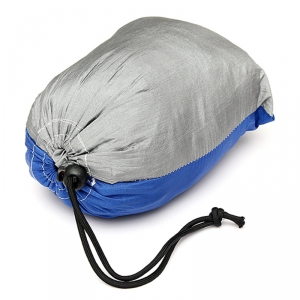

Bir gün kamptayken hamağım olsaydı da şu ağaçların arasına asıp dere kenarında su ve kuş seslerini dinlerken miskinlik yapardım, kitabımı okurdum diye düşünmüştüm. Sonra hamakların katlanmış halinin büyük ve yer kaplıyor oluşundan dolayı motora zor sığdıracağımı ve trekking yaparken de taşımanın çok saçma olacağını düşündüğümden dolayı almaktan vazgeçmiştim ki alttaki ürüne denk geldim.

[https://tr.aliexpress.com/item/Best-Promotion-Blue-Gray-Portable-Parachute-Nylon-Fabric-Hammock-Travel-Camping-Outdoor-For-Two-Persons-Lowest/32308066457.html](https://tr.aliexpress.com/item/Best-Promotion-Blue-Gray-Portable-Parachute-Nylon-Fabric-Hammock-Travel-Camping-Outdoor-For-Two-Persons-Lowest/32308066457.html)

## Paraşüt İpinden Kamp Hamağı

16$’a Çin’den satın aldığım bu ürün bir hamak için o kadar küçük ki motor da bile yer kaplamadan her gittiğim yere götürebiliyorum. Yaklaşık 190kg olarak 2 kişi bindik çok da güzel tarttı. Paraşüt ipinden yapılmış olmasından dolayı fazlasıyla sağlam. Hamak denince insanın aklına ilk olarak baş tarafı tahta olan ve iplerle örülmüş olan hamaklar geliyor. Bunun güzel yanı düz kumaş gibi olması. Böylelikle uzanırken iplerin rahatsız etmesinden kurtulmuş oluyorsunuz.

Böyle bir ürün için 16$ çok uygun bir rakam. Tek eksik kalan yanı hamağı ağaca bağladığınız iplerin kısa oluşu. Bu da çok büyük bir problem değil. Bauhausa gidip veya bir nalbura 2-3 tlye ip alıp uzatabilirsiniz.

Hamak almak isteyenlere şiddetle tavsiye edilir.
