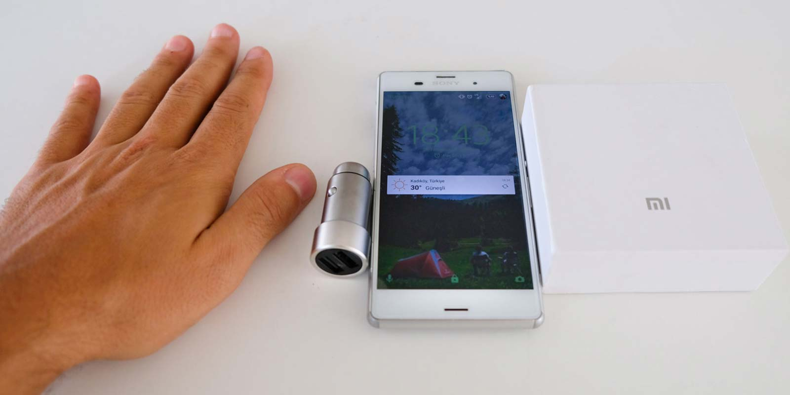

Sağdan soldan aldığım araç şarj aletleri bozulunca yenisini almak gerekti. Daha önce Xiaomi’nin ürünleri kullanmış ve memnun kalmış biri olarak direk Xiaomi Mi araç şarj aletine yöneldim. 10$ ödeyerek Ali abiden(aliexpress) aldığım bu ürünü bir süredir kullanıyorum ve gözlemliyorum. Özellikle kampa giderken ve dönerken arabada şarjım bitiyor ve yedek şarj aletini sadece aktivite esnasında kullanmak istediğimden dolayı şarj sorunu yaşıyordum. 20TL’ye satılan ürünlere göre daha yüksek bir fiyatının olmasına rağmen hakkını veren bir ürün. Bana sağladığı en büyük artıları şöyle;

* 2 usb girişinin olması
* Çıkış akımı olarak 2 çıkışında 2.4A olması ve max. 3.6A kadar verebilmesi.
* Hızlı şarj etmesi
* Gümüş renginin oldukça şık bir tasarımının olması ve çakmaklığa takınca mavi ışığının yanması daha güzel göstermiş.
* Sağlam olması

Artık arabada şarj sorunum yok :). Şimdilik parasının hakkını veren bir ürün. Eğer bozulursa veya başka bir sorun yaşarsam yazarım. Yaklaşık 3 aydır kullanıyorum ve oldukça memnunum. AliExpress’ten almak isteyenler google dan arama yaparak Xiaomi Mi Araç Şarj Aleti’nden alabilirler. Ben buradan aldım. 

