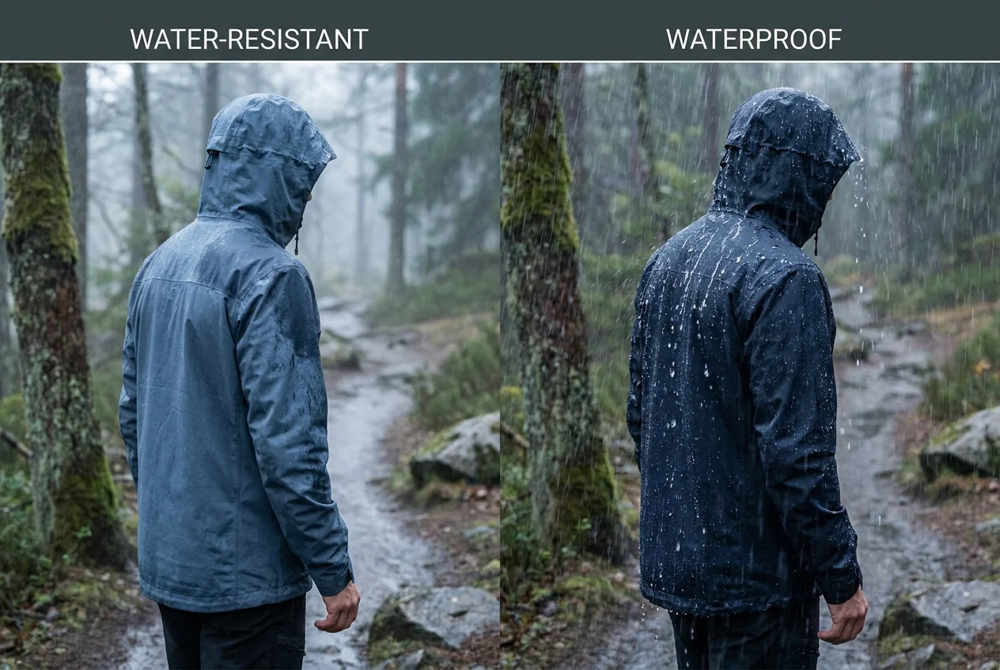
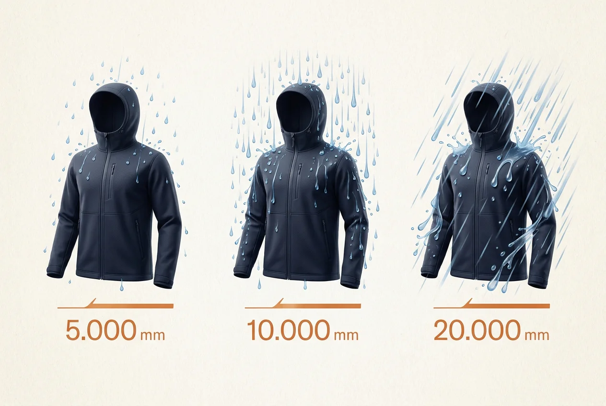
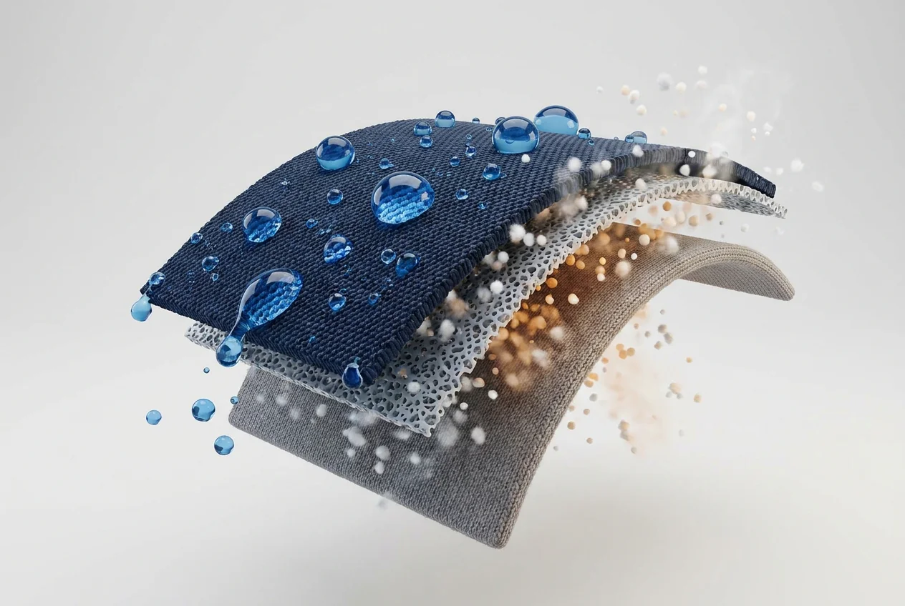
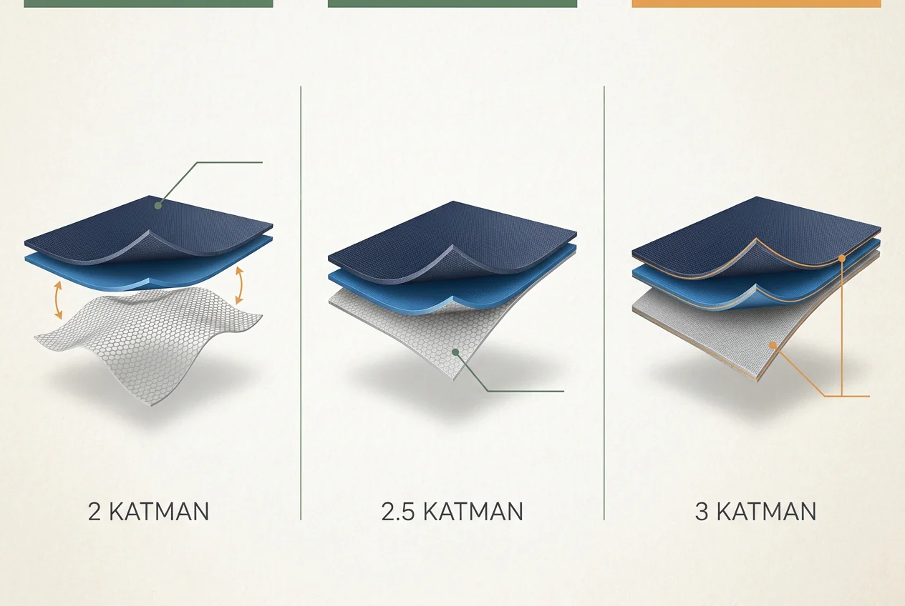
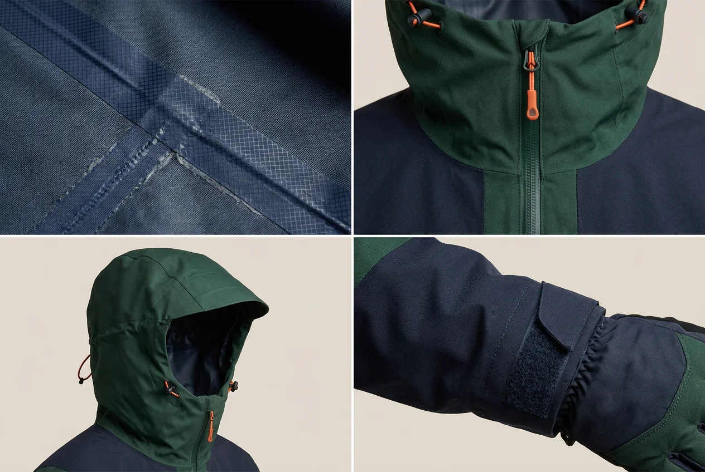

2022 yılında motosikletle Londra’dan yola çıkıp Norveç’in en kuzeyindeki Nordkapp’a gittim. Tam 51 gün süren bu yolculukta dondum. Bildiğiniz dondum yani. Bir güneş açtı, biraz sevindim; ardından yağmur başladı. Yağmur durdu, rüzgâr çıktı. Hava sürekli değişirken montu giy, çıkar, tekrar giy derken yolculuğun kendisinden çok havayla mücadele ettim.

Yolda defalarca yağmura yakalandım. Bazen motosiklet kullanmaya, bazen yürümeye, bazen de kamp kurmaya yağmur altında devam etmek zorunda kaldım. Buna rağmen iyi ekipmanlar sayesinde üst gövdem kuru kaldı. Hasta olmadım ve hava şartları ne kadar zorlarsa zorlasın yolculuğuma devam edebildim.

Nordkapp yolculuğunda şunu çok net öğrendim: İyi bir yağmurluk sadece konfor sağlamıyor. Yağmur altında yaptığınız etkinliğe devam edip edemeyeceğinizi de belirliyor.

Peki yağmurluk nasıl seçilir? Üzerinde “su geçirmez” yazması yeterli mi? Tabii ki değil. Poşeti üzerinize geçirseniz o da su geçirmez ama beş dakika sonra kendi buharınızda pişmeye başlarsınız.

## Yağmurluk alırken nelere dikkat edilmeli?

İyi bir yağmurluk:

* Kullanacağınız koşullara uygun seviyede su geçirmez olmalı
* Vücudunuzda oluşan nemi dışarı atabilmeli
* Dikişleri tamamen bantlanmış olmalı
* Kapüşonu başınıza göre ayarlanabilmeli
* Bileklerinden, fermuarından ve belinden su almamalı
* Altına katman giyebileceğiniz kadar rahat olmalı
* Yapacağınız faaliyet için yeterince hafif ve dayanıklı olmalı

Bütün değerlerin en yükseğine ihtiyacınız yok. İstanbul’da köpeği gezdirmek için kullanacağınız mont ile 51 gün boyunca motosiklet üzerinde Norveç yağmuruna karşı savaşacak mont aynı olmayacaktır.

Önce nerede ve ne kadar süre kullanacağınızı belirlemelisiniz.

## Su geçirmez ve suya dayanıklı aynı şey mi?

Suya dayanıklı bir mont kısa süreli çiseleme ve hafif yağmurda sizi koruyabilir. Yağmur şiddetlenir veya uzun süre devam ederse bir noktadan sonra suyu içeri almaya başlar.

Su geçirmez mont ise membran veya kaplama kullanılarak daha uzun süreli yağmura dayanacak şekilde üretilir. Fakat her su geçirmez mont aynı seviyede koruma sağlamaz.

*Suya dayanıklı ve su geçirmez montlar aynı hava koşulları için üretilmez.*

İşte burada karşımıza 5.000, 10.000 ve 20.000 mm gibi su geçirmezlik değerleri çıkıyor.

## 5.000, 10.000 ve 20.000 mm su geçirmezlik nedir?

Bu değerler kumaşın ne kadar su basıncına dayanabildiğini gösterir. Rakam yükseldikçe kumaşın suya karşı koruması da genel olarak artar.

* **5.000 mm:** Hafif ve kısa süreli yağmurlar
* **10.000 mm:** Doğa yürüyüşü, kamp ve günlük outdoor kullanımı
* **20.000 mm ve üzeri:** Uzun süreli sağanak, sert hava ve zorlu faaliyetler

*Su geçirmezlik değeri yükseldikçe kumaşın dayanabildiği su basıncı da artar.*

Hafta sonu birkaç saatlik doğa yürüyüşü yapıyorsanız 10.000 mm su geçirmezlik çoğu koşulda yeterli olabilir. Ancak günlerce yağmur altında kalabileceğiniz uzun bir trekking veya motosiklet yolculuğu planlıyorsanız daha yüksek koruma sağlayan modellere bakmak mantıklıdır.

Sırt çantası taşıyacaksanız omuz ve bel bölgesinde oluşacak baskıyı da hesaba katın. Çantanın kumaşa baskı yaptığı noktalarda su, montu daha fazla zorlar.

Nordkapp yolculuğumda yağmurun kısa süre sonra durmasını bekleyip yola devam etme gibi bir şansım her zaman olmadı. Gidecek yüzlerce kilometre yol vardı. Bu yüzden yağmurluğun yalnızca ilk yarım saat değil, saatler boyunca koruma sağlaması önemliydi.

## Nefes alabilirlik neden önemli?

Su geçirmezlik sizi dışarıdaki yağmurdan, nefes alabilirlik ise içeride oluşan terden korur.

Yürürken, kamp kurarken veya motosiklet ekipmanlarıyla hareket ederken vücut ısınız yükselir. Mont teri dışarı atamazsa içeride nem birikmeye başlar. Yağmur dışarıdan içeri girmese bile kendi teriniz yüzünden ıslanırsınız.

Sonra da “Bu mont su geçiriyor arkadaş” diye söylenirsiniz. Belki su geçirmiyordur; içerideki hamamın sahibi sizsinizdir.

Nefes alabilirlik değerleri genellikle `g/m²/24 saat` şeklinde gösterilir:

* **5.000–10.000:** Günlük kullanım ve düşük tempolu faaliyetler
* **10.000–20.000:** Doğa yürüyüşü ve hareketli outdoor faaliyetleri
* **20.000 ve üzeri:** Uzun süreli ve yüksek eforlu faaliyetler

*Nefes alabilen membran yağmuru dışarıda tutarken vücutta oluşan nemin dışarı çıkmasına yardımcı olur.*

Markaların kullandığı test yöntemleri değişebildiği için aynı rakam iki farklı montta tamamen aynı performansı göstermeyebilir. Yine de ürünleri değerlendirirken fikir verir.

Çok terleyen biriyseniz koltuk altı fermuarı bulunan modellere bakın. Bazen dünyanın en teknolojik kumaşından daha etkili çözüm, fermuarı açıp içerideki sıcak havayı dışarı bırakmaktır.

## Yağmurluk sizi sıcak tutar mı?

Yağmurluk ile kışlık mont aynı şey değildir. Teknik bir yağmurluğun asıl görevi yağmuru ve rüzgârı kesmektir. Sıcaklığı ise altına giydiğiniz katmanlar sağlar.

Nordkapp yolunda üst gövdem kuru kaldı ama yine de dondum. Çünkü kuru kalmak ile sıcak kalmak aynı şey değil. Yağmurluğun altına hava koşullarına uygun bir iç katman ve polar veya benzeri bir ara katman giymek gerekiyor.

Yağmurluğunuzun altına katman giyebilecek kadar boşluk olmalı. Ancak mont çok bol olup rüzgârda balon gibi şişmemeli. Katmanlı giyim hakkında daha fazla bilgi için [doğa yürüyüşlerinde nasıl giyinilmelidir?](/doga-yuruyuslerinde-nasil-giyinilmelidir/) yazısını okuyabilirsiniz.

## 2, 2.5 ve 3 katmanlı yağmurluk nedir?

Buradaki katman sayısı montun altına kaç kıyafet giydiğinizi değil, su geçirmez kumaşın nasıl üretildiğini anlatır.

### 2 katmanlı yağmurluk

Dış kumaş ile su geçirmez membran birleştirilir. Membranı korumak için içeride ayrı bir astar bulunur.

Günlük kullanımda rahat ve genellikle daha sessizdir. Ancak diğer seçeneklere göre ağır ve hacimli olabilir. Şehir, kamp ve düşük tempolu yürüyüşler için yeterlidir.

### 2.5 katmanlı yağmurluk

Dış kumaş, membran ve membranı koruyan ince bir iç baskıdan oluşur. Hafif ve kolay paketlenebilir olması en büyük avantajıdır.

Koşu, bisiklet ve günübirlik doğa yürüyüşlerinde kullanışlıdır. Fakat 3 katmanlı modellere göre daha az dayanıklı olabilir. Bazı modeller hareket ettikçe teninize yapışarak hafif poşet hissi de verebilir.

### 3 katmanlı yağmurluk

Su geçirmez membran, dış kumaş ile iç koruyucu katmanın arasına yerleştirilir. Genellikle en dayanıklı seçenektir.

Uzun trekking rotaları, dağcılık ve günlerce süren zorlu yolculuklar için daha uygundur. Tabii daha pahalıdır. En iyisi bu diye markete giderken 3 katmanlı dağcılık montu giymenize gerek yok.

*Katman sayısı arttıkça dayanıklılık genellikle yükselir; ancak ağırlık, kullanım amacı ve fiyat da değerlendirilmelidir.*

## Dikişler ve fermuarlar su geçirir mi?

Kumaşın 20.000 mm olması tek başına yeterli değildir. Dikişlerden su giriyorsa elinizde pahalı ama delikli bir mont var demektir.

Gerçek anlamda su geçirmez bir montun dikişleri içeriden bantlanmış olmalıdır. Ürün açıklamasında “fully taped seams” veya “tüm dikişleri bantlanmıştır” ifadesini arayın.

Ana fermuarın suya dayanıklı olması veya üzerinde yağmurun girişini engelleyen koruyucu bir kapak bulunması da önemlidir.

Ceplerin konumuna ayrıca dikkat edin. Sırt çantasının bel kemerini bağladığınızda cepler kapanıyorsa montla aranızda küçük çaplı bir husumet başlayabilir. Uzun yolculuklarda kolay ulaşılabilen ve su almayan cepler gerçekten işe yarıyor.

## Kapüşon ve montun kesimi nasıl olmalı?

Kapüşon başınızı çevirdiğinizde sizinle birlikte hareket etmeli. Siz sağa bakarken kapüşon karşıya bakmaya devam ediyorsa pek kullanışlı değildir.

Ön ve arka ayar iplerinin bulunması kapüşonun rüzgârda başınızdan çıkmasını engeller. Ön taraftaki sert siperlik ise yağmurun yüzünüze akmasını azaltır.

Montu denerken:

1. Altına normalde kullanacağınız katmanları giyin.
2. Kollarınızı yukarı kaldırın ve öne uzatın.
3. Kapüşonu takıp başınızı sağa ve sola çevirin.
4. Mümkünse sırt çantasıyla deneyin.
5. Bilek ve bel ayarlarını kontrol edin.

*Bantlı dikişler, korumalı fermuarlar ve doğru ayarlanan kapüşon montun genel performansını doğrudan etkiler.*

Mont hareketinizi engellememeli ancak gereğinden fazla bol da olmamalıdır. Trekking için kalçaya doğru biraz uzayan modeller belinizi daha iyi korur. Koşu ve bisiklet içinse hafif, vücuda yakın ve kolay paketlenen modeller daha kullanışlı olabilir.

## DWR kaplama nedir?

DWR, montun dış yüzeyine uygulanan su itici kaplamadır. Yağmur damlalarının kumaşa emilmek yerine boncuk gibi yüzeyden akmasını sağlar.

Ancak DWR ile su geçirmez membran aynı şey değildir. Bu kaplama kir, ter ve kullanım nedeniyle zamanla etkisini kaybeder. Dış kumaş suyu emmeye başladığında mont ağırlaşır, soğur ve nefes alması zorlaşır.

İçerideki membran hâlâ suyu durduruyor olabilir ama ıslak dış kumaş yüzünden mont su geçiriyormuş gibi hissedebilirsiniz.

Yağmur damlaları artık montun üzerinden akmıyorsa bakım zamanı gelmiş olabilir. Ürünün yıkama talimatlarını okuyun ve teknik kıyafetlere uygun temizlik ürünleri kullanın. Montu normal deterjana boğup ardından neden eskisi gibi çalışmadığını sorgulamayın.

## Hangi kullanım için nasıl bir yağmurluk alınmalı?

**Şehir ve kısa yürüyüşler:**\
5.000–10.000 mm koruma, rahat kesim ve 2 katmanlı yapı çoğu zaman yeterlidir.

**Günübirlik doğa yürüyüşleri:**\
En az 10.000 mm su geçirmezlik, bantlanmış dikişler, iyi nefes alabilirlik ve ayarlanabilir kapüşon tercih edilebilir.

**Uzun trekking ve kamp yolculukları:**\
10.000–20.000 mm veya üzeri koruma, dayanıklı kumaş, yüksek nefes alabilirlik ve sırt çantasıyla kullanılabilen cepler önemlidir.

**Koşu ve bisiklet:**\
Hafiflik, nefes alabilirlik ve havalandırma ön plana çıkar. Kolay paketlenen 2.5 katmanlı modeller kullanışlı olabilir.

**Motosiklet yolculukları:**\
Uzun süreli yağmura dayanıklılık, rüzgâr koruması, tamamen bantlanmış dikişler ve eldivenlerle ayarlanabilen bilekler önemlidir. Montun sürüş pozisyonunda belinizi açıkta bırakmaması gerekir.

**Dağcılık ve sert hava:**\
3 katmanlı, dayanıklı, yüksek su geçirmezlik değerine sahip teknik modeller tercih edilmelidir.

## Özetle hangi yağmurluğu almalıyım?

En yüksek rakamlara sahip olan değil, yapacağınız işe uygun yağmurluk sizin için en iyisidir.

Ben uzun doğa yürüyüşleri ve günlerce süren yolculuklar için en az 10.000 mm su geçirmezlik, iyi nefes alabilirlik, tamamen bantlanmış dikişler, ayarlanabilir kapüşon ve havalandırma arardım. Uzun süre yağmur altında kalma ihtimalim varsa 20.000 mm ve üzerindeki modellere yönelirdim.

51 günlük Nordkapp yolculuğunda yağmur beni fazlasıyla yordu ama durduramadı. Bunda üst gövdemi kuru tutan ekipmanların payı çok büyüktü. Dondum, söylendim, “Bu yağmur da nereden çıktı arkadaş” dedim ama hasta olmadan ve pes etmeden yolculuğuma devam ettim.

İyi bir yağmurluk yağmuru durdurmaz. Sizin yağmur altında durmadan devam edebilmenizi sağlar.

## Sizin yağmurluk tecrübeniz nasıl?

Yağmur altında gerçekten sınadığınız bir yağmurluk var mı? Kullandığınız marka ve modeli, su geçirmezlik değerini ve hangi koşullarda denediğinizi yorumlara yazabilirsiniz.

Mont dışarıdan mı su aldı, yoksa kendi terinizden mi ıslandınız? Özellikle uzun yol, motosiklet, kamp ve trekking tecrübelerinizi merak ediyorum. Belki de bir sonraki yağmurluğunu arayan birinin ıslanmasını sizin yorumunuz engeller :)