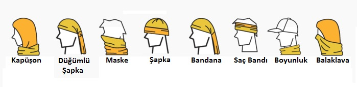

#### BUFF NEDİR, NE İŞE YARAR?

Kamplarda ve Trekking, Hiking gibi doğa yürüyüşlerinde veya günlük hayatta bile farklı şekillerde kullanabileceğiniz iki tarafı açık bere diyebiliriz. Piyasada bir çok farklı malzemeden üretilmiş bufflardan bulabilirsiniz. Microfiber olanını tercih etmenizi öneririm.

**Buff Özellikleri**

Kolay yıkanır, çabuk kurur, rüzgardan korur, farklı şekillerde kullanılır, yer kaplamaz, farklı renk ve modelde bir çok çeşiti vardır. Microfiber olması sayesinde bakteri barındırmaz.

**Buff Hangi Aktivitelerde Kullanılır?**

Kamplarda, Trekking ve Hiking gibi doğa yürüyüşlerinde, bisiklette, kayakta, koşuda, motosiklette ve günlük yaşantınızda bile kullanabilirsiniz.

**Buff Nasıl Giyilir?**

Bere, atkı, boyunluk, maske, bandana gibi bir çok farklı şekilde kullanabilirsiniz. Farklı kullanımlar için alttaki görseli inceleyin.

