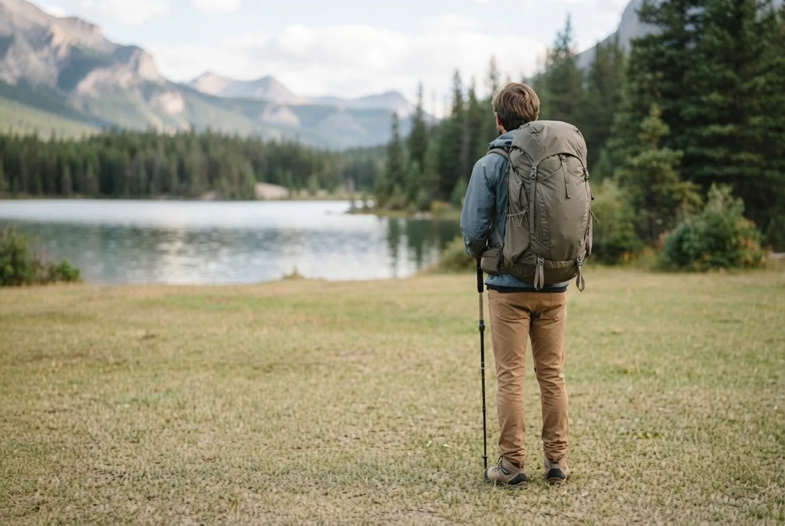
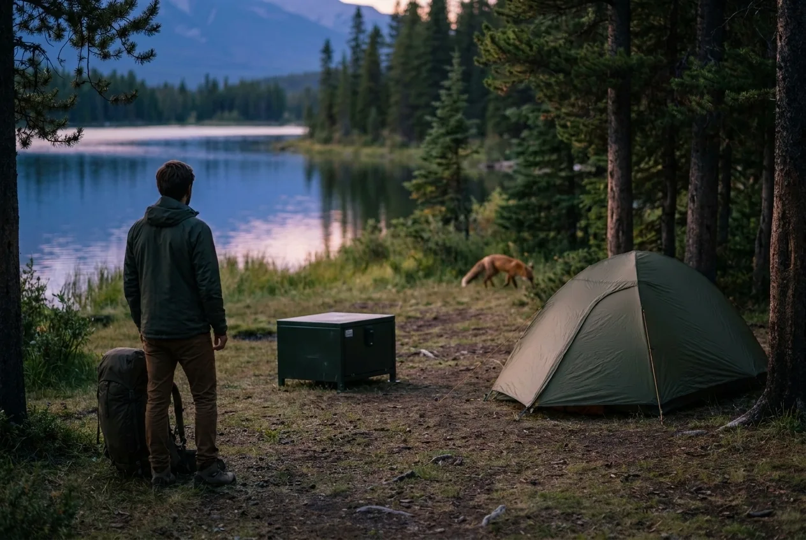
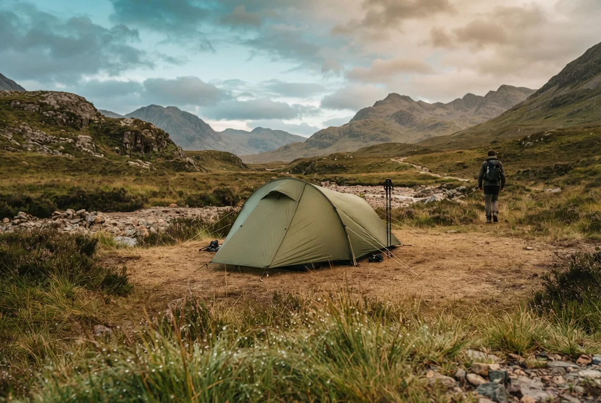
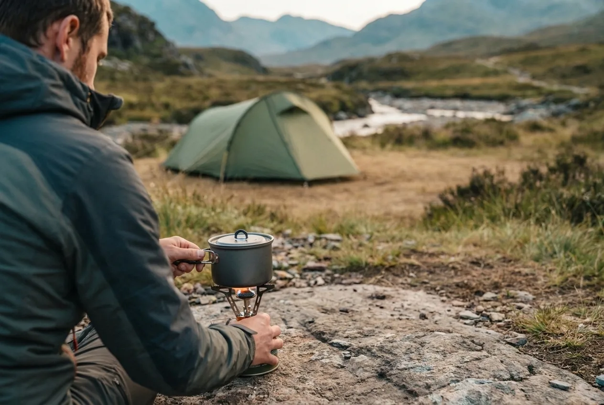
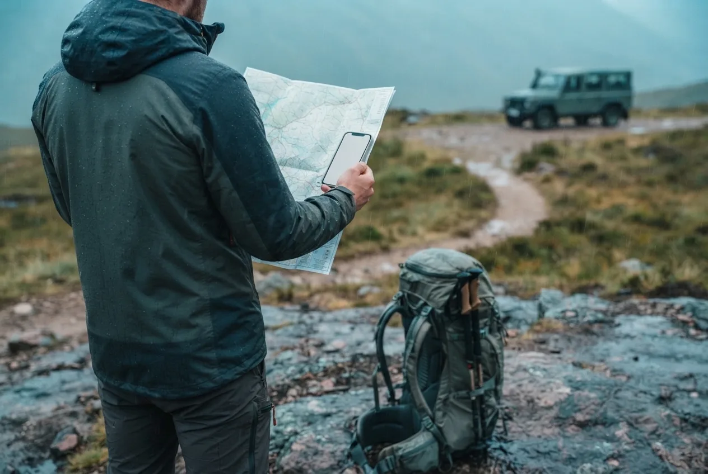

Doğada kamp yapmak güvenli midir? Tek cümleyle cevap vermek gerekirse, güvenlik kamp yapılan yer ve o günkü koşullarla birlikte değerlendirilir. Aynı alan kuru ve sakin bir hafta sonunda rahat olabilir; kuvvetli rüzgâr, yoğun yağış veya yangın riski olan başka bir günde doğru seçim olmayabilir.

Güvenliği yalnızca tanımadığınız insanlarla veya yabani hayvanlarla ilişkilendirmeyin. Yanlış kamp yeri, kötü hava, susuzluk, kaybolma, ateş ve ekipman arızası da en az diğer riskler kadar önemlidir. Yeni başlayanlar için amaç korku üretmek değil, karar vermeyi kolaylaştıran basit bir kontrol düzeni kurmaktır.

Kampa tek, çift veya aileyle gitmeniz değerlendirmeyi değiştirir. Yanınızdaki kişilerin deneyimi, sağlık durumu ve hava koşullarına dayanıklılığı da planın parçasıdır. Kampa gitmeden önce nerede olacağınızı, ne zaman döneceğinizi ve plan değişirse nasıl haber vereceğinizi güvendiğiniz birine bırakın.

## Kamp alanının güvenli olduğunu nasıl anlarsınız?

Kamp yeri seçerken önce orada kamp yapmaya izin verilip verilmediğini öğrenin. Milli park, tabiat parkı, orman ve özel mülklerde kurallar aynı değildir. Bazı alanlarda yalnızca belirlenmiş kamp noktaları kullanılabilir; bazı dönemlerde ormana giriş, çadır kurma veya ateş yakma kısıtlanabilir. İnternetteki eski bir kamp yorumunu güncel izin gibi kabul etmeyin.

Ardından şu ayrıntılara bakın:

*Güzel bir manzara tek başına yeterli değildir; ulaşım, zemin ve gerektiğinde çıkış seçeneklerini de kontrol edin.*

- Hava bozduğunda çıkabileceğiniz bir yol var mı?
- Zemin kuru, düz ve taşkın riskinden uzak mı?
- Çadırın üzerine dal, kaya veya başka bir nesne düşebilir mi?
- Su, tuvalet ve iletişim imkânı nerede?
- Yakınınızda bir işletme, ana yol, sağlık noktası veya yardım isteyebileceğiniz bir yer var mı?

İlk kamp için işletmeli alanları veya ulaşımı kolay, kuralları net yerleri tercih etmek çoğu zaman daha iyi bir başlangıçtır. Uzaklık tek başına güvenlik ölçüsü değildir.

## Yerleşim yeri, piknik alanı ve yayla arasında fark var mı?

Yerleşim yerine yakın bir alanın avantajı, ulaşım ve yardım seçeneklerinin daha kolay olmasıdır. Dezavantajı ise kalabalık, gürültü, gece kullanımı veya alanı sizinle paylaşan kişilerin davranışları olabilir. İnsanları topluca tehlikeli kabul etmek doğru değildir; ancak rahatsız veya tehdit altında hissediyorsanız kamp yerini değiştirmek için bir sebebe ihtiyacınız yok.

Yaylalarda kamp yapmak da tek başına güvenli veya güvensiz değildir. Yöre halkının alışkanlıklarını, hava değişimini, su durumunu ve aracın çıkışını düşünün. Yayla açık ve rüzgârlıysa çadırı sabitlemek, gece sıcaklığını kontrol etmek ve yağış sonrası yol koşullarını öğrenmek önemlidir.

## Issız yerde kamp yapmak daha mı güvenlidir?

Issızlık bazı kişiler için huzur demektir; fakat güvenlik açısından otomatik bir avantaj değildir. Yardımın uzak olması, telefonun çekmemesi, yolun kapanması veya hava değiştiğinde geri dönememek riski artırabilir. İlk kampınızda yalnızlık arıyorsanız bile ulaşımı ve iletişimi tamamen koparmayan bir yer seçin.

*Kamp alanındaki hayvanları uzaktan gözlemleyin; yaklaşmayın, beslemeyin ve yiyecekleri açıkta bırakmayın.*

Kamp yerinde yiyecekleri açıkta bırakmayın, hayvanları beslemeyin ve çadırın içinde yemek kokusu biriktirmeyin. Hayvan görürseniz yaklaşmayın, fotoğraf için peşinden gitmeyin ve bulunduğunuz alanın resmi uyarılarına uyun. “Bana bir şey olmaz” da “her hayvan saldırır” da iyi bir güvenlik planı değildir.

## Hava ve zemin güvenliğini nasıl kontrol edersiniz?

Kamp yerine gitmeden önce saatlik ve beş günlük hava tahminini inceleyin. Rüzgâr, kuvvetli yağış, gök gürültüsü ve gece sıcaklığı özellikle önemlidir. Şehir merkezinin tahmini kamp alanını tam anlatmayabilir; rakım ve açık arazi koşulları sonucu değiştirebilir.

*Çadırı kurmadan önce suyun akışını, gevşek kayaları, rüzgârı ve çevredeki doğal riskleri gözden geçirin.*

Çadırı dere yatağına, suyun akış izine, gevşek kaya altına veya kurumuş dalları üzerinizde duran ağaçların altına kurmayın. Düz ve kuru görünen zemin kadar, yağmurdan sonra suyun nereye gideceği de önemlidir. Kampı karanlıkta kurmak zorunda kalmamak için mümkünse gün ışığında varın.

## Ateş ve ocak kullanırken ne yapmalısınız?

Önce o gün ve o alanda ateş yakılmasına izin olup olmadığını kontrol edin. Orman yangını riski ve yerel yasaklar dönemsel olarak değişebilir. İzin yoksa ateş yakmayın; izin varsa da yalnızca belirlenmiş ocak veya alanları kullanın. Ormandan odun toplamak, ateşi kontrolsüz bırakmak ve közleri tamamen söndürmeden ayrılmak iyi kampçılık değildir.

*Ocağı çadırdan uzakta, devrilmeyecek düz bir zeminde ve yanıcı malzemelerden ayrı tutun.*

Yakıtlı ocağı çadırın içinde, girişinde veya kapalı bagaj bölümünde kullanmayın. Devrilmeyecek düz bir zeminde, yanıcı malzemelerden uzakta ve üretici talimatına uygun çalıştırın. Rüzgâr güçlenirse yemek planını değiştirmek, ateşle inatlaşmaktan daha akıllıcadır. Kamp ateşiyle ilgili daha ayrıntılı bilgi için [güvenli kamp ateşi önerilerine](/guvenli-kamp-atesi-icin-en-iyi-10-ipucu/) bakabilirsiniz.

## Acil bir durumda ilk neyi düşünmelisiniz?

Panikle koşmaya başlamadan önce bulunduğunuz yeri, hava koşulunu ve yanınızdaki kişileri kontrol edin. Telefon çalışıyorsa konumunuzu paylaşın. Çekmiyorsa daha yüksek veya açık bir noktaya gelişigüzel gitmek yerine, önceden belirlediğiniz rotayı ve dönüş planını kullanın.

*Kamp öncesinde rota, konum paylaşımı ve dönüş planını yalnızca telefona bağlı bırakmayın.*

Şunlardan biri varsa kampı sürdürmek zorunda değilsiniz:

- Hava beklenenden hızlı kötüleşiyorsa
- Çadır veya ısınma sisteminiz koşullara yetmiyorsa
- Bir kişi yaralandıysa, üşüyor veya yönünü kaybettiyse
- Su, yiyecek veya ilaç planınız yetersiz kaldıysa
- Yangın, taşkın veya heyelan riski oluştuysa

Kamptan dönmek başarısızlık değildir. Doğada en iyi karar bazen planı erken bitirmektir.

## Doğada kamp güvenliği nasıl özetlenir?

İlk kampınız için ulaşımı kolay, kuralları açık, hava durumu takip edilebilir ve gerektiğinde çıkabileceğiniz bir yer seçin. Konumunuzu bir yakınınızla paylaşın. Ateş ve ocak kurallarını kontrol edin. Yiyecekleri düzenli tutun, hayvanlara yaklaşmayın ve hava kötüleştiğinde planı değiştirin.

Doğada kamp güvenliği korkmadan ama hafife almadan hazırlanmaktır. Şimdiye kadar sorun yaşamamış olmanız, bir sonraki koşulun aynı olacağını garanti etmez; fakat doğru hazırlık, belirsizliği ciddi biçimde azaltır.

Siz kamp yaparken güvenlik kararını en çok ne etkiliyor: hava, kamp alanı, ulaşım, insan kalabalığı veya yalnızlık? Deneyiminizi ve kamp koşullarını yorumlarda paylaşırsanız yeni başlayanlara gerçek bir referans bırakabilirsiniz.
