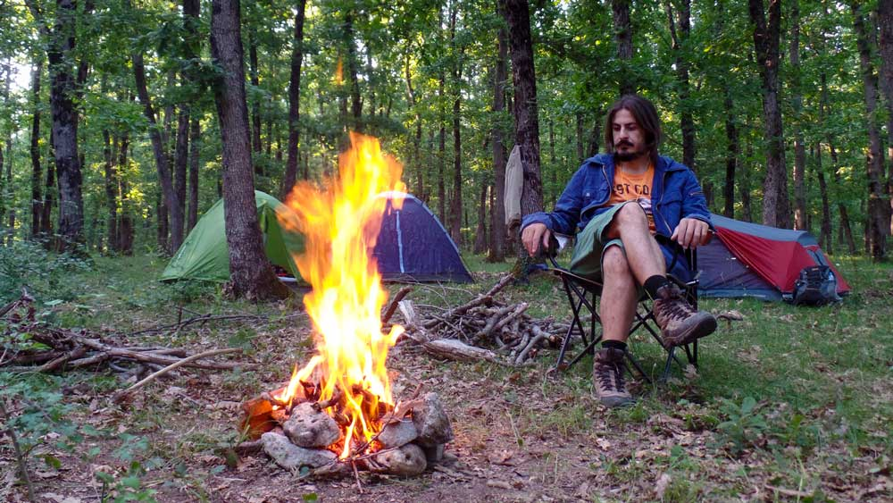
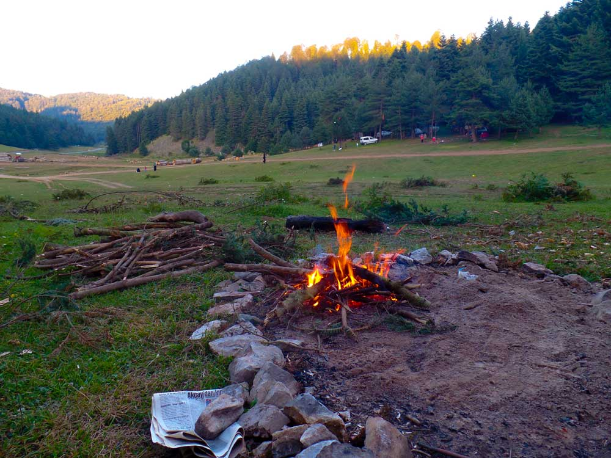
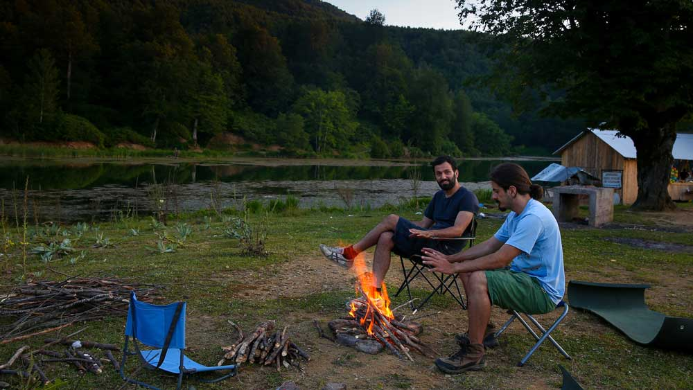
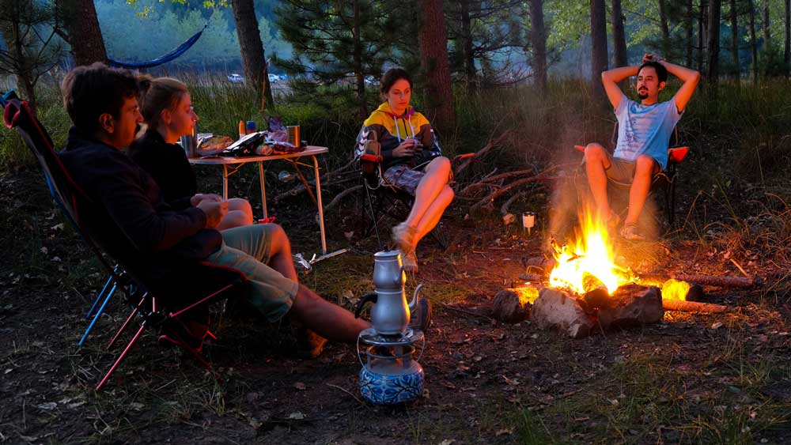
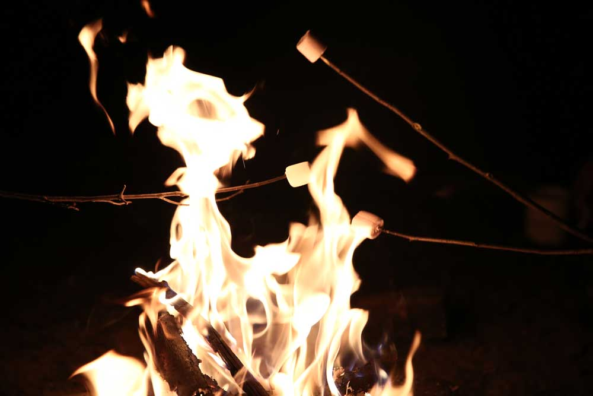
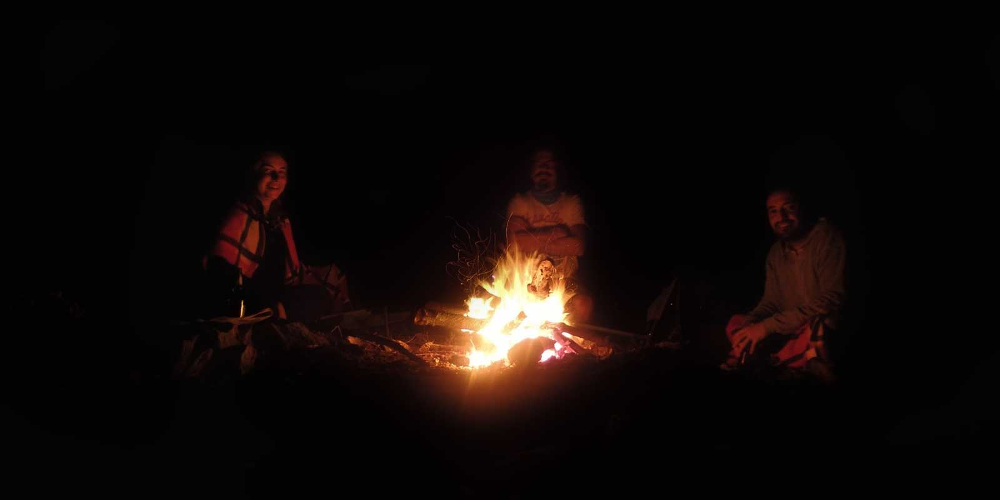

Kamplarda en çok sevdiğimiz şeylerden birisi de bizi ısıtan ve çıtırdayarak yanan güzel bir kamp ateşidir. Hepımiz aldığımız önlemlerle güzel ve doğaya en az zarar verecek şekilde kamp ateşi yakmaya çalırız. Gelin görün ki bazen bilmeyerek, bazen unutarak, bazen de ihmalkarlıklarla çeşitli hatalar yaparız ve doğaya ya da kendimize zarar veririz. 

Dilerseniz yazıyı okumaya devam edin, dilerseniz YouTube'dan benim anlatımımla dinleyin.

`youtube: https://www.youtube.com/watch?v=HuMmBjTpc0k`

## Güvenli kamp ateşi için en iyi 10 ipucu

O zaman bu sırrımı sizinle paylaşayım ve bu riskleri bertaraf etmiş olalım.

### 1- Ateş için güvenli bir yer bulun

Kamp çadırlarından en az 5 metre uzaklıkta, ağaçlardan, ormandan mümkün mertebe uzakta güvenli olduğunu düşündüğüniz bir yerde ateşinizi yakın. 

### 2- Yerde ateş yakmayın

Eee o zaman bu millet nerede ateş yakacak? Yerde ateş yaktığınız zaman yerdeki çimlerin ve bitkilerin ciddi bir şekilde tahrip olmasıyla beraber bunların içerisinde yaşayan bir çok canlıyı da yakmış olursunuz. İsterseniz şöyle bir eğilin ve inceleyin. Çimlerin arasında yaşayan canlıları rahatlıkla görebileceksiniz. Yerle teması olmayan ateş ocakları kullanabilirsiniz. Eğer böyle bir ekipmanınız yoksa etrafta bir bakının ve varsa toprak bir alan üzerinde veya daha önce ateş yakılmış bir yer üzerinde ateş yakın. Böylelikle doğaya minumum zarar vermiş olursunuz. En güzeli yerle teması olmayan ateş ocağı kullanmaktır.

### 3- Ateşin etrafını korunaklı hale getirin

Toprak bir zeminde ateş yakıyoranız küçük bir çukur açığ etrafını taşlarla daha güvenli hale getirebilirsiniz. Çukur açma şansınız yoksa taş toplayarak ateş yakacağınız yerin etrafını çevirin. Böylece ateşinizi daha fazla kontrol altında tutabilirsiniz.

### 4- Yanınızda su veya kum bulundurun

Her an ne olacağını bilemezsiniz. Aldığınız önlemlerin yeterli olduğunu düşünürsünüz ancak aniden çıkan bir rüzgarla ateş yön değiştirip büyüyebilir. Anında müdehale edebilmek için yanınızda su bulundurmanızda fayda var.

### 5- Benzin veya gaz gibi tutuşturucular kullanmayın

Ateşi kibritle yakın var yaktığınız kibriti sağa sola atmak yerine direk ateşin içine bırakın. Benzin gibi tutuşturucu sıvılar kullanmak çok tehlikeli. Basitce ve hızlıca ateş yakacağınızı düşündüğünüz anda bir anda parlayıp alev alıp sizi de yakabilir. 

### 6- Ateşi başıboş bırakmayın

Ateşi yaramaz bir çocuk gibi düşünebilirsiniz. Aniden çıkan bir rüzgar ateşten közler savurarak bir anda ateşin yayılmasını sağlayabilir. Ateş başından sürekli bir kişi olmalı. Ateşi bırakıp bir yere gitmeyin.

### 7- Kuru odun ve ağacları kullanın

Etrafınızda orman varsa çok şanslısınız. Sakın ha yaş ağaçları kesmeyin. Zaten orman varsa her yerde kuru dallar var demektir. Tüm kamp ekibi ormana dağılarak yarım saat içerisinde bütün gece size yetecek kadar kuru odun toplayabilir. Eğer kuru dallar, odunlar bulma şansınız yoksa kampa gitmeden önce odun satan yerlerden satın alabilirsiniz.

### 8- Ateşi kontrol atında tutun

Yani ateşi gereksiz yere büyütmeyin. Daha bütük devasa ateş yakacağım diye uğraşırken kontrolünüzden çıkacak bir kamp ateşiniz olur ki bu canavar çok kötü şeyler yapabilir. 

### 9- Çocuklara ve evcil hayvanlarınıza dikkat edin

İki tehlikeli canlı. Her an ne yapacağını bilemezsiniz. Çocuklarınıza ateş yakmayı ve güvenliğini sağlamayı öğretin. Aynı zamanda onları ateşle başbaşa bırakmayın. Bir gözünüz onlarda olsun.

### 10- Ateşin tamamen söndüğünden emin olun

Kamp ateşiniz tamamen sönmeden çadırlarınıza çekilip uyumayın. Ateşin tamamen söndüğünden emin olun. Gece çıkan bir rüzgar minicik közleri alevlendirip her yerin yanmasını sağlayabilir ki içinde uyuduğunuz çadırlar her ne kadar yanmaya dayanıklı malzemelerden üretilse de yanacaktır. O yüzden tedbiri hiç bir zaman elden bırakmamak gerekir.
