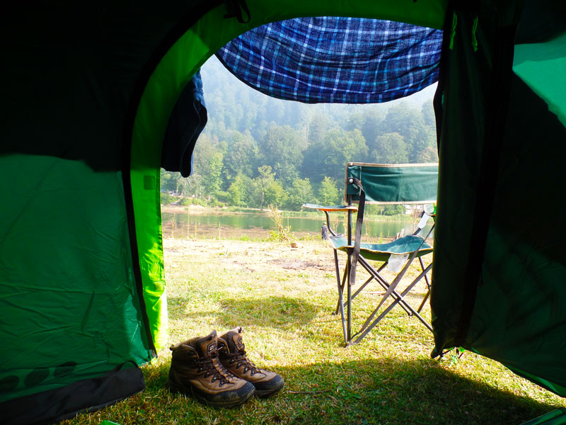

İlk kamp için gerekli malzemeler listesi internette uzadıkça uzuyor. Bir noktadan sonra insan kamp yapmaya değil, küçük bir nalbur dükkânı taşımaya hazırlandığını düşünüyor. Oysa ilk kampınız için ihtiyacınız olan şey, her ihtimali satın almak değil; barınma, uyku, su, beslenme, aydınlatma ve güvenlik ihtiyaçlarını karşılayacak sade bir sistem kurmak.

Kamp malzemesi seçerken önce nereye ve nasıl gideceğinizi belirleyin. Otomobille işletmeli bir kamp alanına giden kişinin listesiyle, ekipmanını sırtında taşıyıp yürüyen kişinin listesi aynı olmaz. [İlk kamp için kamp alanı seçimini](/ilk-kamp-nerede-yapilir/) yaptıktan sonra aşağıdaki listeyi kendi koşullarınıza göre daraltabilirsiniz.

## İlk kamp için zorunlu ekipmanlar nelerdir?

İlk geceyi güvenli ve makul bir konforla geçirmek için temel sisteminiz şu parçalardan oluşur:

- **Çadır:** Yağmur, rüzgâr, böcek ve gece mahremiyeti için barınak.
- **Uyku tulumu:** Vücudunuzun ürettiği ısıyı korumaya yardımcı olan uyku ekipmanı.
- **Kamp matı:** Sert zemini daha rahat hâle getirmenin yanında zeminden gelen ısı kaybını azaltan yalıtım katmanı.
- **Aydınlatma:** Kafa lambası veya el feneri ve yedek pil.
- **Su:** İçme, yemek ve temel temizlik için önceden planlanmış miktar.
- **Yiyecek:** Pişirme imkânınıza ve kamp süresine uygun, bozulma riski düşük yiyecekler.
- **Mevsime uygun kıyafet:** Yağmur katmanı, kuru yedek kıyafet ve gece için sıcak tutan katman.
- **İletişim ve yön bulma:** Şarjı dolu telefon, güç kaynağı, rota bilgisi ve mümkünse kâğıt yedek.
- **İlk yardım ve tamir:** Kişisel ilaçlar, temel ilk yardım malzemeleri, tamir bandı ve küçük çok amaçlı araç.

Çadır, tulum ve matı birer ayrı ürün gibi değil, birlikte çalışan bir uyku ve barınma sistemi gibi düşünün. Bir parça eksik veya kullanım koşuluna uygunsuzsa diğer ekipmanın iyi olması açığı tamamen kapatmaz.

## Çadır, uyku tulumu ve mat seçimi nasıl yapılır?

Çadır seçerken kişi sayısından önce taşıma biçiminizi ve beklenen hava koşullarını düşünün. Otomobille kamp yapıyorsanız iç hacim ve rahat giriş önemli olabilir. Sırt çantasıyla yürüyorsanız ağırlık ve paket hacmi öne çıkar. [Çadır alırken nelere dikkat edilmeli?](/cadir-alirken-nelere-dikkat-edilmeli/) yazısında bu kararları daha ayrıntılı karşılaştırabilirsiniz.

Uyku tulumunda etiketteki en düşük sayıya güvenip sınırda seçim yapmayın. Beklediğiniz en düşük gece sıcaklığını ve konfor değerini birlikte değerlendirin. Tulumun nasıl kullanılacağı, içinde ne giyileceği ve matın neden önemli olduğu için [uyku tulumu nasıl kullanılır?](/uyku-tulumu-nasil-kullanilir/) rehberine bakabilirsiniz.

Mat seçiminde yalnızca yumuşaklığa bakmayın. Soğuk zeminde R değeri, kalınlık, paket hacmi, denge ve dayanıklılık da önemlidir. [R değeri nedir?](/r-degeri-nedir/) yazısı, kamp matındaki yalıtım değerini günlük kullanım senaryolarına çeviriyor.

## Aydınlatma, su ve yemek için ne almalısınız?

Telefonun feneri acil durumda işe yarar ama kampın bütün aydınlatma planı olmamalı. Kafa lambası ellerinizi serbest bırakır; çadır kurarken, yemek hazırlarken ve gece tuvalete giderken farkı hemen anlarsınız. Yedek pil veya şarj planını da listenin dışında bırakmayın.

Su için “orada bir kaynak vardır” diye yola çıkmayın. Haritadaki mavi çizgi, içilebilir ve yıl boyunca akan su anlamına gelmez. Kamp yerine göre içme suyunu yanınızda götürün veya suyun arıtılması gerekiyorsa kullandığınız filtrenin, tabletin ya da kaynatma yönteminin talimatına uyun. Kaynağın güvenli olduğundan emin değilseniz içmeyin.

İlk kampta yemek planını basit tutun. Bir tencereyle hazırlanabilecek yiyecekler, sandviç, dayanıklı meyveler ve ölçüsü önceden ayarlanmış içecekler gereksiz ekipman taşımanızı engeller. Pişirme için ocak kullanacaksanız çadırın içinde, girişinde veya kapalı bagaj bölümünde yakıtlı cihaz çalıştırmayın. Ocak açık havada, devrilmeyecek bir zeminde kullanılmalı ve kamp alanının ateş kurallarına uyulmalı.

## Kıyafet ve kişisel bakım listesinde ne olmalı?

Kamp için yanınıza bütün gardırobunuzu almanıza gerek yok. Fakat ıslanma ve terleme ihtimaline karşı kuru kalacak bir yedek planınız olmalı:

- Hava tahminine uygun temel katman
- Yağmur ve rüzgâr koruması
- Kuru çorap ve iç katman
- Gece için ayrı, kuru uyku kıyafeti
- Mevsime göre şapka, bere veya eldiven
- Diş fırçası, küçük havlu ve kişisel temizlik malzemeleri
- Tuvalet kâğıdı ve atıkları taşımak için sağlam poşet

Gün içinde giydiğiniz terli kıyafetlerle uyku tulumuna girmek iyi bir fikir değildir. Islak kıyafet sizi soğutur, tulumun içini nemlendirir ve ertesi gün için kuru kıyafet bırakmaz.

## İlk yardım ve tamir çantasında neler bulunmalı?

İlk yardım çantası herkes için aynı olmaz. Düzenli kullandığınız ilaçlar, alerjileriniz ve gideceğiniz yerin uzaklığı listeyi değiştirir. Temel çantada yara bandı, gazlı bez, antiseptik, eldiven, küçük makas ve kişisel ilaçlar bulunabilir. İlaçlar konusunda kendi sağlık durumunuzu, sağlık uzmanınızın önerisini ve ürün talimatını dikkate alın.

Tamir tarafında ise küçük ama işe yarayan malzemeler yeterlidir:

- Tamir bandı
- Birkaç metre sağlam ip
- Yedek çadır kazığı
- Küçük bir ip veya elastik parça
- Şişme mat kullanıyorsanız üreticinin tamir kiti
- Çakı veya çok amaçlı alet

Kamp ocağının kartuşu, çadır direği veya mat valfi için uyumsuz yedek taşımak yerine ekipmanınızı evde deneyin. İlk kamp sabahı “bu parça buraya mı takılıyordu?” sorusunu çözmek için güzel bir zaman değildir.

## Arabayla kamp ile yürüyüş kampının listesi neden farklıdır?

Otomobille kamp yapıyorsanız masa, sandalye, büyük soğutucu veya daha geniş bir çadır konforunuzu artırabilir. Bunlar zorunlu hâle gelmez; sadece taşıma maliyetiniz düşük olduğu için tercih edilebilir.

Kısa bir yürüyüşle kamp alanına gidiyorsanız her parçanın ağırlığını sırtınızda taşırsınız. Bu durumda:

- Aynı işi yapan iki ürünü yanınıza almayın.
- Paket hacmini ve toplam ağırlığı evde tartın.
- Suyu hangi noktaya kadar taşıyacağınızı önceden bilin.
- Büyük ambalajları ve tek kullanımlık gereksiz paketleri azaltın.
- Konfor ekipmanını temel barınma ve güvenlik ekipmanından sonra ekleyin.

İlk kampınızda eksik kalan bir konfor malzemesini sonraki gezide tamamlarsınız. Fakat gereksiz ağırlık, daha ilk kilometrede bütün kamp hevesinizi sırtınızdan aşağı indirebilir.

## Evden çıkmadan önce kamp malzemesi kontrolü nasıl yapılır?

Ekipmanı çantaya gelişigüzel doldurmak yerine kamp sırasına göre kontrol edin:

1. Çadır, direk, kazık ve ipler tamam mı?
2. Tulum, mat ve kuru uyku kıyafeti hazır mı?
3. Aydınlatma ve yedek enerji çalışıyor mu?
4. Su ve yemek planı kamp süresine uygun mu?
5. Ocak, yakıt ve pişirme ekipmanı uyumlu mu?
6. Hava koşuluna uygun yağmur ve sıcaklık katmanı var mı?
7. İlk yardım, kişisel ilaç ve tamir malzemeleri tamam mı?
8. Çöp ve ıslak kıyafet için poşet aldınız mı?
9. Rota, izin ve kamp alanı kuralları kontrol edildi mi?
10. Bir yakınınız nerede olduğunuzu biliyor mu?

Eve dönünce de ekipmanı kurutup temizleyin. Islak çadırı ve tulumu çantasında bekletmek, sonraki kampın ilk problemini daha evde hazırlamak demektir.

## İlk kamp için malzeme listesi nasıl sadeleştirilir?

İhtiyacınız olan her şeyi tek seferde almak zorunda değilsiniz. Önce barınma, uyku, su, beslenme, aydınlatma ve güvenlik ihtiyaçlarını tamamlayın. Kampı birkaç kez yaptıktan sonra gerçekten eksikliğini hissettiğiniz konfor malzemelerini ekleyin.

İyi kamp listesi en uzun liste değildir. Gideceğiniz yere ve taşıma biçiminize uyan, eve döndüğünüzde tamamını kullanmış olduğunuz listedir.

Siz ilk kampınıza giderken yanınıza aldığınız ve gereksiz olduğunu sonradan fark ettiğiniz malzeme neydi? Marka ve modelden çok, kullanım koşulunu yazarsanız yeni başlayanlara daha faydalı bir liste bırakabilirsiniz.
