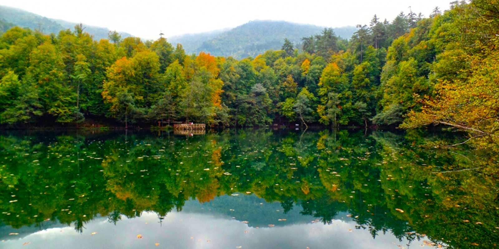

İlk kamp için çok uzaklara gitmeniz gerekmiyor. Hatta ilk gece için evden saatlerce uzaklaşmak, kamp deneyimini güzelleştirmekten çok işleri zorlaştırabilir. Yeni başlayan biri için iyi kamp yeri; ulaşımı anlaşılır, hava koşulları takip edilebilir, gerektiğinde kolayca çıkılabilir ve kamp yapmaya izin verilen yerdir.

Manzara elbette önemli. Fakat ilk kampınızda güzel manzaradan önce geceyi nasıl geçireceğinizi, suyu nereden bulacağınızı ve bir sorun çıktığında ne yapacağınızı düşünün. Doğa size sınav kâğıdı vermez; eksik hazırlığı doğrudan gösterir.

## İlk kamp için kamp alanı mı, doğada kamp mı?

İlk kez çadır kuracaksanız işletmeli bir kamp alanı veya kamp yapmaya izin verilen, temel ihtiyaçlara erişimi olan bir alan başlangıç için daha rahat olabilir. Tuvalet, su, araç yolu, başka kampçılar ve gerektiğinde yardım isteyebileceğiniz bir işletmenin bulunması ilk geceki belirsizliği azaltır.

Doğada, işletme olmayan bir yerde kamp yapmak da mümkündür. Ancak bu durumda kamp yeri, su, tuvalet, ulaşım, hava, ateş ve acil durum planının tamamı size aittir. “Doğada her yer kamp alanıdır” düşüncesi kulağa özgür geliyor ama her güzel düzlükte çadır kurulabileceği anlamına gelmiyor.

Milli park, tabiat parkı, orman ve özel mülklerde kurallar alanın yönetimine ve dönemsel kararlara göre değişebilir. Kamp yapmadan önce alanın resmi duyurusunu, belirlenmiş kamp noktalarını ve ateş kuralları varsa bunları kontrol edin. Bir yerde geçen yıl kamp yapılmış olması bugün de izin verildiği anlamına gelmez.

## Kamp alanı seçerken hangi soruları sormalısınız?

Bir yeri kaydetmeden önce şu soruların cevabını bulmaya çalışın:

- Çadır kurmaya izin var mı, yoksa yalnızca günübirlik kullanım mı mümkün?
- Araçla veya toplu taşımayla ne kadar yaklaşabiliyorum?
- Son bölümde yürümem gerekiyorsa yolu ve mesafeyi biliyor muyum?
- İçme suyu, tuvalet ve çöp imkânı var mı?
- Telefon çekiyor mu, çekmiyorsa en yakın iletişim noktası neresi?
- Yağmurda yol kapanır mı veya araç çıkışı zorlaşır mı?
- Yakında sağlık kuruluşu, jandarma, işletme veya ana yol var mı?
- Çadırı kuracağım zemin düz, kuru ve taşkın riskinden uzak mı?

Bu soruların hepsinin cevabını bulamıyorsanız illa vazgeçmeniz gerekmez. Fakat ilk kamp için belirsizliği azaltan başka bir yer seçmek daha akıllıca olabilir. Macera ile plansızlık aynı şey değil.

## Hava durumunu kamp öncesi nasıl kontrol etmelisiniz?

Kamp yerine karar verirken yalnızca şehir merkezinin hava tahminine bakmayın. Kamp alanının ilçesini, rakımını ve mümkünse tam konumunu ayrıca kontrol edin. Meteoroloji Genel Müdürlüğü’nün saatlik ve beş günlük tahminlerinde yağışın yanında rüzgâr, sıcaklık, nem ve gök gürültüsü ihtimaline de bakın.

Özellikle şu durumlarda planı yeniden değerlendirin:

- Kuvvetli rüzgâr veya fırtına uyarısı varsa
- Gece sıcaklığı ekipmanınızın sınırına yaklaşıyorsa
- Gök gürültülü sağanak, yoğun yağış veya sel ihtimali varsa
- Kar, buz veya çamur nedeniyle ulaşım değişecekse
- Varış saatinde hava kararmış olacaksa

Hava tahmini garanti değildir; karar vermenize yardım eden bir veridir. Gündüz güneşli görünen bir yerde gece rüzgârı çadırı ve uykunuzu tamamen değiştirebilir. İlk kampınızda hava penceresi geniş, ulaşımı kolay ve geri dönüşü mümkün bir plan seçin.

## Çadırı nereye kurmalısınız?

Düz görünen her yer iyi kamp zemini değildir. Su akışının belli olduğu çukurlara, dere yatağına, gevşek kaya altına veya kurumuş dalları üzerinizde duran ağaçların altına çadır kurmayın. Deniz, göl veya dere kenarında manzara güzel olabilir; fakat su seviyesi, rüzgâr ve gece oluşan nemi de hesaba katın.

Zemini kurmadan önce yürüyerek kontrol edin. Sivri taşları ve dalları temizleyin ancak doğayı kazıp biçimlendirmeyin. Çadırın girişini rüzgârı doğrudan karşılamayacak, suyun çadırdan uzağa akacağı ve çevreyi görebileceğiniz bir yöne çevirmek çoğu zaman daha kullanışlıdır.

Çadır seçimi ve zemine sabitleme hakkında daha ayrıntılı bilgi için [çadır alırken nelere dikkat edilmesi gerektiği](/cadir-alirken-nelere-dikkat-edilmeli/) rehberine bakabilirsiniz.

## İlk kamp için ne kadar uzaklaşmalısınız?

İlk kampın başarılı olması için uzaklık değil, yönetilebilirlik önemlidir. Eve yakın bir yerde kamp yapmak daha az havalı görünebilir. Ama hava bozduğunda, bir ekipman eksik çıktığında veya gece çadırda uyuyamayacağınızı anladığınızda eve yakın olmak büyük avantajdır.

İlk gece için gün ışığında ulaşabileceğiniz, yolu önceden görebileceğiniz ve gerektiğinde aynı gün dönebileceğiniz bir yer seçin. Kamp alanına vardığınızda çadırı karanlıkta kurmak zorunda kalmamak için varış saatini planın parçası yapın.

## Kamp planınızı kiminle paylaşmalısınız?

Kampa gitmeden önce bir yakınınıza şu bilgileri bırakın:

- Kamp alanının adı ve konumu
- Gidiş-dönüş güzergâhı
- Kimlerle gittiğiniz
- Ne zaman haber vereceğiniz
- Plan değişirse hangi kanaldan iletişim kuracağınız

Telefonunuzun çekmesi, bu bilgiyi paylaşmanızın yerini tutmaz. Şarjınız bitebilir, cihazınız bozulabilir veya bulunduğunuz yerde sinyal zayıflayabilir. Basit bir rota ekran görüntüsü ve yazılı adres bile işe yarar.

## İlk kamp yeri seçimi nasıl özetlenir?

İlk kampınızı şu sırayla planlayın:

1. Kamp yapmaya izin verilen, ulaşımı kolay bir alan seçin.
2. Alanın resmi kurallarını ve dönemsel yasaklarını kontrol edin.
3. Saatlik hava, rüzgâr ve yağış ihtimalini inceleyin.
4. Su, tuvalet, telefon ve acil çıkış seçeneklerini not edin.
5. Kamp planınızı bir yakınınızla paylaşın.
6. Gündüz varacak, çadırı aydınlıkta kuracak şekilde yola çıkın.

Bu plan sizi bütün sürprizlerden korumaz. Zaten kamp biraz da sürprizlerle tanışmaktır. Fakat ilk gecenizi, bilmediğiniz beş problemi aynı anda çözmeye çalıştığınız bir teste dönüştürmez.

Kamp alanını seçtikten sonra [ilk kamp için gerekli malzemeler](/ilk-kamp-icin-gerekli-malzemeler/) listesini hazırlayabilir, güvenlik tarafını da [doğada kamp yapmak güvenli midir?](/dogada-kamp-yapmak-guvenli-midir/) yazısıyla tamamlayabilirsiniz.

Siz ilk kampınızı nerede yaptınız veya ilk kamp için nasıl bir yer arıyorsunuz? Ulaşım, su, hava ve kamp alanı deneyiminizi yorumlarda paylaşırsanız aynı hazırlığı yapanlara yol gösterir.
