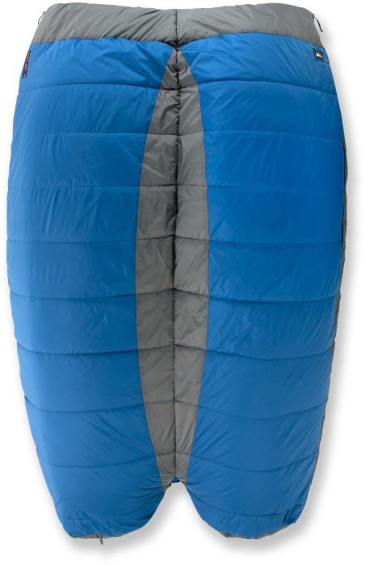

## İKİ KİŞİLİK UYKU TULUMU SENCE NASIL?

Bence güzel. Eşiyle veya sevdiğiyle kampa gidenler için çift kişilik uyku tulumları ilk bakışta çok sempatik geliyor. Aa ne de güzel, çok da mantıklı diyor insan. Zaten kampa hiç ayrı gitmiyoruz düşüncesi de varsa 2 kişilik uyku tulumundan alalım düşüncesi ağır basıyor. Bu noktada ürünün güzelliğine aldanmamak lazım. Artılarını eksiklerini iyice değerlendirmek ve kullanan kişilerden yorum almak doğru karar vermenizde etkili olacaktır. Gelelim benim düşüncelerime;

## TEK KİŞİ KALMAK İÇİN UYGUN MU?

Hayır, uygun değil. Yani bence değil. Çünkü 2 kişilik bir uyku tulumunu alırım tek gittiğim kamplarda da kullanırım diye düşünüyorsanız eksileri var. Tek gittiğiniz kamplarda yer kaplayacaktır ve uyku tulumu sizin için geniş kalacaktır. Uyku tulumunun görevi sizi ısıtmak değildir. Vücut ısınızla ısıttığınız havayı korumaktır. Yani yalıtım uygular. İç hacminin daha geniş olması demek ısıtmanız gereken alanın daha fazla olması anlamına gelir. 2 kişi kaldığınız bir kampta üşümezken aynı şartlarda tek kişi kaldığınız bir kampta üşüyebilirsiniz.

## DAHA GENİŞ VE DAHA RAHAT MI?

İki kişilik uyku tulumları daha geniş ve daha rahat değillerdir. Her kişiye normal uyku tulumundaki kadar alan düşer. Ben iriyim eşim ufak diyorsanız o zaman tabiki de size daha fazla alan düşer. İki kişilik uyku tulumda uyurken sanki yorgan altındaymışsınız gibi düşünürsünüz ve dolayısıyla yanınızdaki kişinin alanını işgal edebilir ve köşeye sıkıştırabilirsiniz. Üstelik hava soğuksa sağdan soldan açık alan daha fazla kalacağından içeriye soğuk girecektir. Boyun kısmını büzüştürmek için ipler var tabiki ama 2 kişi olunca açık yer kalabiliyor.

## KAÇ FARKLI MODEL VAR

2 kişilik uyku tulumlarında 2 farklı model var. Birleştirilebilen ve bütün olan 2 model. Bütün olan yukarıda bahsettiğim özelliklere sahip. Birleştirilebilen uyku tulumlarının tek farkı ise alttaki fotoğraftaki gibi 2 farklı uyku tulumunun fermuarlarının ortaya gelerek birleştirilebilir olması. Birleştirilebilen uyku tulumlarının en büyük artısı kavga ettiğinizde veya soğuk havalarda normal uyku tulumu gibi ayrı bir şekilde kullanabilmenizdir.

### SONUÇ

Sevdiceğinizi çok seviyorsanız ve yazlık kullanım için çift kişilik uyku tulumu arıyorsanız bütünleşik yani tek olan uyku tulumunu tercih edebilirsiniz. Zaman zaman kavga eden bir çiftseniz ve bahar aylarında da kaldığımızda üşümeyelim diyorsanız birleştirilebilen uyku tulumlarından almanızı tavsiye ederim. Birleştirilebilen uyku tulumları aslında 2 ayrı uyku tulumudur. Dolayısıyla daha pahalıdır.

Uyku tulumları hakkında daha fazla bilgi için alttaki linkleri takip edebilirsiniz.

[Uyku Tulumu Seçimi Nasıl Yapılmalıdır?](/uyku-tulumu-alirken-nelere-dikkat-edilmelidir/)

[Kampta Uyku Tulumu Yetersiz Kalırsa Ne Yapılabilir?](/uyku-tulumu-yetersiz-kalirsa-ne-yapilmalidir/)
