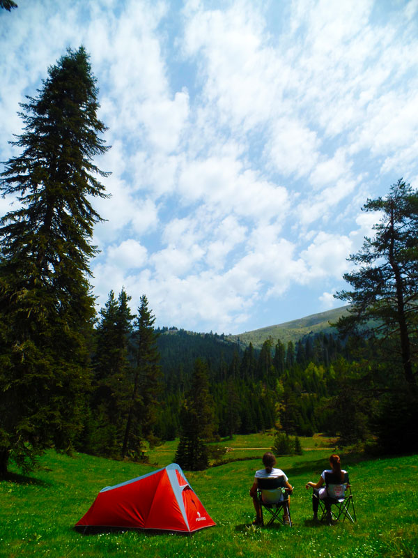
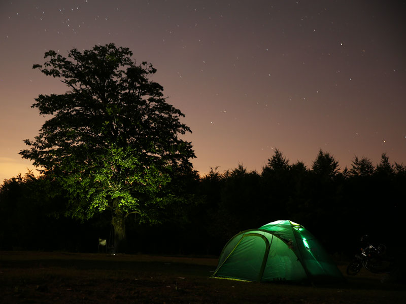

Daha önce bir gece bile doğada geçirmediyseniz çadırda uyumak gözünüzde büyüyebilir. Bu çok normal. İnsan bilmediği şeyi biraz gizemli, biraz da tehlikeli görür. Fakat ilk kampı kolaylaştırmanın yolu kendinizi zorlamak değil, ilk geceyi yönetilebilir hâle getirmektir.

İlk kampınız için ulaşımı kolay, hava koşulları takip edilebilir ve gerektiğinde geri dönülebilir bir yer seçin. Bir gecelik kamp, doğada hayatta kalma yarışması değildir. Çadırınızı kurup yemeğinizi hazırlayacak, geceyi geçirecek ve sabah ekipmanınızı toplayıp döneceksiniz. İlk hedefiniz budur.

## İlk kamp için hangi ekipmanlar gerekir?

Temel düzen aslında basit: çadır, uyku tulumu ve mat. Çadır sizi hava koşullarından ve çevreden ayıran barınaktır. Uyku tulumu vücudunuzun ürettiği ısıyı korumaya yardımcı olur. Mat ise hem zemini daha rahat hâle getirir hem de soğuk zeminden gelen ısı kaybını azaltır.

Fener, ocak, su, yiyecek, kuru kıyafet, ilk yardım ve küçük bir tamir seti de kampın koşullarına göre listenize girer. Hamak, sandalye ve masa ise ilk kampın zorunlu parçaları değildir; taşıma biçiminize ve konfor beklentinize göre eklenir.

İlk kampınız için ayrıntılı ve sade bir listeyi [ilk kamp için gerekli malzemeler](/ilk-kamp-icin-gerekli-malzemeler/) yazısında bulabilirsiniz.

## İlk kampı nasıl planlamalısınız?

İlk kamp için işletmeli bir kamp alanı veya kamp yapmaya izin verilen, temel ihtiyaçlara erişimi olan bir yer seçmek işinizi kolaylaştırabilir. Suya, tuvalete, araç yoluna ve gerektiğinde yardım isteyebileceğiniz bir noktaya yakın olmak ilk geceki belirsizliği azaltır.

İşletmesiz doğa kampında ise kamp yerini, suyu, hava koşullarını, ulaşımı ve acil durum planını siz düşünürsünüz. Bu daha özgür bir deneyimdir ama başlangıç için her zaman daha kolay değildir. [İlk kamp için kamp alanı seçme rehberinde](/ilk-kamp-nerede-yapilir/) bu kararı adım adım ele aldım.

## Doğada kamp yaparken neye dikkat etmelisiniz?

Kamp yapacağınız yerin kurallarını ve dönemsel kısıtlamalarını önceden kontrol edin. Özellikle ateş ve ormana giriş kuralları bölgeye ve mevsime göre değişebilir. İzin verilmeyen yerde çadır kurmayın; izin verilen yerde de yalnızca belirlenmiş alanları kullanın.

Yabani hayvanları romantik bir macera unsuru gibi görmeyin, gereksiz bir korku da üretmeyin. Yiyecekleri ve kokulu malzemeleri düzenli tutun, hayvanları beslemeyin, karşılaşma durumunda yaklaşmayın ve alanın resmi uyarılarını dikkate alın. Doğayla aramızdaki mesafeyi korumak çoğu zaman en iyi güvenlik planıdır.

İlk kampın amacı bütün riskleri yok etmek değil, bilmediğiniz şeyleri azaltmaktır. Hava bozarsa dönebileceğiniz, ekipmanınızı aydınlıkta kurabileceğiniz ve bir yakınınızın konumunuzu bildiği bir planla başlayın. Güvenlik konusunda daha ayrıntılı bilgi için [doğada kamp yapmak güvenli midir?](/dogada-kamp-yapmak-guvenli-midir/) yazısına geçebilirsiniz.

İyi bir ilk kamp, en uzağa gittiğiniz veya en çok eşya taşıdığınız kamp değildir. Sabah uyandığınızda “bunu bir daha yaparım” dedirten kamptır. Gerisi, ekipman ve deneyim arttıkça zaten gelir.

İlk kampınıza hazırlanırken en çok hangi konu gözünüzde büyüyor? Yorumlarda paylaşırsanız serinin sonraki yazılarını ona göre daha faydalı hâle getirebiliriz.
