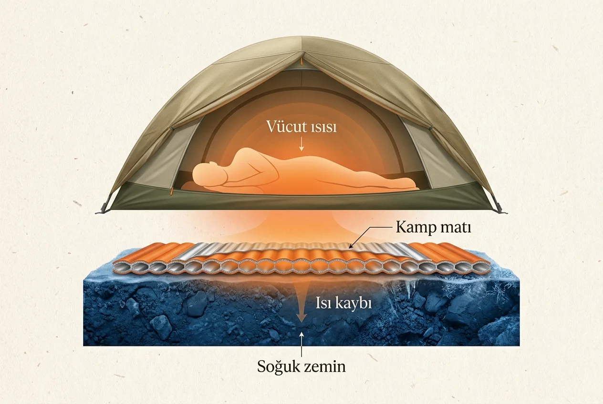
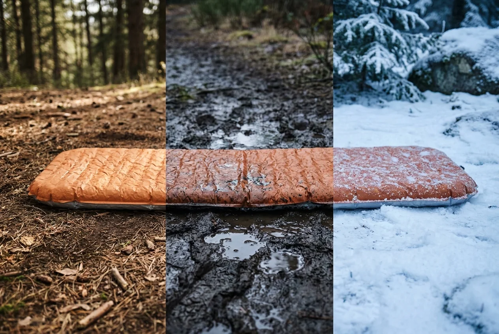
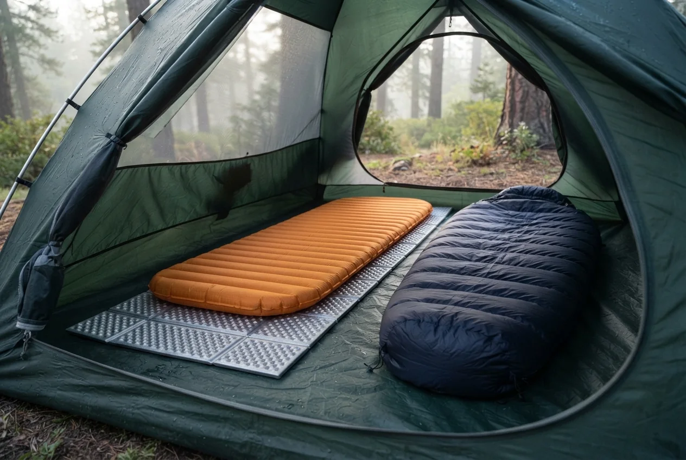
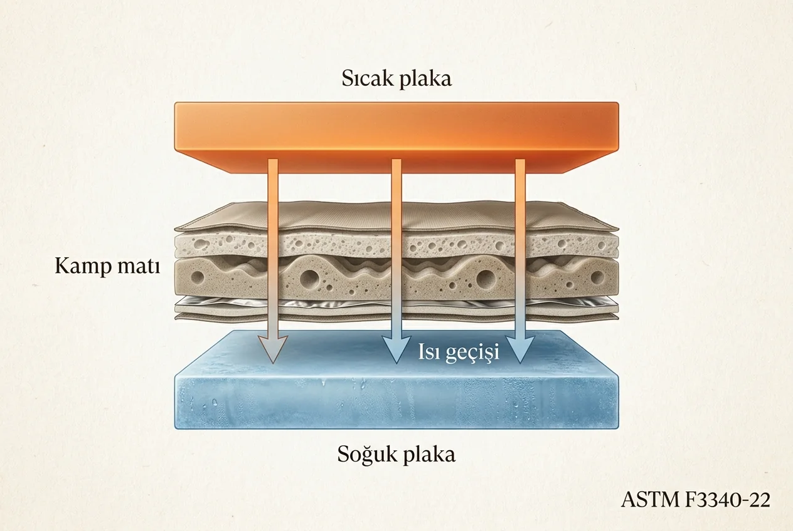

R değeri, bir kamp matının vücudunuzdaki ısının soğuk zemine geçmesine karşı ne kadar direnç gösterdiğini anlatır. Rakam yükseldikçe matın yalıtımı artar. Kısacası yüksek R değeri, zeminle aranızda daha güçlü bir ısı bariyeri olduğu anlamına gelir.

Bu değer bir sıcaklık derecesi değildir. R değeri 4 olan bir mat için doğrudan “şu dereceye kadar kullanılır” diyemeyiz. Hava, zeminin nemi, kullandığınız uyku tulumu, kıyafetleriniz ve soğuğa karşı hassasiyetiniz sonucu değiştirir.

Benim için R değeri önemli bir seçim ölçütü. Kamp matı alırken yalnızca ambalajdaki rakama değil, o rakamın hangi standarda göre test edildiğine de dikkat ederim. Ürünlerini bu kadar ayrıntılı çalışan ve test sonuçlarını açıkça paylaşan firmalara daha fazla güvenirim. Benim görüşüm, bu özeni gösteren firmaların malzeme ve işçilik kalitesinin de genellikle daha iyi olduğu yönünde. Bu da ürünün uzun ömürlü olma ihtimalini artırıyor.

Elbette tek başına yüksek bir R rakamı dayanıklılık garantisi değildir. Yine de test ve şeffaflık, alışveriş yaparken elimizdeki en faydalı işaretlerden biridir.

## R değeri ne işe yarar?

Uyku tulumu ile matın görevleri aynı değildir. Uyku tulumu vücudunuzun çevresindeki sıcak havayı korumaya çalışır. Fakat tulumun altında kalan dolgu, vücut ağırlığıyla sıkışır ve yalıtım gücünün önemli bir bölümünü kaybeder.

Tam bu noktada kamp matı devreye girer. Matın işi yalnızca taşları ve kökleri daha az hissettirmek değildir; soğuk zemine karşı yalıtım sağlamaktır.

*Uyku tulumu ve kamp matı birlikte çalışan bir sistemdir; mat zeminden gelen ısı kaybını azaltır.*

Gece tulumunuzun sıcaklık değeri yeterli göründüğü hâlde özellikle sırtınızda ve kalçanızda soğuk hissediyorsanız sorun tulumdan önce mat olabilir. Üstünüze bir kat daha örtmek bazen işe yarar ama alttan kaybettiğiniz ısı devam ediyorsa asıl açık hâlâ zemindedir.

## Yüksek R değeri matı daha sıcak mı yapar?

Aslında kamp matı kendi başına sıcak değildir. Bulunduğu ortamın sıcaklığına gelir; siz üzerine yattığınızda vücut ısınız sistemi ısıtmaya başlar.

Yüksek R değerli bir mat, bu ısının zemine kaçmasını daha fazla sınırlar. Bu nedenle “mat beni ısıttı” gibi hissedersiniz ama yaptığı iş ısı üretmek değil, ısı kaybını azaltmaktır.

Yüksek R değerli bir matın yazın mutlaka bunaltacağını düşünmeyin. Mat bir ısıtıcı gibi çalışmaz. Bununla birlikte daha yüksek yalıtım sunan modeller bazen daha ağır, daha hacimli veya daha pahalı olabilir. Yaz kampında karar verirken yalnızca R değerine değil; ağırlık, paket hacmi, konfor ve dayanıklılık dengesine de bakmak gerekir.

## Mat R değeri kaç olmalı?

Bu sorunun herkes için geçerli tek bir rakamı yok. Kamp yapacağınız mevsim kadar gece kalacağınız zemini de düşünmelisiniz. Kuru bir yaz kampıyla ıslak toprak, yüksek rakımlı bir yayla veya kar üzerindeki kamp aynı şartları oluşturmaz.

*Aynı mat kuru toprakta, ıslak zeminde ve kar üzerinde aynı konforu vermeyebilir.*

Seçim yaparken şu sırayı kullanabilirsiniz:

1. Kamp noktasında beklediğiniz en düşük gece sıcaklığını araştırın.
2. Zeminin kuru, ıslak, donmuş veya karla kaplı olma ihtimalini hesaba katın.
3. Kullandığınız uyku tulumunun konfor derecesini değerlendirin.
4. Soğuğa karşı kişisel hassasiyetinizi unutmayın.
5. Üreticinin kullanım önerisini ve test yöntemini kontrol edin.
6. Sınırda kalan bir değer yerine makul bir güvenlik payı bırakın.

R değerini tek başına mevsim etiketi gibi okumak yanıltıcı olabilir. Aynı “üç mevsim” ifadesi farklı markalarda ve farklı coğrafyalarda başka şartları anlatabilir. Sayıyı kullanım koşullarıyla birlikte değerlendirmek daha sağlıklıdır.

## İki mat üst üste kullanılırsa R değerleri toplanır mı?

Evet, iki mat birlikte kullanıldığında yalıtım değerleri yaklaşık olarak birbirine eklenir. Örneğin R değeri 3 olan bir şişme matın altına R değeri 2 olan köpük mat koyduğunuzda yaklaşık R 5 seviyesinde bir uyku yüzeyi elde edersiniz.

*Şişme matın altındaki köpük mat hem yalıtımı destekler hem de zemine karşı ek koruma sağlar.*

Bu yöntem özellikle soğuk havada mevcut sistemi güçlendirmek için kullanışlıdır. Alttaki köpük mat aynı zamanda şişme matı sivri taşlardan ve zemindeki küçük pürüzlerden koruyabilir.

Yine de bu toplama işlemini laboratuvar sonucu kadar kesin görmeyin. Matların birbirine oturması, kayması, şişme basıncı ve gece boyunca hareket etmeniz gerçek performansı etkileyebilir.

## R değeri nasıl test edilir?

Kamp matları için güncel ve karşılaştırılabilir test yöntemi `ASTM F3340-22` standardıdır. Test sırasında mat, sıcak ve soğuk iki plaka arasına belirli bir basınçla yerleştirilir. Sıcak taraftan soğuk tarafa geçen enerji ölçülür ve matın ısı geçişine karşı gösterdiği direnç hesaplanır.

*Standart laboratuvar testi, sıcak taraftan soğuk tarafa geçen ısıyı ölçerek matları karşılaştırılabilir hâle getirir.*

Kulağa biraz laboratuvar işi geliyor; çünkü öyle. Fakat kullanıcı açısından faydası oldukça basit: Aynı yönteme göre test edilen iki matın R değerlerini daha anlamlı biçimde karşılaştırabilirsiniz.

Burada sık karışan bir noktayı da ayıralım. Kamp matlarının R değeri için kullanılan standart ASTM F3340'tır. `ISO 23537-1:2022` ise yetişkin uyku tulumlarının sıcaklık performansı, ölçüleri ve etiketlenmesiyle ilgilidir. Yani iyi bir uyku sistemi kurarken matta ASTM testini, uyku tulumunda ise ISO sıcaklık değerlerini aramak daha doğru olur.

## Laboratuvar sonucu gerçek kampta aynen çıkar mı?

Hayır. Standart test bize tekrarlanabilir bir karşılaştırma sağlar; arazide yaşayacağınız geceyi birebir garanti etmez.

Gerçek kullanımda sonucu değiştiren başlıca ayrıntılar şunlardır:

* Islak veya nemli zemin, kuru zemine göre ısıyı daha hızlı taşıyabilir.
* Şişme matın içindeki havanın fazla hareket etmesi ısı kaybını artırabilir.
* Matın yeterince dengeli olmaması, vücudun bazı bölgelerinin daha çok çökmesine yol açabilir.
* Uyku pozisyonunuz ve gece boyunca hareket etmeniz basınç dağılımını değiştirir.
* Matın kenarlarından ve açıkta kalan bölgelerden ek ısı kaybı olabilir.
* Uyku tulumu, kıyafet, yorgunluk ve kişisel metabolizma hissedeceğiniz konforu etkiler.

Bu nedenle mağazada şişme matı yalnızca yumuşak mı diye kontrol etmeyin. Üzerine uzanıp sağa sola döndüğünüzde ne kadar dengeli kaldığına da bakın. Kâğıt üzerinde güzel duran mat, siz her döndüğünüzde küçük bir deniz yatağı gibi dalgalanıyorsa gece performansı aynı ölçüde güzel olmayabilir.

## R değeri gerçekten test edilmiş mi, nasıl anlaşılır?

Ürün sayfasında yalnızca büyük bir R rakamı görmek yeterli değildir. Şu bilgileri arayın:

* R değerinin `ASTM F3340` standardına göre ölçüldüğü açıkça yazıyor mu?
* Testin üretici tarafından mı, bağımsız bir laboratuvar tarafından mı yapıldığı belirtilmiş mi?
* Marka test yöntemi ve sonuçları konusunda anlaşılır bilgi veriyor mu?
* Aynı modelin farklı kalınlık ve boy seçeneklerinde değer değişiyorsa bunlar ayrı ayrı açıklanmış mı?
* Ürünün ağırlığı, kumaşı, tamir imkânı ve garanti şartları da açık mı?

Bazı ürünlerde “test edilmiş R değeri” yerine yalnızca tahmini veya üretici tarafından beyan edilen bir sayı bulunabilir. Böyle bir değeri, ASTM standardıyla ölçülmüş başka bir ürünle doğrudan karşılaştırmak sağlıklı değildir.

Ben ayrıntılı teknik bilgi veren markalara bu yüzden önem veriyorum. Bir firma ürününün sınırlarını, testini ve bakımını açıkça anlatıyorsa yalnızca güzel bir pazarlama cümlesi kurmuyor; yaptığı işe ne kadar hâkim olduğunu da gösteriyor.

## Kamp matı seçerken yalnızca R değerine bakmak yeterli mi?

Hayır. R değeri yalıtımı karşılaştırmak için güçlü bir ölçüdür fakat matın tamamını anlatmaz.

İyi bir kamp matında şunları birlikte değerlendirin:

* Kullanacağınız koşula uygun, test edilmiş R değeri
* Uyku pozisyonunuza uygun kalınlık ve genişlik
* Üzerinde dönerken dengeli kalan yapı
* Taşıyabileceğiniz ağırlık ve paket hacmi
* Kumaşın dayanıklılığı
* Arazide tamir edilebilme imkânı
* Valf ve dikiş kalitesi
* Garanti ve yedek parça desteği

Mat ne kadar iyi olursa olsun, uyku tulumu yetersizse gece yine rahat geçmez. Aynı şekilde çok iyi bir tulum da zemine karşı zayıf kalan matın açığını tamamen kapatamaz. Bu ikisini ayrı ürünler değil, tek bir uyku sistemi olarak düşünmek gerekir.

Uyku sisteminin diğer yarısını doğru kurmak için [uyku tulumu nasıl kullanılır?](/uyku-tulumu-nasil-kullanilir/) rehberine, yeni bir tulum arıyorsanız [uyku tulumu alırken dikkat edilmesi gerekenlere](/uyku-tulumu-alirken-nelere-dikkat-edilmelidir/) de bakabilirsiniz.

## R değeri hakkında akılda ne kalmalı?

Kısa özeti şöyle:

* R değeri yükseldikçe matın zemine karşı yalıtımı artar.
* R değeri doğrudan bir sıcaklık derecesi değildir.
* Kamp matlarında karşılaştırılabilir test için ASTM F3340 standardını arayın.
* Uyku tulumlarındaki ISO sıcaklık testiyle matın ASTM R değeri aynı şey değildir.
* İki matın R değerleri birlikte kullanıldığında yaklaşık olarak toplanabilir.
* Laboratuvar değeri önemlidir fakat nem, zemin, matın dengesi ve kişisel şartlar gerçek sonucu değiştirir.
* R değerini konfor, ağırlık, dayanıklılık ve tamir edilebilirlikle birlikte değerlendirin.

Benim için iyi ekipman yalnızca iyi görünen ekipman değildir. Değerleri ölçülmüş, sınırları dürüstçe anlatılmış ve yıllarca kullanılabilecek kadar özenli üretilmiş ekipmandır.

Siz kullandığınız matın marka ve modelini, R değerini, gece sıcaklığını ve zemin şartlarını yorumlarda paylaşır mısınız? Böylece aynı matı araştıranlar yalnızca etiketteki rakamı değil, gerçek kullanım tecrübesini de görebilir.
