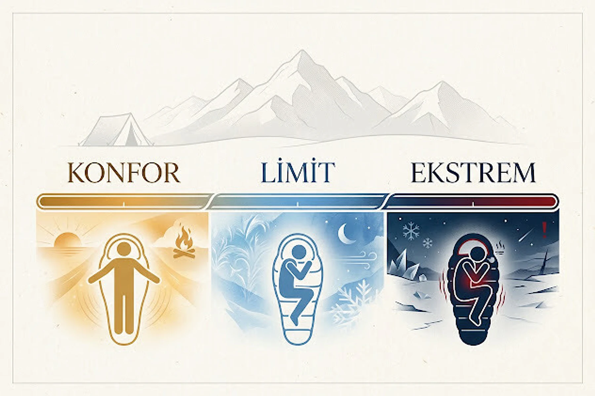
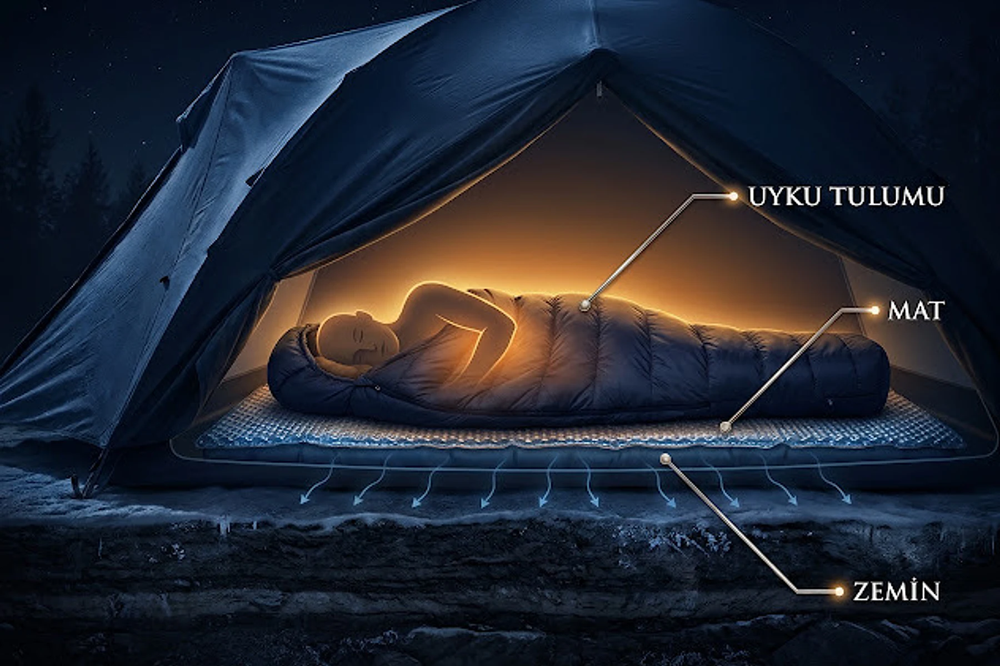
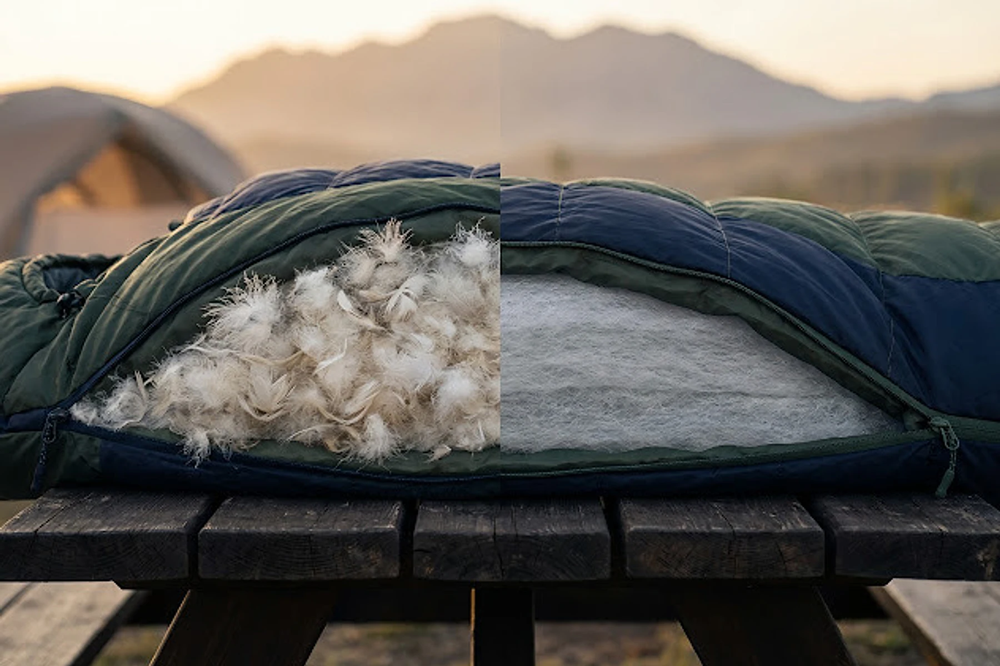
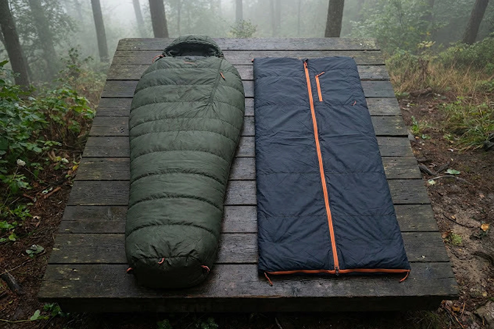
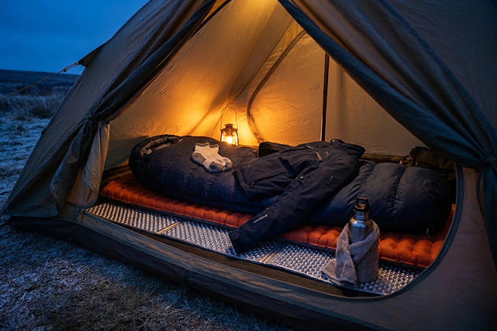

Uyku tulumu sizi kendi başına ısıtmaz. Vücudunuzun ürettiği sıcak havayı içeride tutarak dışarıya olan ısı kaybını azaltır. Bu nedenle tulumun üzerinde yazan derece kadar kullandığınız mat, giydiğiniz kıyafetler, tulumun bedeninize uyumu ve o geceki hava şartları da önemlidir.

En kısa cevap şu: Beklediğiniz en düşük gece sıcaklığına uygun konfor derecesi bulunan bir tulum kullanın, zeminden iyi yalıtılın ve tulumun içine kuru kıyafetlerle girin. Ekstrem dereceyi ise satın alma veya kullanım hedefi olarak görmeyin.

Uyku tulumunu henüz almadıysanız önce [uyku tulumu seçerken dikkat edilmesi gerekenler](/uyku-tulumu-alirken-nelere-dikkat-edilmelidir/) yazısına bakabilirsiniz. Kamp için hazırladığınız uyku sistemini diğer malzemelerle birlikte değerlendirmek isterseniz [doğa yürüyüşleri için gerekli ekipmanlar](/doga-yuruyusleri-icin-gerekli-ekipmanlar/) listesi de işinize yarayacaktır.

## Uyku tulumundaki konfor, limit ve ekstrem dereceleri ne demek?

Kaliteli uyku tulumlarının etiketinde genellikle konfor, limit ve ekstrem olmak üzere üç sıcaklık değeri bulunur.

### Konfor derecesi

Rahat bir pozisyonda, belirgin biçimde üşümeden uyumanız beklenen en düşük sıcaklığı gösterir. Soğuğa karşı hassassanız veya ilk defa serin havada kamp yapacaksanız temel almanız gereken değer budur.

### Limit derecesi

Vücudunuzu kıvırarak ve soğuğu hissetmeye başlayarak uyuyabileceğiniz alt sınırı ifade eder. Tulum bu sıcaklıkta hâlâ iş görür fakat iyi bir gece uykusu garanti etmez.

Konfor ile limit arasında teknik olarak uyuyabilirsiniz ama gecenin bir bölümünü “Ben buraya neden geldim arkadaş?” diye düşünerek geçirmeniz mümkündür.

### Ekstrem derece

Bir konfor değeri değildir. Acil durumda hayatta kalmaya yönelik teorik alt sınırı gösterir. Bu sıcaklıkta donma ve hipotermi riski vardır.

Uyku tulumunun üzerinde `ekstrem -15°C` yazması, o tulumla -15°C’de keyifle uyuyabileceğiniz anlamına gelmez. Alışveriş yaparken büyük puntolarla yazılan ekstrem rakama değil, konfor ve limit değerlerine bakın.

Günümüzde yetişkin uyku tulumlarının karşılaştırılmasında [ISO 23537-1:2022 standardı](https://www.iso.org/standard/82789.html) kullanılıyor. Yine de laboratuvar sonucu bir garanti değildir. Metabolizma, yorgunluk, nem, rüzgâr, kıyafet ve mat gerçek hayattaki sonucu değiştirir.

*Ekstrem değer rahat uyku için değil, acil durum sınırını göstermek için kullanılır.*

## Uyku tulumunun mevsim değeri yeterli bilgi verir mi?

Uyku tulumları bazen bir, iki, üç veya dört mevsim olarak sınıflandırılır. Bu sistem ilk eleme için kullanışlıdır:

* Bir mevsim tulumlar sıcak yaz geceleri ve kapalı alanlar için uygundur.
* İki mevsim tulumlar ilkbahar sonundan sonbahar başına kadar kullanılabilir.
* Üç mevsim tulumlar serin geceler ve hafif sıfır altı koşullar için tasarlanır.
* Dört mevsim tulumlar kış şartlarına yöneliktir.
* Dört mevsim üzeri ürünler çok daha ağır kış ve ekspedisyon koşullarını hedefler.

Fakat markaların mevsim tanımları değişebilir. İngiltere’deki yaz ile Norveç’teki yaz aynı yaz değildir. Bu nedenle mevsim sayısını tek başına yeterli görmeyin; mümkünse standartla test edilmiş sıcaklık değerlerini inceleyin.

## Hava 5 dereceyse konforu 3 derece olan tulumda rahat uyur muyum?

Kâğıt üzerinde büyük ihtimalle evet. Gerçek hayatta ise tulum dereceleri basit toplama çıkarma hesabıyla çalışmıyor.

Şehir merkezindeki hava tahminiyle kamp kuracağınız yaylanın sıcaklığı aynı olmayabilir. Planlama yaparken her 150 metre yükselişte sıcaklığın yaklaşık 1°C düşebileceğini kaba bir tahmin olarak kullanabilirsiniz. Fakat rüzgâr, vadi yapısı, nem ve sıcaklık terselmesi bu hesabı değiştirebilir. Mümkünse doğrudan kamp noktasının tahminine bakın.

Benim kullandığım tulumlardan birinin konfor sıcaklığı yaklaşık 2–3°C civarındaydı. Havanın yaklaşık 15°C olduğu bir gecede fermuarını kapatıp içine girmek mümkün değildi; tulumu battaniye gibi üzerime alarak uyudum. Daha serin başka bir gecede ise bel bölgemde hafif soğuk hissettim. Motosiklet montumu tulumun üzerine örterek o bölgedeki ısı kaybını azalttım.

Yani gereğinden sıcak tulum da her koşulda avantaj değildir. Yaz gecesinde kışlık tulumun içinde uyumaya çalışırsanız bu defa soğukla değil, kendi küçük hamamınızla mücadele edersiniz.

## Uyku tulumu tek başına yeterli mi?

Hayır. Uyku tulumu, mat ve kuru uyku kıyafetleri birlikte çalışan bir sistemdir.

Vücut ağırlığınız tulumun altındaki dolguyu sıkıştırır. Sıkışan dolgu yeterince hava tutamadığı için alt taraftaki yalıtım azalır. Bu nedenle sizi soğuk zeminden asıl koruyan parça mattır.

Matlarda kullanılan `R` değeri, malzemenin ısı kaybına karşı gösterdiği direnci anlatır. Değer yükseldikçe matın zemine karşı yalıtımı artar. Farklı markaları karşılaştırırken mümkünse [ASTM standardıyla ölçülmüş R değerlerini](https://support.seatosummit.com/hc/en-us/articles/42006301575828-What-is-an-R-Value-Are-R-Values-tested-and-does-this-matter) kullanın.

Bütçe sınırlıysa kapalı hücreli, askeri tip köpük matlar işe yarar. Hafiftirler, delinmezler ve iyi bir temel yalıtım sağlarlar. Tek kusurları konfor konusunda pek cömert olmamalarıdır. İki üç gece idare edersiniz ama sabah kalktığınızda zeminle aranızdaki husumet devam ediyor olabilir.

Soğuk havalarda iki mat üst üste de kullanılabilir. R değerleri ölçülmüş matlar birlikte kullanıldığında yalıtım değerleri yaklaşık olarak birbirine eklenir.

*İyi bir uyku sistemi yalnızca tulumdan oluşmaz; zeminden gelen ısı kaybını mat azaltır.*

## Kaz tüyü mü sentetik uyku tulumu mu daha kullanışlı?

İki dolgu türünün de güçlü ve zayıf tarafları var. Doğru seçim, kullanım biçiminize bağlıdır.

### Kaz tüyü dolgu

Kaz veya ördek tüyünün arasındaki hava boşlukları iyi yalıtım sağlar. Kaz tüyü tulumlar genellikle aynı sıcaklık seviyesindeki sentetik modellere göre daha hafif ve daha küçük paketlenebilir.

Kaz tüyü ıslandığında kümelenerek hacmini kaybedebilir. Bu da yalıtım performansını ciddi biçimde düşürür. Ayrıca kaliteli kaz tüyü tulumlar daha pahalıdır ve yıkama ile kurutma sırasında daha dikkatli bakım ister.

Hayvansal dolgu kullanmak istemiyorsanız veya tüyün nasıl elde edildiği konusunda kaygınız varsa sentetik seçeneklere yönelebilirsiniz. Kaz tüyü tercih edecekseniz ürünün sorumlu tedarik sertifikalarını da inceleyin.

### Sentetik dolgu

Sentetik tulumlar genellikle daha uygun fiyatlıdır. Nemli koşulları kaz tüyüne göre daha iyi tolere eder ve daha kolay kurur.

Buna karşılık aynı sıcaklık performansı için daha ağır ve hacimli olabilirler. Sırt çantasıyla uzun yürüyüş yapmayacaksanız bu fark çok önemli olmayabilir.

Araçla kamp yaparken biraz daha büyük paket taşımak sorun değildir. Günlerce bütün evinizi sırtınızda taşıyacaksanız ağırlık ve paket hacmi bir anda çok daha önemli hâle gelir.

*Dolgu seçimini yalnızca sıcaklığa göre değil; nem, ağırlık, hacim, bakım ve bütçeye göre yapın.*

## Uyku tulumunun dış kumaşı önemli mi?

Dış kumaş dolguyu aşınma, kir ve hafif nemden korur. Ripstop adı verilen dokular küçük bir yırtığın büyümesini yavaşlatacak şekilde üretilir.

Bazı tulumların dış yüzeyinde DWR olarak adlandırılan su itici bir kaplama bulunur. Bu kaplama yoğuşma veya hafif nem karşısında yardımcı olabilir fakat tulumu su geçirmez yapmaz.

Uyku tulumunu yağmur altında dışarıda bırakıp “Üzerinde DWR yazıyordu” demek pek işe yaramaz. Özellikle kaz tüyü tulumu taşırken su geçirmeyen ayrı bir torba veya çanta astarı kullanmak daha güvenlidir.

İç kumaşın ise teninize rahat gelmesi ve nemi yönetebilmesi önemlidir. Pamuk karışımlı iç yüzeyler yumuşak olabilir ancak daha ağırdır ve ıslandığında geç kurur. Teknik kullanımda hafif sentetik kumaşlar daha pratiktir.

## Mumya tipi mi dikdörtgen uyku tulumu mu?

Dikdörtgen tulumlar geniş ve rahattır. Fermuarı tamamen açıldığında battaniye gibi kullanılabilir. Araçla yapılan yaz kamplarında veya kapalı alanlarda güzel iş görür.

Fakat içeride ısıtmanız gereken alan daha fazladır. Daha ağır ve hacimli olmaları da yürüyüş sırasında dezavantaj yaratır.

Mumya tipi tulumlar omuzlardan ayaklara doğru daralır. Başlık, boyun büzgüsü ve daha küçük iç hacim sayesinde soğuk havada ısıyı daha verimli korur. Karşılığında hareket alanınız azalır.

Boyunuza uygun ölçüyü seçmek de önemlidir. Gereğinden uzun ve geniş tulumda daha fazla hava hacmi ısıtırsınız. Fazla dar tulumda ise vücudunuz dolguyu dışarı doğru sıkıştırarak yalıtımı azaltabilir.

İki kişi için tulum düşünüyorsanız [çift kişilik uyku tulumlarının avantaj ve dezavantajlarını](/iki-kisilik-uyku-tulumu-hakkinda/) ayrıca değerlendirebilirsiniz.

*Mumya tipi tulumlar ısı verimliliğine, dikdörtgen modeller ise hareket alanına öncelik verir.*

## Uyku tulumunun içinde ne giyilmeli?

Uyku tulumuna tamamen çıplak veya yalnızca ince pijamayla girilmesi gerektiği sık tekrarlanan bir inanış. Aslında kuru ve uygun kıyafetler sıcak kalmanıza yardımcı olabilir.

Benim tercih edeceğim temel düzen şöyle olur:

* Kuru bir içlik veya rahat uyku kıyafeti
* Kuru çorap
* Gerekiyorsa ince bir bere
* Kan dolaşımını engellemeyen, bol olmayan katmanlar

Gün boyunca yürüdüğünüz terli kıyafetlerle tuluma girmeyin. Nem hem sizi soğutur hem de zamanla tulumun içini kirletir.

Öte yandan bütün montları üst üste giyip tuluma zorla girmek de iyi fikir değildir. Çok hacimli kıyafet tulumun dolgusunu sıkıştırabilir, hareketinizi kısıtlayabilir ve terlemenize neden olabilir.

Kısacası amaç mümkün olduğunca az veya çok giyinmek değil; kuru kalmak ve tulumun yalıtımını ezmemektir.

## Uyku tulumunda üşürsem ne yapabilirim?

Önce sorunun nereden geldiğini anlamaya çalışın. Sırtınız ve kalçanız soğuksa sorun büyük ihtimalle mattadır. Boyun ve omuz çevresi soğuksa başlığı, boyun büzgüsünü ve fermuar arkasındaki rüzgâr şeridini kontrol edin.

Şunları deneyebilirsiniz:

1. Nemli kıyafetlerinizi kuru katmanlarla değiştirin.
2. Başınıza ince bir bere takın.
3. Tulumun başlık ve boyun ayarlarını kapatın fakat nefesinizi tulumun içine vermeyin.
4. Tulumun altına ikinci bir köpük mat ekleyin.
5. Montunuzu tulumun üzerine, soğuk hissettiğiniz bölgeye örtün.
6. Uyumadan önce terletmeyecek kadar hafif hareket edin.
7. Sıcak sıvı tüketin ve aç yatmayın.
8. Sıcak suya uygun, sızdırmaz bir matarayı doldurup havluya sararak tulumun içine alın.

Tek kullanımlık yapışkan ısıtıcıları geçmişte ben de ayak ve bel tarafında kullandım. Fakat birçok standart ürünün ambalajında uyurken kullanılmaması ve doğrudan tenle temas ettirilmemesi gerektiği yazıyor. Uzun süreli temas düşük sıcaklık yanığına neden olabilir. Yalnızca üreticisi tarafından uyku sırasında kullanıma uygun olduğu açıkça belirtilen ürünleri talimatına göre kullanın.

Tek kullanımlık PET şişeye kaynar su doldurmak yerine sıcak sıvıya uygun, kapağı güvenilir bir matara kullanın. Tulumun içinde açılan bir şişe yalnızca sizi ıslatmaz; gecenin geri kalanını da ciddi biçimde soğutabilir.

*Ek yalıtımı önce zeminde, ardından ısı kaybettiğiniz bölgelerde güçlendirin.*

Titreme kontrol edilemez hâle geliyor, konuşma bozuluyor, hareketlerde beceriksizlik veya kafa karışıklığı başlıyorsa mesele artık konfor değildir. Bunlar [hipotermi belirtisi](https://www.nhs.uk/conditions/hypothermia/) olabilir. Soğuk ortamdan çıkın ve acil yardım isteyin.

## Uyku tulumu astarı gerekli mi?

Uyku tulumu astarı tulumun içini terden ve kirden korur. Tuluma göre daha kolay yıkandığı için özellikle uzun yolculuklarda kullanışlıdır.

Pamuklu astarlar uygun fiyatlı ve rahat olabilir fakat ağırdır, büyük paketlenir ve nemliyken geç kurur. İpek veya hafif sentetik astarlar daha küçük paketlenir. Polar astarlar ise daha sıcak olabilir fakat ağır ve hacimlidir.

Bazı ürünlerin belirli sayıda derece sıcaklık eklediği iddia edilir. Buna kesin bir sonuç gibi güvenmeyin. Astarın sağlayacağı katkı tuluma, mata, kıyafete ve kişinin metabolizmasına göre değişir.

Astar, kışlık tulumun yerine geçmez. Elinizdeki sistemin esnekliğini biraz artırır.

## Uyku tulumu nasıl yıkanır ve saklanır?

Her kamptan sonra tulumu hemen yıkamanız gerekmez. Önce tamamen açın, havalandırın ve nemliyse kurutun. Küçük kirleri bölgesel olarak temizlemek çoğu zaman yeterlidir.

Yıkamanız gerekiyorsa:

* Üreticinin bakım etiketini okuyun.
* Dolgu türüne uygun temizleyici kullanın.
* Ağartıcı ve yumuşatıcı kullanmayın.
* Kaz tüyü tulumu kaldırmadan önce tamamen kuruduğundan emin olun.
* Kurutma makinesi kullanacaksanız ürünün izin verdiği düşük sıcaklığı seçin.
* Islak tulumu tek bir köşesinden kaldırmayın; ağırlaşan dolgu dikişlere zarar verebilir.

Tulumun taşıma torbası yolculuk içindir. Eve döndüğünüzde tulumu aylarca sıkıştırılmış hâlde bırakmayın. Büyük, nefes alabilen bir saklama torbasına gevşek biçimde koyun veya uygun bir yerde asın.

Dolgunun içindeki hava boşlukları tulumun yalıtımını sağlar. Tulum sürekli sıkışık kalırsa zamanla eski hacmine dönme yeteneğini kaybedebilir.

## Uyku tulumundan iyi verim almanın özeti nedir?

Etiketteki tek bir rakama güvenmek yerine bütün uyku sistemini değerlendirin:

* Beklenen en düşük sıcaklık için konfor değerini esas alın.
* Ekstrem değeri kullanım hedefi olarak görmeyin.
* Zemine uygun R değerine sahip bir mat kullanın.
* Tulumun içine kuru ve rahat kıyafetlerle girin.
* Mumya veya dikdörtgen kesimi kullanım amacınıza göre seçin.
* Islanma ihtimaline göre kaz tüyü veya sentetik dolgu tercih edin.
* Tulumunuzu kuru, temiz ve sıkıştırılmamış hâlde saklayın.

İyi bir uyku tulumu soğuk havayı ortadan kaldırmaz. Sabah dinlenmiş biçimde çadırdan çıkabilmenizi sağlar.

Siz hangi uyku tulumunu, kaç derece sıcaklıkta ve nasıl bir mat üzerinde kullandınız? Konfor değeriyle gerçek deneyiminiz birbirini tuttu mu? Marka, model, gece sıcaklığı ve mat bilgisiyle yorumlara yazarsanız yeni tulum arayanlara gerçekten faydalı bir karşılaştırma bırakmış olursunuz.
