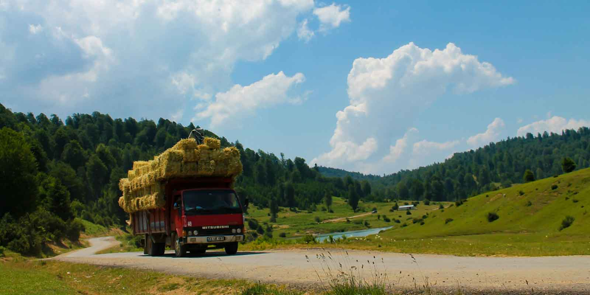
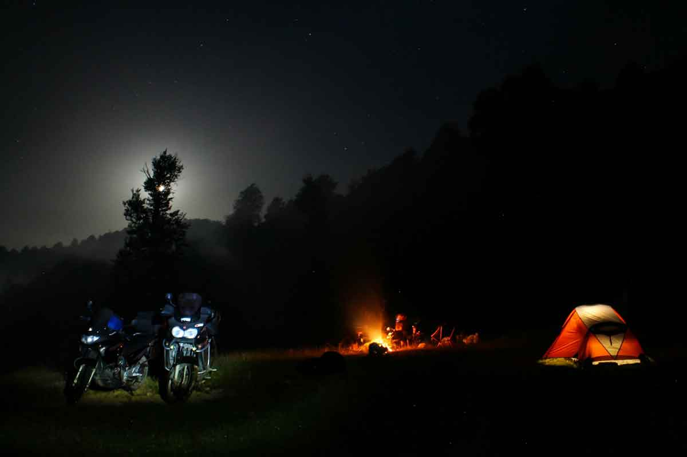
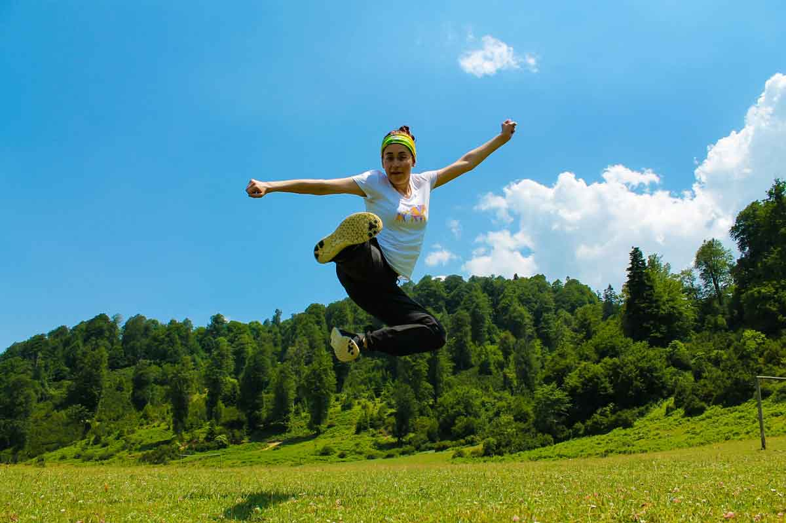

Acelle Yaylası'na ulaşım, kamp alanı imkânları ve farklı uzunluklardaki yürüyüş rotalarını bu rehberde bulabilirsiniz. Saha bilgileri 2016 gözlemlerime dayanıyor.

## Hızlı özet

- **Bölge:** Sakarya, Taraklı–Akyazı çevresi
- **Kamp:** İşletmesiz, göl ve yayla çevresindeki uygun düzlükler
- **Rotalar:** 13 km, 24 km ve 28 km seçenekleri
- **Saha gözlemi:** Temmuz 2016

> **Güncellik notu:** Yol, tesis, tuvalet, çeşme ve kamp kuralları değişmiş olabilir. Hareket etmeden önce hava durumunu, yol durumunu ve yerel kısıtlamaları doğrulayın.

Sakarya’nın Taraklı bölgesinde yer alan ama Akyazı üzerinden daha kolay ulaşılan Acelle yaylası belki de Türkiye’nin en büyük yaylasıdır. Kesin bilgim yok ama çok kalabalık bir yayla olduğunu söyleyebilirim. Bunu bir eksi olarak görmeyin. Oldukça güzel bir doğası var. Etrafında bir çok yayla olması da trekking parkurları oluşmasına neden olmuş. 

## Acelle Yaylası nerede ve nasıl gidilir?

İstanbul’dan Tem otoyolu üzerinden gelirken Adapazarı’nı geçtikten sonra Akyazı yönüne doğru devam edeceksiniz. Kuzuluk’ta bulunan İhlas Kuzuluk Kaplıca Evlerini geçtikten sonra Beldibi köyüne geleceksiniz. Asfalt yolu takip ederek Hanyatak üzerinden Acelle yaylasına ulaşacaksınız.

<iframe
  class='mappingFrame'
  src='https://www.google.com/maps/embed?pb=!1m24!1m12!1m3!1d170952.7828453397!2d30.391486681922625!3d40.58173205227702!2m3!1f0!2f0!3f0!3m2!1i1024!2i768!4f13.1!4m9!3e0!4m3!3m2!1d40.719545499999995!2d30.471758899999998!4m3!3m2!1d40.5182643!2d30.625968099999998!5e1!3m2!1str!2str!4v1468354089111'
  width='300'
  height='150'
  allowfullscreen='allowfullscreen'
></iframe>

 

## Acelle Yaylası kamp alanı bilgileri

### Olanlar

- Gölün etrafındaki düzlük alanlara veya çok kalabalıksa yaylanın olduğu taraflarda çadırınızı kurabilirsiniz.
- Aracınızı göl kenarındaki geniş alanlara veya yol kenarına bırakabilirsiniz.
- Kamp yeri için özel bir tesis yok. Gölge düz bir alan bulmak zor. Ağaçların olduğu yerler genellikle yamaç olduğundan çadır kurulamıyor.
- Çeşme ve tuvalet var. Özel bir işletme olmadığından tuvaletin çok temiz olmasını beklemeyin.
- Kamp eksiklerinizi Akyazı’da bulunan market ve diğer iş yerlerinden karşılayabilirsiniz.
- Yaylada köy bakkalı var. Temel ihtiyaçlarınızı bulabilirsiniz. Ancak köy yeri olduğundan dolayı her zaman açık olmayabiliyor. Yani adam dükkanı kapayıp çilek toplamaya çıkmış olabilir :)
- Haziran sonu Temmuz’un ilk haftası giderseniz yamaçlarda dağ çileği toplayabilirsiniz.
- Köyde cami var.

### Olmayanlar

- Market
- Restoran
- Otel, Pansiyon

Not: Bu bilgiler Temmuz 2016 yılına aittir.

## Acelle Yaylası yürüyüş rotaları

### 7 yayla 5 gölet turu (28 km)

<iframe
  frameBorder='0'
  scrolling='no'
  src='https://tr.wikiloc.com/wikiloc/spatialArtifacts.do?event=view&id=7242837&measures=on&title=on&near=off&images=on&maptype=H'
  width='100%'
  height='600'
  style={{ borderRadius: '10px 10px' }}
></iframe>

- Zor olmayan ve güzel manzaralarla dolu bir parkur.
- Parkur yaylalardan geçtiğinden dolayı su sıkıntısı yok.
- 1 günde 28km yürümek yorucu olabilir. Kamp atarak yürüyebilirsiniz.
- Parkurun bir bölümü yollardan bir bölümü ise orman içinden devam etmektedir.

### Karagöl Yaylası'ndan Acelle Yaylası'na ve geri dönüş (24 km)

<iframe
  frameBorder='0'
  scrolling='no'
  src='https://tr.wikiloc.com/wikiloc/spatialArtifacts.do?event=view&id=695734&measures=on&title=on&near=off&images=on&maptype=H'
  width='100%'
  height='600'
  style={{ borderRadius: '10px 10px' }}
></iframe>

- Zor olmayan ve güzel manzaralarla dolu bir parkur.
- Parkur yaylalardan geçtiğinden dolayı su sıkıntısı yok.
- Kamp atarak yürüyebilirsiniz.
- Kışın yürünebilecek bir parkur.
- Parkurun bir bölümü yollardan bir bölümü ise orman içinden devam etmektedir.

### Karagöl Yaylası'ndan Çardacık ve Acelle yaylalarına (13 km)

<iframe
  frameBorder='0'
  scrolling='no'
  src='https://tr.wikiloc.com/wikiloc/spatialArtifacts.do?event=view&id=12569075&measures=on&title=on&near=off&images=on&maptype=H'
  width='100%'
  height='600'
  style={{ borderRadius: '10px 10px' }}
></iframe>

- Zor olmayan ve güzel manzaralarla dolu bir parkur.
- Parkur yaylalardan geçtiğinden dolayı su sıkıntısı yok.
- Kış veya yağmur sonrası Karagöl yaylasında oluşan su çukurları görülmeye değer.
- Parkurun bir bölümü yollardan bir bölümü ise orman içinden devam etmektedir.

## Yakındaki kamp ve hazırlık rehberleri

- İstanbul yönünde bir gölet rotası için [Karacaköy Göleti](/karacakoy-goleti/) rehberini inceleyin.
- Kocaeli tarafında yürüyüş seçenekleri için [Gebze Denizli Göleti](/gebze-denizli-goleti/) rehberine bakın.
- Değişken yayla havasında kullanışlı bir ekipman için [Buff nedir ve nasıl kullanılır?](/buff-nedir-ne-ise-yarar/) yazısına geçin.
