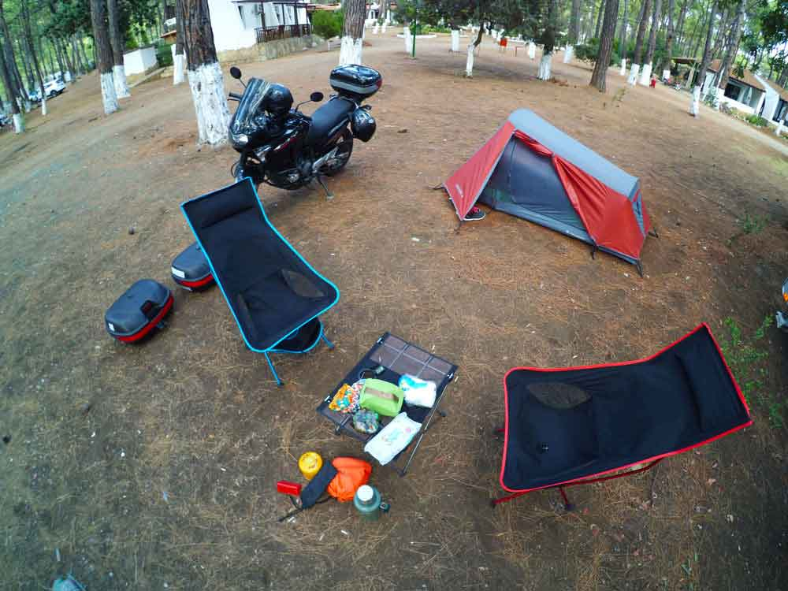
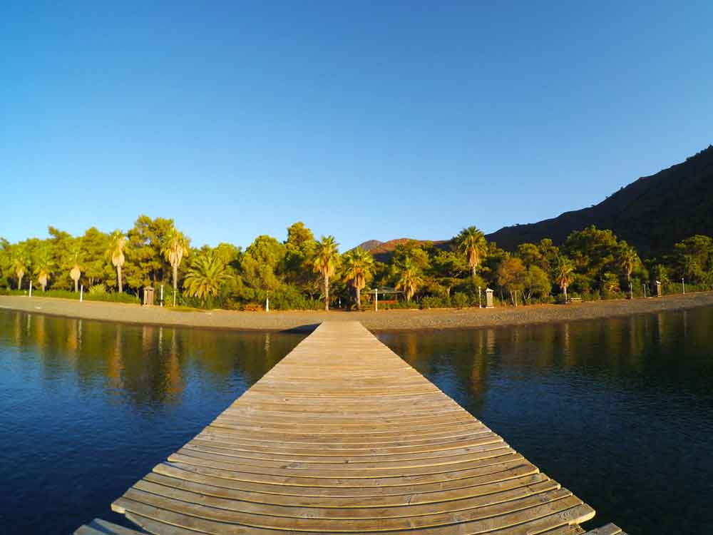

Genelde gürültülü, pis yerler olduğundan ve huzurlu olmadığından dolayı Camping alanlarını pek sevmem. Ancak Aktur camping istisnalardan biri. Özenle hazırlanmış bir kamp alanı gibi. Temizlik ve size ayrılan alan çok iyi. Üstelik bayağı büyük bir yer. İnsan içeride yürürken yoruluyor :). Kalabalık olma durumu gittiğiniz döneme göre memnuniyet derecenizi değiştirecektir. Ancak bu işletmenin güleryüzü ve verdiği hizmeti çok etkileyeceğini sanmıyorum. Yönetim değişirse o başka tabi. Aktur aslında bir tatil köyü. Bir bölümü ise camping olarak işletiliyor. Çadır kurmak ve karavanla kalmak isteyenlerin uğrak mekanı. Eylül’de yani sezon sonunda gittiğimde çok sakindi. Dip dibe çadır kurma mantığı yok. Size ayrılan genişçe bir alan var. Oldukça memnun ayrıldığım ve huzuru da bulduğum için Aktur camping blogda kendine yer edindi

### Aktur Camping nerede ve nasıl gidilir?

Kendi aracınızla geliyorsanız her zamanki gibi işiniz daha kolay. Marmaris -> Datça arasında bulunan bu güzelim yere ulaşım asfalt yoldan sağlanıyor. Marmaris’ten Datça istikametine giderken yaklaşık 46km sonra solda Aktur tabelasını göreceksiniz. Aktur Kurucabük yazan yer ile karıştırmayın. Kurucabük’ten biraz daha ileride yine solda kalıyor. İçeri girişte güvenliğe kamp alanına geldiğinizi söyleyip kayıt işlemi(kimlik,plaka vs.) sonrasında soldaki yolu takip ederek kamp alanına ulabilirsiniz. Kamp alanına vardığınızda resepsiyon binasını göreceksiniz.  Sonrasında görevliyle birlikte çadır kuracağınız yeri seçebilirsiniz.

Aktur’a Datça’da hareket eden dolmuşlar var. Datça’ya ulaştıktan sonra bu dolmuşlarla Aktur’a gelebilirsiniz. Veya Marmaris’ten Datça’ya gelen dolmuşları kullanarak Aktur’da inebilirsiniz. Aktur yolun hemen kenarında olmasından dolayı ulaşımı kolay bir yer. Yoldaki araçların sesi gelse de çok rahatsız etmiyor. Yol ile kamp alanı arasında epey bir mesafe var.

<iframe
  class='mappingFrame'
  src='https://www.google.com/maps/embed?pb=!1m24!1m12!1m3!1d165044.298433335!2d27.940496060657544!3d36.810134670220705!2m3!1f0!2f0!3f0!3m2!1i1024!2i768!4f13.1!4m9!3e0!4m3!3m2!1d36.8598393!2d28.275387799999997!4m3!3m2!1d36.755805699999996!2d27.889651999999998!5e0!3m2!1str!2str!4v1477475207024'
  width='300'
  height='150'
  allowfullscreen='allowfullscreen'
></iframe>

 

### Aktur Camping Dolmuş Saatleri

Datça – Aktur arasında çalışan dolmuş(S.S. 134 nolu araçlar) saatleri alttaki gibidir. Yaz-Kış dönemine göre saatler değişebilir mi? Bence değişebilir. Sorularınızla ilgili 0252-724-66-24 ve 0532-591-60-99 numaralı telefondan bilgi alabilirsiniz.

| Aktur’dan                                                                                                               | Datça’dan                                                                                                                           |
| ----------------------------------------------------------------------------------------------------------------------- | ----------------------------------------------------------------------------------------------------------------------------------- |
| 07:45 08:45 09:15 09:45 10:15 10:45 11:45 12:45 13:45 14:45 15:15 15:45 16:15 16:45 17:15 17:45 18:15 18:45 19:15 19:45 | 07:55 09:00 10:00 10:30 11:00 11:30 12:00 13:00 14:00 15:00 16:00 16:30 17:00 17:30 18:00 18:30 19:00 19:30 20:00 22:00 24:00 01:00 |

### Aktur Camping kamp alanı bilgileri

##### Olanlar;

- Tuvalet, Duş, Mutfak, Buzdolabı, Elektrik, Su, Çamaşırhane yani ne ararsanız var.
- Temizlik olarak bayağı iyi olduğunu söyleyebilirim. Daha yoğun dönemlerde fark olacaktır.
- Aktur’da önce işgaliye ücreti alınır sonra kişi başı ücret alınır. Biz 19 işgaliye ücreti yani çadır kurduğumuz alan için verdiğimiz ücret, 19 tl ise kişi başı ücret ödedik. Aylara göre değişen fiyat listesi bulunuyor. [Aktur camping fiyatlarına ulaşmak için tıklayın.](http://www.datcakamping.com/fiyatlarimiz.html)
- 2 farklı koyu var. Bir taraf dalgalıyken diğer taraf durgun oluyor. Mavi bayraklı denizin tadına doyamayacaksınız.
- Aktur sitesinin içerisinde MigrosJet olması büyük avantaj.
- Eczane, berber, kafe gibi bir kaç küçük işletme de bulunuyor.
- Plajda şezlong ve şemsiyeler vardı. Yoğun zamanlarda boş bulamayabilrsiniz. İnsanlar kendi şemsiye ve sandalyelerini getiriyor. Yanınıda götürmenizde fayda var.

Not: Bu bilgiler Eylül 2016 yılına aittir.

### Aktur Camping Yürüyüş Rotaları

Yakın yerlerde Karia yolu patikaları var. Karia yolunda henüz yürümedim. Karia yoluyla ilgili rotalar arıyorsanız google’a danışabilir veya wikiloc üzerinden rota bulabilirsiniz. Aktur camping’de her sabah sahil yürüyüşü yaptım. Rota alttaki gibi. Yürüyüş yapıp sonrasında denize girmek büyük keyif.

#### Aktur sahil yürüyüşü (2.3 km)

<iframe
  frameBorder='0'
  scrolling='no'
  src='https://tr.wikiloc.com/wikiloc/spatialArtifacts.do?event=view&id=15259551&measures=on&title=on&near=off&images=on&maptype=H'
  width='100%'
  height='600'
  style={{ borderRadius: '10px 10px' }}
></iframe>

- Deniz kenar kolay bir parkur.
- Aktur tatil sitesinde konaklamıyorsanız sahile girebilmek için kapıdaki güvenlik ile görüşmeniz gerekecektir. Sonuçta bu alanın tamamı onlara ait değil. Kıyı kanuna göre de kıyılar kamuya açıktır.
- Kısa bir parkur. Suyunuz biterse yol üzerinden temin edebilirsiniz.
