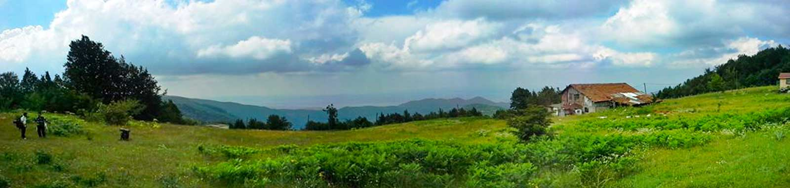

### Aytepe nerede ve nasıl gidilir?

Kocaeli -> Yuvacık üzerinden Aytepe tabelalarını takip ederek önce Kazandere köyüne ardından Aytepe’ye ulaşabilirsiniz. Asfalt bir yol yoldan yükselerek varacağınız manzarası güzel bir tepe.

<iframe class="mappingFrame" style="border: 0;" src="https://www.google.com/maps/embed?pb=!1m25!1m12!1m3!1d6381.788194345407!2d29.941961144238352!3d40.60385082346899!2m3!1f0!2f0!3f0!3m2!1i1024!2i768!4f13.1!4m10!1i0!3e0!4m3!3m2!1d40.7860541!2d29.968986599999997!4m3!3m2!1d40.6038156!2d29.947017199999998!5e1!3m2!1str!2s!4v1405758024950" width="300" height="150"></iframe>

  

### Aytepe kamp alanı bilgileri

* Kamp Yeri (Bulduğunuz düzlüklere çadırınızı kurabilirsiniz. Özel işletme olarak Veysel Dayının Yeri ve Sinanın Yeri var. Buralarda da konaklayabilirsiniz.)
* Temiz Su
* Wc
* Market(Şaban amcanın Körfez manzaralı kafeteryasında bir kaç çikolata vardı. Bunun haricinde başka bir şey bulamazsınız.)
* Restoran
* Kafeterya
* Mescit

Not: Bu bilgiler Ağustos 2013 yılına aittir.

### Aytepe Yürüyüş Rotaları

#### Yuvacık barajından Aytepe ve Soğukpınar üzerinden İznik gölüne (62 km)

<iframe frameBorder="0" scrolling="no" src="https://tr.wikiloc.com/wikiloc/spatialArtifacts.do?event=view&id=7088465&measures=on&title=on&near=off&images=on&maptype=H" width="100%" height="600" style="border-radius: 10px 10px;"></iframe>

* Parkur üzerinde bolca su noktaları var.
* Yuvacık kavşağından başlayarak yolun kenarından yürüyüp Karaaslan kamping ulaşıyorsunuz. Sonrasında yine aynı yolu takip ederek Servetiye Cami köyüne ardından eski bir orman içi yol/patika ile Aytepe de bulunan Soğukpınar’a ulaşıyorsunuz. Buradan dik bir çıkışla Papaz çayırına ve sonrasında Sansarak köyüne doğru yol alıyorsunuz. Sansarak köyünü geçtikten sonra İznik’e ulaşacaksınız.
* Orta zorlukta bir parkur. Rotanın uzun oluşu zorlayabilir. Hepsini yapmak yerine kısım kısım yapmayı tercih edebilisiniz.

#### Aytepe'den Soğukpınar'a sonrada Papaz Çayırı üzerinden Menekşe yaylasına (11.5 km)

<iframe frameBorder="0" scrolling="no" src="https://tr.wikiloc.com/wikiloc/spatialArtifacts.do?event=view&id=4027124&measures=on&title=on&near=off&images=on&maptype=H" width="100%" height="600" style="border-radius: 10px 10px;"></iframe>

* Rotaya Aytepe’den başlayarak önce Soğukpınar’a iniyorsunuz. Sonra buradan dik bir orman içi patika çıkarak önce Papaz Çayırına ardından da Menekşe yaylasına ulaşıyorsunuz. Rota ardından aynı yolu kullanarak başlangıç noktasına geri dönüyor.
* Soğukpınar, Papaz Çayırı ve Menekşe yaylasında su var.
* Soğukpınar – Kayaklıklar arasındaki orman içi patika sizi biraz yorabilir. Ama genel itibariyle yeni başlayanlar için orta, deneyimli yürüyüşçüler için kolay seviyede bir parkur.

#### Aytepe Soğukpınar üzerinden Papaz çayırına sonrasında Menekşe yaylası üzerinden Servetiye Karşı köyüne (22 km)

<iframe frameBorder="0" scrolling="no" src="https://tr.wikiloc.com/wikiloc/spatialArtifacts.do?event=view&id=4037382&measures=on&title=on&near=off&images=on&maptype=H" width="100%" height="600" style="border-radius: 10px 10px;"></iframe>

* Rotaya Aytepe’den başlayarak önce Soğukpınar’a iniyorsunuz. Sonra buradan dik bir orman içi patika çıkarak önce Papaz Çayırına ardından da Menekşe yaylasına ulaşıyorsunuz. Sonrasında ise orman içi yoldan Servetiye Karşı köyüne iniyorsunuz.
* Soğukpınar, Papaz Çayırı ve Menekşe yaylasında su var.
* Soğukpınar – Kayaklıklar arasındaki orman içi patika sizi biraz yorabilir. Orta seviyede bir parkur. Uzun oluşu da sizi yorabilir.

#### Kırıntı Köyünden Soğukpınar'a (9 km)

<iframe frameBorder="0" scrolling="no" src="https://tr.wikiloc.com/wikiloc/spatialArtifacts.do?event=view&id=2854173&measures=on&title=on&near=off&images=on&maptype=H" width="100%" height="600" style="border-radius: 10px 10px;"></iframe>

* Rotaya Kırıntı köyünden başlayarak toprak yoldan önce Menekşe yaylasına ardından Papaz çayırına sonra da orman içi patikadan Soğukpınar’a ulaşıyorsunuz.
* Kırıntı köyü, Soğukpınar, Papaz Çayırı ve Menekşe yaylasında su var.
* Genel itibariyle kolay bir parkur.
* Bu rotayı Aytepe Soğukğınar’dan başlayarak da yapabilirsiniz.

#### Aytepe'den Karaaslan kamp alanına (20 km)

<iframe frameBorder="0" scrolling="no" src="https://tr.wikiloc.com/wikiloc/spatialArtifacts.do?event=view&id=7267447&measures=on&title=on&near=off&images=on&maptype=H" width="100%" height="600" style="border-radius: 10px 10px;"></iframe>

* Rotaya Aytepe’den başlayarak dik bir orman içi parkurla Menekşe yaylasına ulaşıyorsunuz. Sonra aynı yolu geri dönerek Soğukpınar’dan aşağıya doğru Servetiye Cami köyüne ulaşıp sonrasında Karaaslan kamping alanına ulaşıyorsunuz.
* Yolda su noktaları var.
* Orta seviyede bir parkur. Uzun oluşu sizi yorabilir.

#### Aytepe'den İnönü yaylasına ve sonrasında Serindere'ye (35 km)

<iframe frameBorder="0" scrolling="no" src="https://tr.wikiloc.com/wikiloc/spatialArtifacts.do?event=view&id=1761070&measures=on&title=on&near=off&images=on&maptype=H" width="100%" height="600" style="border-radius: 10px 10px;"></iframe>

* Ana noktalarda su var. Bu yüzden su sıkıntısı çekmezsiniz.
* Aytepe’deki orman işletme binasını geçtikten sonra Menekşe yaylasına giden yol ayrımından başlıyor. Önce Ercuva yaylasına ulaşıyorsunuz sonra İnönü yaylasına. Buradalarda içme suyu var. Sonra tekrar toprak yoldan Çilekli’ye doğru yol alıyorsunuz. Ardından Sultaniye’ye ulaşıp Serindere’ye doğru inişe geçiyorsunuz.
* Orta zorlukta uzun bir parkur. Uzun oluşu sizi zorlayabilir.
* Aynı rotayı kullanarak Serindere üzerinden yola çıkıp İnönü yaylasına ulaşabilirsiniz.

#### Aytepe'den Kungul dağı turu (16 km)

<iframe frameBorder="0" scrolling="no" src="https://tr.wikiloc.com/wikiloc/spatialArtifacts.do?event=view&id=4965243&measures=on&title=on&near=off&images=on&maptype=H" width="100%" height="600" style="border-radius: 10px 10px;"></iframe>

* Parkur üzerinde su var. Bu yüzden su sıkıntısı çekmezsiniz.
* Aytepe’deki orman işletme binasını geçtikten sonra sola orman içerisine girerek Kungul Dağı turu yaparak tekrar Aytepe’ye geri dönüyorsunuz.
* İnişli çıkışlı bir rota olduğundan orta zorlukta uzun bir parkur.

#### Aytepe'den sonra Kırıntılı köyü üzerinden Mahmuriye köyüne (35 km)

<iframe frameBorder="0" scrolling="no" src="https://tr.wikiloc.com/wikiloc/spatialArtifacts.do?event=view&id=7042912&measures=on&title=on&near=off&images=on&maptype=H" width="100%" height="600" style="border-radius: 10px 10px;"></iframe>

* Parkur üzerinde su var. Bu yüzden su sıkıntısı çekmezsiniz.
* Aytepe’deki orman işletme binasını geçtikten sonra Menekşe yaylasına giden yoldaki yol ayrımından sola orman içerisine girerek Kırıntı köyüne doğru ilerliyorsunuz. Kırıntı köyünden sonra tekrar orman içerisinden inişe geçerek Mahmuriye köyüne ulaşıyorsunuz.
* Genel itibariyle iniş yaptığınız orta zorlukta uzun bir parkur. Yeni başlayanlar için ise uzun oluşu parkuru zorlu bir hale getiriyor.

#### Tepecik köyünden Aytepe'ye (19 km)

<iframe frameBorder="0" scrolling="no" src="https://tr.wikiloc.com/wikiloc/spatialArtifacts.do?event=view&id=2041078&measures=on&title=on&near=off&images=on&maptype=H" width="100%" height="600" style="border-radius: 10px 10px;"></iframe>

* Su sıkıntısı çekmemek için yola çıkmadan suyunuzu almalısınız.
* Tepecik köyünden başlayan bu parkur orman içerisinden ilerleyerek sizi Aytepe’ye ulaştırıyor.
* İlk 1.5km de 350 metre yükselmek sizi biraz yoracaktır.
* Son 5km iniş olarak devam ettiğinden daha rahat olacaktır.
* Orta zorlukta uzun bir parkur. Yeni başlayanlar için ise uzun oluşu parkuru zorlu bir hale getiriyor.

#### Aytepe'den Aytepe'ye (16 km)

<iframe frameBorder="0" scrolling="no" src="https://tr.wikiloc.com/wikiloc/spatialArtifacts.do?event=view&id=1371887&measures=on&title=on&near=off&images=on&maptype=H" width="100%" height="600" style="border-radius: 10px 10px;"></iframe>

* Su sıkıntısı çekmemek için yola çıkmadan suyunuzu almalısınız.
* Aytepe orman işletme binasının yanından başlayan orman içi toprak yoldan devam eden bu parkurda bir yuvarlak çizerek farklı bir yoldan geldiğiniz noktaya geri dönüyorsunuz.
* Kolay bir parkur. 16km olması gözünüzde büyümesin.

#### Aytepe'den Elmalı'ya (25 km)

<iframe frameBorder="0" scrolling="no" src="https://tr.wikiloc.com/wikiloc/spatialArtifacts.do?event=view&id=3293453&measures=on&title=on&near=off&images=on&maptype=H" width="100%" height="600" style="border-radius: 10px 10px;"></iframe>

* Parkur üzerinde su noktaları var.
* Aytepe’den başlayan yolculuk önce Soğukpınar’a ardından Papaz Çayırına uzanıyor. Soğukpınar’dan Papaz çayırına orman içi patikadan dik bir çıkış yapıyorsunuz. Burada biraz yorulabilirsiniz. Sonrasında orman içi toprak yoldan bir yuvarlak oluşturarak farklı bir yoldan tekrar Aytepe’ye ulaşıyorsunuz.
* 25km oluşundan dolayı orta zorlukta bir parkur. Yeni başlayanları zorlayabilir.

#### Aytepe'den Kazandere'ye (17.5 km)

<iframe frameBorder="0" scrolling="no" src="https://tr.wikiloc.com/wikiloc/spatialArtifacts.do?event=view&id=6690011&measures=on&title=on&near=off&images=on&maptype=H" width="100%" height="600" style="border-radius: 10px 10px;"></iframe>

* Parkur üzerinde su noktaları var.
* Aytepe’den orman içerisinden başlayan parkur hafifçe yükselerek devam ediyor. Kazandere’ye doğru inişe geçeceksiniz. Kazandere’ye yaklaşınca yoldan devam ederek Yuvacık barajı yakınlarında rotayı tamamlamış olacaksınız.
* Orta zorlukta bir parkur. Ormanın iyice içlerinden geçeceğiniz keyifli bir rota.

#### Aytepe'den Nüzhetiye'ye (18 km)

<iframe frameBorder="0" scrolling="no" src="https://tr.wikiloc.com/wikiloc/spatialArtifacts.do?event=view&id=557748&measures=on&title=on&near=off&images=on&maptype=H" width="100%" height="600" style="border-radius: 10px 10px;"></iframe>

* Parkur üzerinde su noktaları var.
* Aytepe’den başlayan yolculuk önce Soğukpınar’a ardından Papaz Çayırına uzanıyor. Soğukpınar’dan Papaz çayırına orman içi patikadan dik bir çıkış yapıyorsunuz. Burada biraz yorulabilirsiniz. Sonrasında orman içi toprak yoldan Menekşe Subatımı yaylasının yanından geçerek orman içerisine daha çok girerek Nüzhetiye’ye doğru inişe geçeceksiniz.
* Orta zorlukta bir parkur. Yeni başlayanları zorlayabilir.