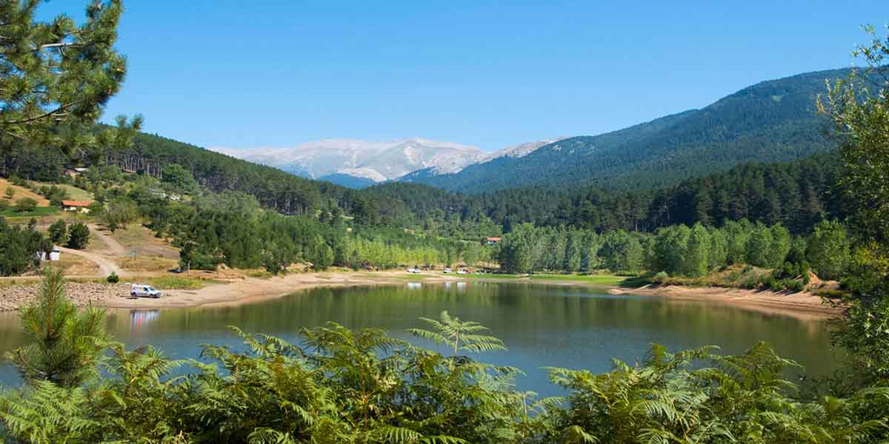
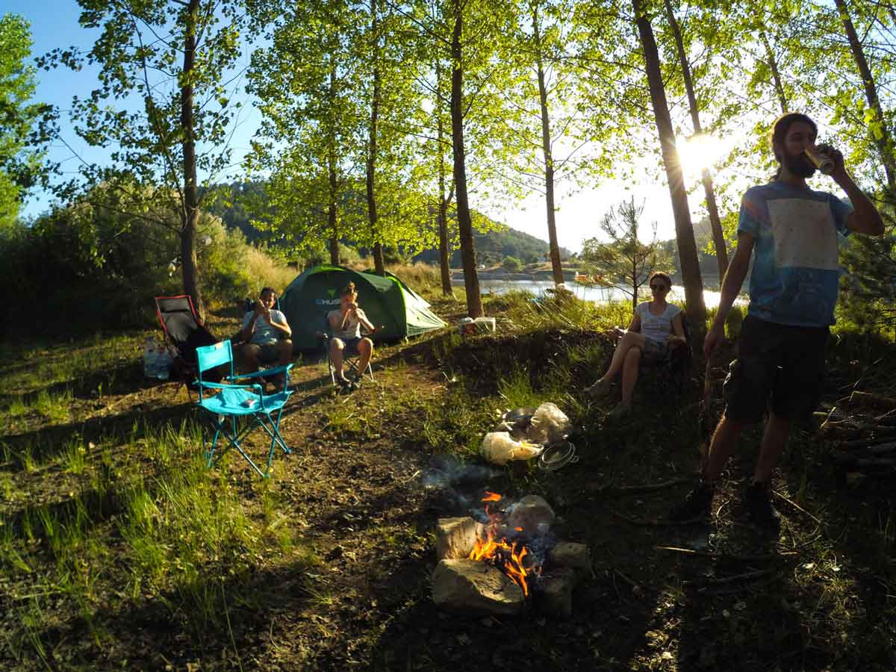

Baraklı Göleti, Bursa’nın Keles ilçesi yakınında, Uludağ manzarasına sahip yapay bir gölettir. Bursa merkezden yaklaşık 55 km süren yolun ardından Baraklı’dan ayrılan yaklaşık 8 km’lik toprak yolu takip ederek gölete ulaşabilirsiniz. Son bölüm 2017’de binek araçla geçilebiliyordu; yola çıkmadan önce güncel yol koşullarını kontrol edin.

> **Bilgi tarihi:** Yol, kamp alanı, ücret ve tesis bilgileri Eylül 2017 deneyimime dayanıyor. Güncel durumu Baraklı veya Keles’te yerel kaynaklardan doğrulayın.

## Baraklı Göleti nerede ve nasıl gidilir?

Bursa şehir merkezine yaklaşık olarak 55km uzaklıkta olan bu gölete gitmek için Keles yolunu takip etmelisiniz. Baraklı’ya ulaşana kadar virajlı asfalt bir yoldan geliyorsunuz. 55kmlik yol 1saat 15dk civarı sürüyor. Yol virajlı olduğu için hızlı gidemiyorsunuz. Buna rağmen etrafın yeşillendiği güzel bir yol olduğunu söyleyebilirim. 2017’de Baraklı’ya kadar yol çalışması vardı. Baraklıya varınca merkeze gelmeden sola doğru Baraklı göleti tabelasını göreceksiniz ve yaklaşık 8km toprak bir yolu takip ederek Baraklı göletine ulaşacaksınız. Gölete kadar yol düzgün, binek aracınızla gidebilirsiniz. Ben Polo ile gittim. Sadece göletin etrafındaki yol çok bozuk. Aracın altını sürtmemek için çok dikkat etmelisiniz. Alttaki google maps tarifi ile de gölete rahatlıkla ulaşabilirsiniz.

<iframe class="mappingFrame" src="https://www.google.com/maps/embed?pb=!1m26!1m12!1m3!1d183921.1436981452!2d29.035037538533075!3d40.06520547136568!2m3!1f0!2f0!3f0!3m2!1i1024!2i768!4f13.1!4m11!3e0!4m3!3m2!1d40.2711057!2d28.961151299999997!4m5!1s0x14ca2ecd5810493d%3A0x6acddb34a91041ec!2zQmFyYWtsxLEgTWFoYWxsZXNpLCBCYXJha2zEsSBHw7ZsZXRpLCBCYXJha2zEsSBLw7Z5w7wgxLDDpyBZb2x1LCAxNjc0MCBLZWxlcy9CdXJzYSwgVMO8cmtpeWU!3m2!1d39.9748714!2d29.290235!5e0!3m2!1str!2suk!4v1522006887359" width="300" height="150" data-mce-fragment="1"></iframe>

  

## Baraklı Göleti kamp alanı bilgileri

### Olanlar

* Aracınızı göl kenarındaki uygun bir yere bırakabilirsiniz.
* Henüz giriş ücreti alınmıyor.
* Kamp yeri için özel bir tesis yok. İlk fotoğrafta tam karşıda gözüken düzlük alanda veya gölün etrafında bulacağınız düzlük bir alanda çadır atabilirsiniz.
* Çeşme ve tuvalet yok. Aslında çeşme var akmıyor. Tuvalete benzer bir kulübe var ama girmek istemezsiniz. O yüzden Baraklı’dan suyunuzu fazlasıyla alın.
* Kamp eksiklerinizi Baraklı’daki marketlerden veya biraz daha ilerideki Keles’den tamamlayabilirsiniz. Keles daha büyük bir ilçe. Tüm ihtiyaçlarınızı buradan karşılayabilirsiniz.

