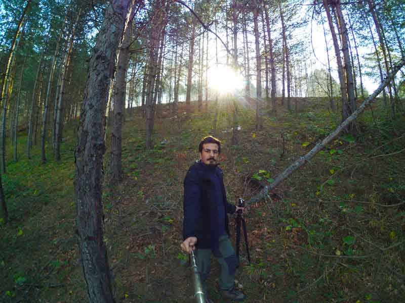
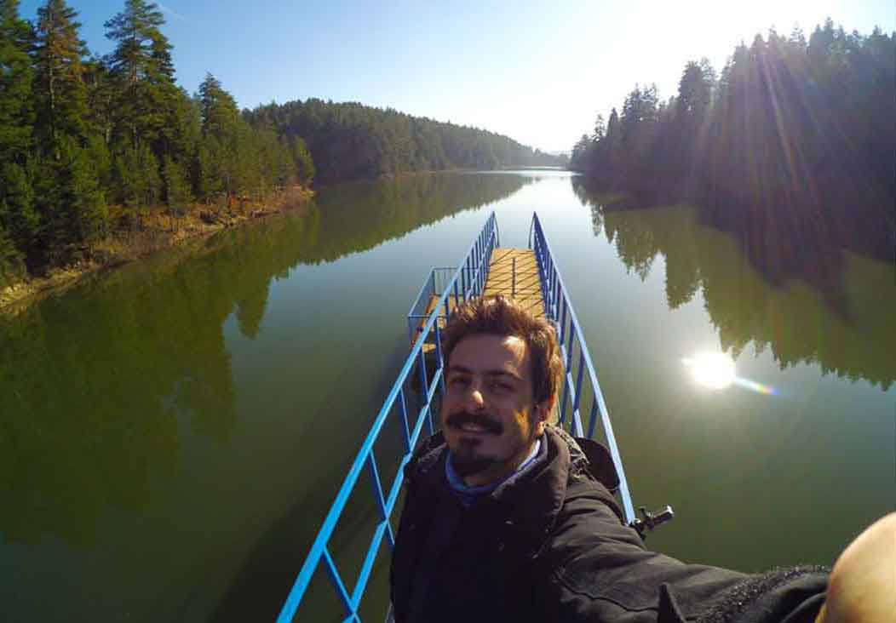

Bozcaarmut Göleti, Bilecik’in Pazaryeri ilçesine bağlı Bozcaarmut köyünün yaklaşık 3 km ilerisindedir. Bozüyük yönünden Pazaryeri, Küçükelmalı ve Bozcaarmut köyü üzerinden ulaşılır; 2016’daki ziyaretimizde yolun neredeyse tamamı asfalttı. Göl çevresinde kamp alanları ve 1,7 km ile 20 km arasında farklı yürüyüş seçenekleri bulunuyor.

Dağların ve açık tepelerin ardından bir anda başlayan orman ve göl manzarası bana [Artvin Şavşat Karagöl’ü](/savsat-karagol/) anımsattı. Yaz dışındaki dönemlerde daha sakin olabilen bölgede yaban hayatı canlıdır; biz ayı izi ve ayı dışkısı gördük, ardından ayının sesini duyduk.

> **Bilgi tarihi:** Yol, ücret, tesis ve kamp koşulları Kasım 2016 deneyimime dayanıyor. Güncel durumu gitmeden önce yerel kaynaklardan doğrulayın.

## Bozcaarmut Göleti nerede ve nasıl gidilir?

Tem otoyolu üzerinde gelirken Adapazarı çıkışından çıkıp Bilecik yönüne doğru devam etmelisiniz. Bilecik içerisine girmeden Bozüyük’e doğru giderken sağa Pazaryeri’ne doğru ayrılan yoldan devam edeceksiniz. Pazaryeri’ni geçtikten sonra önce Küçükelmalı sonra Bozcaarmut köyüne geleceksiniz. Göl, Bozcaarmut köyünden yaklaşık olarak 3km sonra. Yol çalışmasından dolayı bir kaç yer bozuk olsa da yolun tamamına yakını asfalt. Ulaşımı oldukça rahat.

<iframe class="mappingFrame" src="https://www.google.com/maps/embed?pb=!1m26!1m12!1m3!1d82247.78409783286!2d29.78198098821853!3d39.99612568586359!2m3!1f0!2f0!3f0!3m2!1i1024!2i768!4f13.1!4m11!3e0!4m5!1s0x14cbe9d87f167d9f%3A0x6d43d27fa55c5cb4!2sBozcaarmut+G%C3%B6leti%2C+11800+Bozcaarmut%2FPazaryeri%2FBilecik!3m2!1d39.959462699999996!2d29.788563!4m3!3m2!1d39.995623599999995!2d29.902976199999998!5e0!3m2!1str!2str!4v1484041814602" width="300" height="150" allowfullscreen="allowfullscreen"></iframe>

  

## Bozcaarmut Göleti kamp alanı bilgileri

### Olanlar

* Aracınızı göl kenarındaki geniş alanlara veya yol kenarına bırakabilirsiniz.
* Orman işletme 5 TL giriş ücreti alıyor. Kamp yapacaklardan ise 5 TL daha alıyor.
* Kamp yeri için özel bir tesis yok. Göl kenarında Düzlük alan çok fazla olmayışı kamp yerini kısıtlı hale getiriyor.

  * Gölün arka tarafına doğru gidince düzlük alan daha fazla. Bu taraflarda da çadır atılabilir. Daha sakin olacaktır.
* Çeşme ve tuvalet var. Ancak tuvaletler kullanılmayacak kadar pis.
* Yolun asfalt oluşundan dolayı ulaşımı kolay bir yer bu yüzden pazar günleri ziyaretçi sayısı artabiliyor.
* Kamp eksiklerinizi Pazaryeri oldukça büyük bir ilçe. Tüm ihtiyaçlarınızı buradan karşılayabilirsiniz.
* Birkaç noktada piknik masası bulunmakta.

### Olmayanlar

* Market
* Restoran
* Otel, Pansiyon

## Bozcaarmut Göleti yürüyüş rotaları

### Bozcaarmut Göleti’nden Elmalı Göleti’ne gidiş dönüş (20 km)

<iframe frameBorder="0" scrolling="no" src="https://tr.wikiloc.com/wikiloc/spatialArtifacts.do?event=view&id=15628313&measures=on&title=on&near=off&images=on&maptype=H" width="100%" height="600" style="border-radius: 10px 10px;"></iframe>

* Orman içi bir kaç geçiş zorlayabilir.
* Orman içerisinden Elmalı göletine ulaşıyorsunuz ardından araç yolundan Bozcaarmut gölüne geri dönebilirsiniz.
* Yeni başlayanlar için 20km yorucu olabilir. Düzenli yürüş yapanlar için keyifli bir parkur.
* Yol üzerinde çeşmeler olduğundan dolayı su sıkıntısı yok.
* Ayılara dikkat ediniz. Şaka değil :)

### Bozcaarmut Göleti yürüyüşü (1,7 km)

<iframe frameBorder="0" scrolling="no" src="https://tr.wikiloc.com/wikiloc/spatialArtifacts.do?event=view&id=16073928&measures=on&title=on&near=off&images=on&maptype=H" width="100%" height="600" style="border-radius: 10px 10px;"></iframe>

* Kolay olan ve göl etrafını dolaşan keyifli bir parkur.

### Bozcaarmut köyünden Bozcaarmut Göleti’ne (6,7 km)

<iframe frameBorder="0" scrolling="no" src="https://tr.wikiloc.com/wikiloc/spatialArtifacts.do?event=view&id=4802614&measures=on&title=on&near=off&images=on&maptype=H" width="100%" height="600" style="border-radius: 10px 10px;"></iframe>

* Bozcaarmut köyünden başlayıp çoğunluğu orman içi patikayla devam eden ve arka taraftan göle ulaşan güzel bir parkur.
* Az yürümek isteyenlere uygun bir parkur.

### Bozcaarmut köyü ve orman yürüyüşü (13 km)

<iframe frameBorder="0" scrolling="no" src="https://tr.wikiloc.com/wikiloc/spatialArtifacts.do?event=view&id=4801601&measures=on&title=on&near=off&images=on&maptype=H" width="100%" height="600" style="border-radius: 10px 10px;"></iframe>

* Bozcaarmut köyünden başlayıp çoğunluğu orman içi patikayla gölün arka tarafından geçen ve sonrasında tekrar orman içi patikadan köye dönen bir parkur.
* Sürekli yürüyüş yapanları hafif terletecek bir parkur.
* Yola çıkmadan yanınıza su almalısınız. Bir kaç noktada su var.
