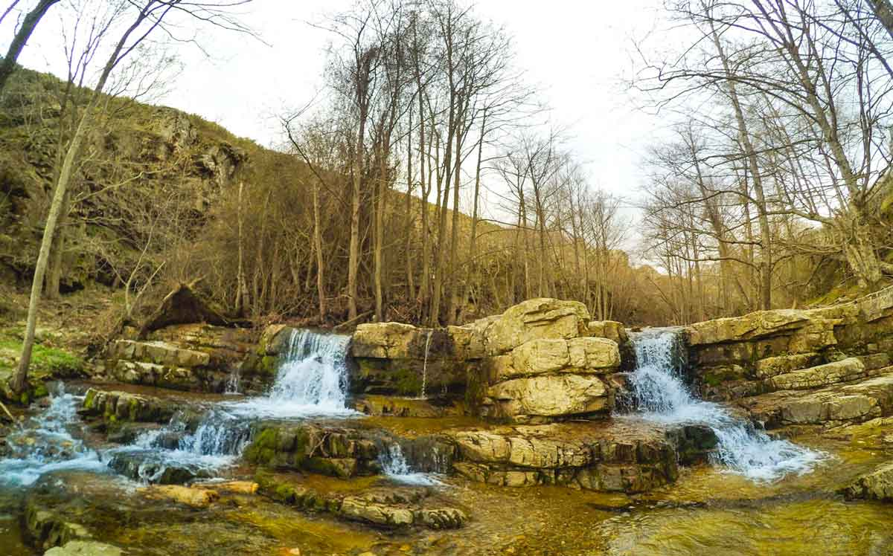
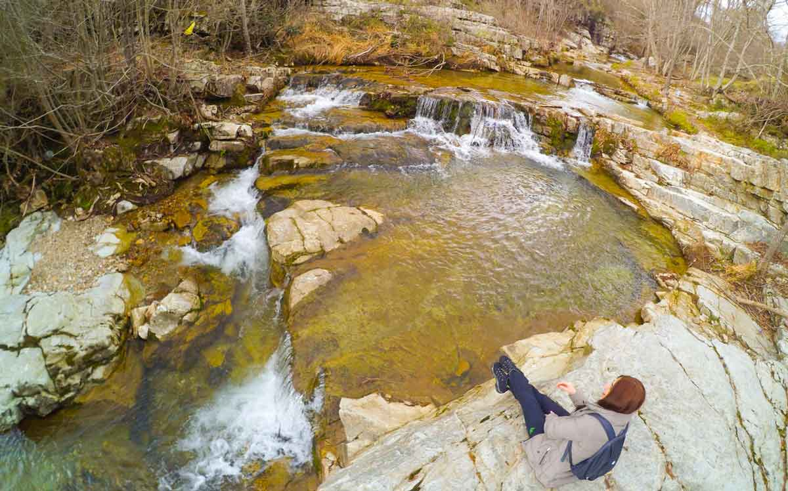

Longozların Kırklareli’nde barındırdığı gizli şelalelerdir. Yeni yeni keşfedilmeye başlanmıştır

### Cehennem Şelaleleri nerede ve nasıl gidilir?

İstanbul’dan Çerkezköy üzerinden önce Saray’a sonra Vize’ye ulaşılır. Vize’ye gelindikten sonra Kıyıköy tabelası takip edilerek Kıyıköy yoluna girilir. Kömürköy’ü geçtikten sonra Kızılağaç köyü yol ayrılımda bu yoldan çıkılır ve Kızılağaç köyünü geçtikten sonra sola doğru bir tabela sizi Cehennem Şelalelerine yönlendirecektir. Bu noktada asfalt yoldan çıkılır ve yaklaşık 3km toprak yoldan gidilerek şelalerin başladığı tepeye varılır. Aracınızı burada bırakıp aşağı inmeniz gerekiyor. Korkmayın şelaleler çok uzakta değil. Aşağı inince hemen göreceksiniz.

<iframe class="mappingFrame" src="https://www.google.com/maps?f=d&amp;source=s_d&amp;saddr=Bilinmeyen+yol&amp;daddr=41.82469,27.765643+to:%C4%B0stanbul+%C3%87evre+Yolu%2FO-1&amp;geocode=FcVigAIdC7irAQ%3BFbIxfgIdi6unASkRIEff9cCgQDFdvfoAYlb4nQ%3BFU15cgId8tC6AQ&amp;sll=41.037931,28.748474&amp;sspn=0.388956,0.727158&amp;t=h&amp;hl=tr&amp;mra=dme&amp;mrsp=2&amp;sz=11&amp;via=1&amp;ie=UTF8&amp;ll=41.037931,28.748474&amp;spn=0.388956,0.727158&amp;output=embed" width="300" height="150"></iframe>

  

### Cehennem Şelaleleri kamp alanı bilgileri

##### Olanlar;

* Burada bir kamp alanı yok. Düzlük bir alan bulmak bana yeter diyenlerdenseniz şelale çevresinde bir kaç düzlük alan var. Buraya çadır attığınızda günübirlikçilere maruz kalacağınızı unutmayın.
* Otopark (Şelalalerin başladığı geniş alana aracınızı bırakabilirsiniz)
* Şelalelere yakın olmak istemiyorsanız Demirköy yolu üzerinden şelalelere saptığınız yol ayrımının tam karşısındaki ormana giren bir yol var. Biraz içeri girerseniz geniş bir düzlük ve yüksek ağaçlar sizi karşılayacaktır.
* Suyunuzu yanınıza getirmeyi unutmayın.
* Yabani hayvan olarak domuzun sık görüldüğü söylenir. Ancak şimdiye kadar hiç görmedim.

##### Olmayanlar;

* Market (Vize ilçe merkezinde ihtiyaçlarınızı karşılamalısınız)
* Restoran
* Otel, Pansiyon

Not: Bu bilgiler Mart 2016 yılına aittir.

