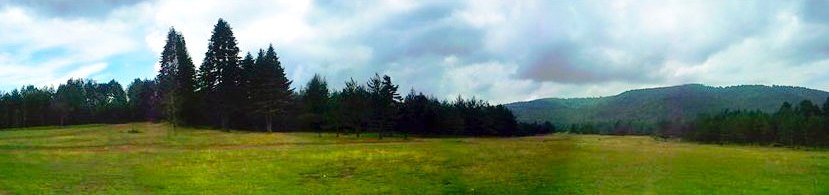

### Ercuva yaylası nerede ve nasıl gidilir?

Kocaeli’ne geldikten sonra Yuvacık yol ayrımından Yuvacık barajına doğru devam edilir. Barajın sağından yukarı doğru en üste gelindiğinde yol ayrılımda Tepecik Köyü, İnönü yaylası tabelasını göreceksiniz. Bu yolu takip edince Tepecik köyüne ulacaşaksınız. Tepecik köyünün içerisinden geçtikten sonra camiye varınca buradan sağa doğru yukarı giden yolu takip ederek İnönü yaylasına ulaşılır. İnönü yaylası geçildikten 2-3 km sonra Ercuva yaylasına ulaşmış olursunuz.

<iframe
  class='mappingFrame'
  src='https://www.google.com/maps?q=40.560805,29.99041&amp;num=1&amp;t=h&amp;hl=tr&amp;ie=UTF8&amp;z=14&amp;ll=40.560267,29.991421&amp;output=embed'
  width='300'
  height='150'
></iframe>

 

### Ercuva yaylası kamp alanı bilgileri

##### Olanlar;

- Kamp Yeri(Özel bir işletme yok. Yaylanın herhangi bir yerine çadır kurabilirsiniz.)
- Temiz Su
- Bakkal/Market(Yuvacık’ta halletmelisiniz.)

##### Olmayanlar;

- Restoran veya kafeterya
- Pansiyon
- WC

Not: Bu bilgiler 2013 yılına aittir.

### Ercuva yaylası Yürüyüş Rotaları

#### Kazandere köyünden Ercuva yaylasına ve sonrasında Hüseyni köyüne (17 km)

<iframe
  frameBorder='0'
  scrolling='no'
  src='https://tr.wikiloc.com/wikiloc/spatialArtifacts.do?event=view&id=1459783&measures=on&title=on&near=off&images=on&maptype=H'
  width='100%'
  height='600'
  style={{ borderRadius: '10px 10px' }}
></iframe>

- Yol üzerinde su noktaları var.
- Kazandere köyü içerisinden orman içi toprak yoldan başlayan parkur yavaş yavaş yükselerek Ercuva yaylasına ulaşıyor. Ardından inişe geçerek Hüseyni köyüne varmış oluyorsunuz.
- Kolay bir parkur. 17km oluşu sizi biraz yorabilir.

#### Aytepe'den İnönü yaylasına ve sonrasında Serindere'ye (35 km)

<iframe
  frameBorder='0'
  scrolling='no'
  src='https://tr.wikiloc.com/wikiloc/spatialArtifacts.do?event=view&id=1761070&measures=on&title=on&near=off&images=on&maptype=H'
  width='100%'
  height='600'
  style={{ borderRadius: '10px 10px' }}
></iframe>

- Ana noktalarda su var. Bu yüzden su sıkıntısı çekmezsiniz.
- Aytepe’deki orman işletme binasını geçtikten sonra Menekşe yaylasına giden yol ayrımından başlıyor. Önce Ercuva yaylasına ulaşıyorsunuz sonra İnönü yaylasına. Buradalarda içme suyu var. Sonra tekrar toprak yoldan Çilekli’ye doğru yol alıyorsunuz. Ardından Sultaniye’ye ulaşıp Serindere’ye doğru inişe geçiyorsunuz.
- Orta zorlukta uzun bir parkur. Uzun oluşu sizi zorlayabilir.
- Aynı rotayı kullanarak Serindere üzerinden yola çıkıp İnönü yaylasına ulaşabilirsiniz.

#### Saklı yayladan İnönü yaylasına ve sonrasında Ercuva yaylasına (11 km)

<iframe
  frameBorder='0'
  scrolling='no'
  src='https://tr.wikiloc.com/wikiloc/spatialArtifacts.do?event=view&id=6153851&measures=on&title=on&near=off&images=on&maptype=H'
  width='100%'
  height='600'
  style={{ borderRadius: '10px 10px' }}
></iframe>

- Yol üzerinde su noktaları var.
- Önce Saklı yaylaya ardından orman içi bir yol ile İnönü yaylasına ulaşaan parkur devamında Ercuva yaylasına uzanıyor ve ardından başladığı yere geri dönüyor.
- 11kmlik kolay bir parkur.
- Bu 3 yaylada da kamp kurabilirsiniz. Tabi en güzel İnönü yaylasıdır.
