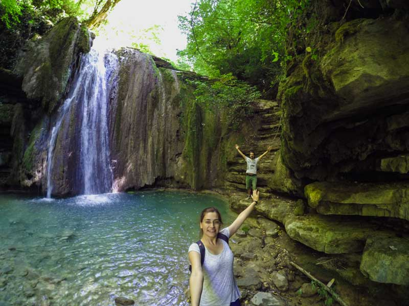
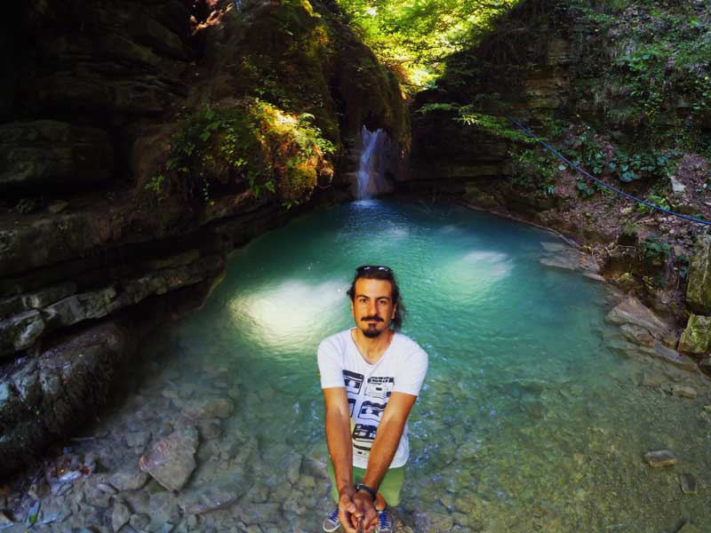
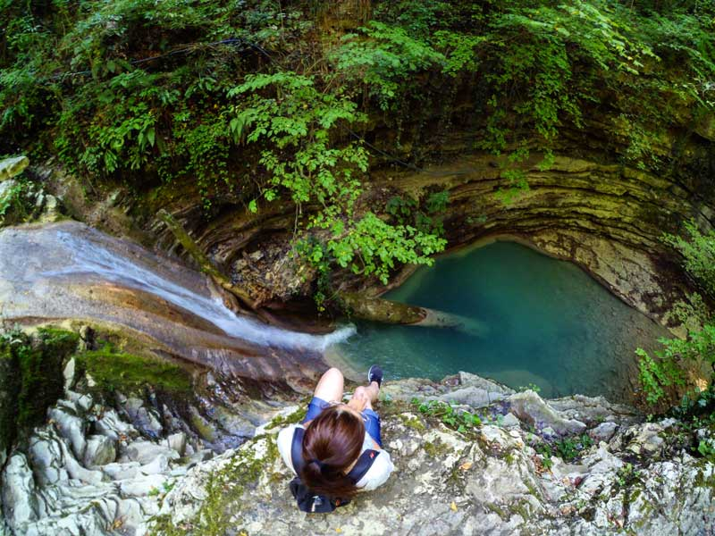
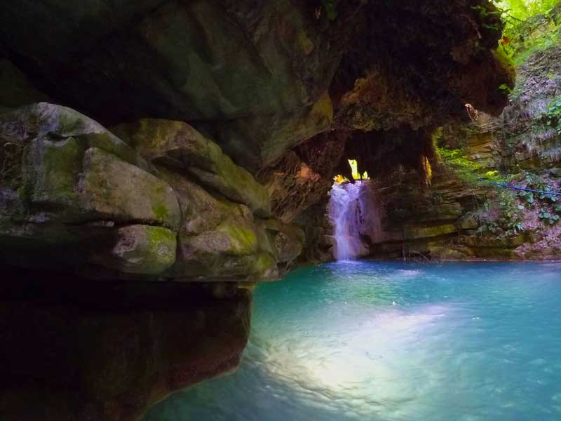
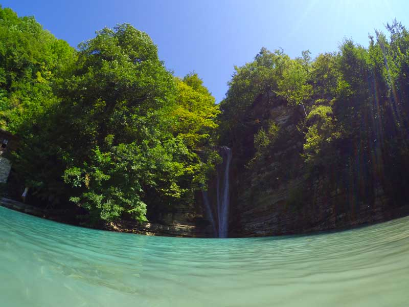

Işığın ağaçların arasından süzülüp kayalardan sekerek suya düşüşüyle çok güzel bir görüntü ortaya çıkıyor. Gördüğüm en güzel şelale takımı diyebilirim. İrili ufaklı 28 şelaleden oluşuyor. İlkbahar ayında suların bol olduğu zamanda şelaleler daha güzel gözükecektir. Sinop’un Erfelek ilçesi üzerinden gidilen şelale görülmesi gereken en güzel şelalelerdendir. Her yerde pet şişeler görüp asabınızın bozulabileceği doğa harikası bir yer. Milli parklar koruma altına almış. Sözde tabi. Gerçekte yaptıkları tek şey fazladan ücret almak. Araç girişi için 12 TL ödedik. Bu güzel şelalelerin etrafında çöpleri görünce de asabımız bozuldu.

### Erfelek Tatlıca Şelaleleri nerede ve nasıl gidilir?

Sinop Erfelek ilçesi üzerinden gidilir. Yol çalışmasından dolayı yolun kısa bir bölümü toprak yoldan oluşsa da çoğunluğu asfalttır. Erfelek ilçesine ulaştıktan sonra tabelaları takip ederek şelaleye rahatlıkla ulaşabilirsiniz.

<iframe class="mappingFrame" style="border: 0;" src="https://www.google.com/maps/embed?pb=!1m28!1m12!1m3!1d167001.2600496348!2d34.916290494882!3d41.90703603556013!2m3!1f0!2f0!3f0!3m2!1i1024!2i768!4f13.1!4m13!3e6!4m5!1s0x408f12de6b86738d%3A0xcfa12eddefc640fb!2sSinop+Merkez%2C+Sinop%2C+T%C3%BCrkiye!3m2!1d42.027974!2d35.151725!4m5!1s0x408f7d0cd5e69cff%3A0xd237726252d2becf!2zRXJmZWxlayBUYXRsxLFjYSDFnmVsYWxlbGVyaSwgNTc1MDAgQWvDtnJlbi9BeWFuY8Sxay9TaW5vcA!3m2!1d41.84036!2d34.7798002!5e1!3m2!1str!2sde!4v1443197631515" width="300" height="150" allowfullscreen="allowfullscreen"></iframe>

  

### Erfelek Tatlıca Şelaleleri kamp alanı bilgileri

##### Olanlar;

* Kamp yeri olarak özel bir yer aramayın. Milli park içerisinde boş bulduğunuz yere çadırınızı kurabilirsiniz. Özellikle bir kamp alanı göremedim.

  * Günübirlikçilerin yoğunlukla geldiği uğrak bir mekan. Çadır atan kişiler pek rahat edemez. Günübirlik gezmeniz tavsiye edilir.
* Restoran
* Hediyelik eşya satan vb. satıcılar.
* Market
* Tuvalet
* Çöp kutusu
* Çocuk Oyun Parklı
* Otopark
* Piknik alanı (masa, sandalye, ocak vs)

Not: Bu bilgiler Eylül 2015 yılına aittir.

### Erfelek Tatlıca Şelaleleri Yürüyüş Rotaları

#### Erfelek Şelaleleri (4.4 km)

<iframe frameBorder="0" scrolling="no" src="https://tr.wikiloc.com/wikiloc/spatialArtifacts.do?event=view&id=7491416&measures=on&title=on&near=off&images=on&maptype=H" width="100%" height="600" style="border-radius: 10px 10px;"></iframe>

* Şelale rotası. Zor olmayan bir parkur.
* Suyunuzu yola çıkmadan yanınıza almalısınız.
* Kaygan geçişlere dikkat edilmeli.

