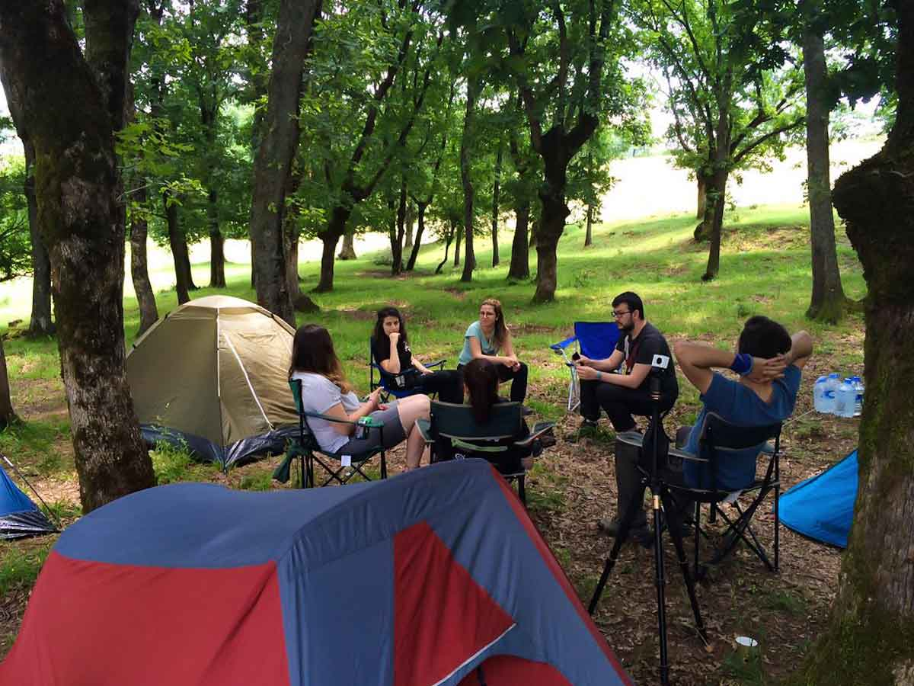

Gebze Denizli Göleti'ne ulaşım, kamp imkânları ve çevredeki yürüyüş rotaları bu rehberde yer alıyor. Saha bilgileri 2016 gözlemlerime dayanıyor; güncel güvenlik koşullarını gitmeden önce ayrıca kontrol edin.

## Hızlı özet

- **Bölge:** Kocaeli, Gebze–Denizli Köyü çevresi
- **Kamp:** İşletmesiz ve temel tesisi olmayan doğal alan
- **Rotalar:** 11 km ile 27 km arasında dört seçenek
- **Saha gözlemi:** Haziran 2016

> **Güvenlik ve güncellik notu:** Bu yazıdaki yol, kamp ve güvenlik gözlemleri güncel değildir. Bölgeye gitmeden önce yerel makamların duyurularını, hava ve yangın riskini, erişim durumunu ve güncel ziyaretçi yorumlarını kontrol edin. Tek başınıza ve karanlıkta hareket etmeyin.

İstanbul’a çok yakın bu gölette balık tutup, kamp yapabilirsiniz. Çok yakın olması sebebiyle hafta sonları çok kalabalık olduğunu söylemeliyim. Gebze Denizli Göleti’ne gelmek için hafta içi bir gün seçmek çok daha ideal ve keyifli olacaktır. 

2017'de bölgeyle ilgili güvenlik kaygıları nedeniyle ziyareti önermediğimi not etmiştim. Bu tarihsel uyarıyı tek başına güncel karar ölçütü olarak kullanmayın; bugünkü koşulları güvenilir yerel kaynaklardan doğrulayın.

## Gebze Denizli Göleti nerede ve nasıl gidilir?

Tem otoyolu üzerinden giderken Şekerpınar çıkışından ayrıldıktan sonra Mollafenari istikametine devam ediyorsunuz. Burayı geçtikten sonra Denizli köyüne geleceksiniz. Denizli köyünden yaklaşık 1 km sonra yol sola orman içine ayrılacak. Burayı takip ederek aşağıya doğru devam etttiğinizde göle ulaşacaksınız.

<iframe frameBorder="0" scrolling="no" src="https://tr.wikiloc.com/wikiloc/spatialArtifacts.do?event=view&id=13676650&measures=on&title=on&near=off&images=on&maptype=H" width="100%" height="600" style="border-radius: 10px 10px;"></iframe>

  

## Gebze Denizli Göleti kamp alanı bilgileri

### Olanlar

* Gölün etrafındaki düzlük alanlara veya haritada işaretli olan yerlerde çadırınızı kurabilirsiniz. çadırınızı kurabilirsiniz. Özellikle Pazar günleri çok kalabalık olacağını unutmayın.
* Aracınızı göl kenarındaki geniş alanlara veya yol kenarına bırakabilirsiniz. Kamp alanı olan yere kadar aracınızla girebilirsiniz.
* Kamp eksiklerinizi Mollafenari’den tamamlayabilirsiniz. Marketten kasabına kadar her şey var.
* Yakın olmasından dolayı günübirlikçilerin sıkça uğradığı bir mekan.

### Olmayanlar

* Kamp yeri için özel bir tesis yok.
* Çeşme ve tuvalet yok.
* Market
* Restoran
* Otel, Pansiyon

Not: Bu bilgiler Haziran 2016 yılına aittir.

## Gebze Denizli Göleti yürüyüş rotaları

### Denizli Göleti'nden Değirmençayırı Köyü'ne (23,5 km)

<iframe frameBorder="0" scrolling="no" src="https://tr.wikiloc.com/wikiloc/spatialArtifacts.do?event=view&id=6080712&measures=on&title=on&near=off&images=on&maptype=H" width="100%" height="600" style="border-radius: 10px 10px;"></iframe>

* Çoğunluğu orman içi patikalardan oluşan orta zorlukta bir parkur.
* Kondisyonunuz yoksa 23.5km oluşu sizi yorabilir.
* Su noktaları olmaması dikkat edilmesi gereken bir durum.
* Patika, çalılık ve sık ağaçların arasından devam eden rota zaman zaman toprak yollardan ilerliyor.
* Son 4kmsi yorucu olabilir.
* Yürüyüş sonunda yemek için veya soluklanmak için Değirmençayırı köyünde küçük bir aile işletmesi bulabilirsiniz.

### Denizli Göleti'nden Değirmençayırı Köyü'ne (18,5 km)

<iframe frameBorder="0" scrolling="no" src="https://tr.wikiloc.com/wikiloc/spatialArtifacts.do?event=view&id=9216680&measures=on&title=on&near=off&images=on&maptype=H" width="100%" height="600" style="border-radius: 10px 10px;"></iframe>

* Denizli Göletinden toprak yoldan başlayan rota yaklaşık 5km böyle devam ediyor. Ardından dere kenarı boyunca orman içi patikalardan devam ediyor.
* Orta zorlukta ve yukarıdakine göre daha kolay bir parkur.
* Su noktaları olmaması dikkat edilmesi gereken bir durum.
* Yürüyüş sonunda yemek için veya soluklanmak için Değirmençayırı köyünde küçük bir aile işletmesi bulabilirsiniz.

### Denizli Göleti'nden Ballıkayalar Tabiat Parkı'na (11 km)

<iframe frameBorder="0" scrolling="no" src="https://tr.wikiloc.com/wikiloc/spatialArtifacts.do?event=view&id=4283340&measures=on&title=on&near=off&images=on&maptype=H" width="100%" height="600" style="border-radius: 10px 10px;"></iframe>

* Denizli köyünden başlayan parkur yaklaşık 2km yoldan devam ettikten sonra patikadan ilerliyor. Önce küçük bir şelaleye uğradıktan sonra güzel bir manzara sonrası Ballı Kayalar Tabiat Parkına ulaşıyor.
* Zor olmayan bir parkur.
* Yola çıkmadan önce yanınıza suyunuzu almalısınız.

### Denizli Göleti'nden Ovacık ve Akfırat köylerine (27 km)

<iframe frameBorder="0" scrolling="no" src="https://tr.wikiloc.com/wikiloc/spatialArtifacts.do?event=view&id=9361555&measures=on&title=on&near=off&images=on&maptype=H" width="100%" height="600" style="border-radius: 10px 10px;"></iframe>

* Denizli göletinden başlayan parkur yer yer toprak yoldan yer yer patikalardan 14km boyunca devam ederek Ovacık köyüne varıyor. Sonrasında kalan 13kmlik kısım ise asfalt yoldan devam ederek Akfırat köyüne ulaşıyor.
* Zor olmayan bir parkur. Uzunluğu gözünü korkutuyorsa Ovacık köyüne kadar yürüyebilirsiniz.
* Yola çıkmadan önce yanınıza suyunuzu almalısınız.
* Patikalardan ilerlemek yorucu olacaktır.

## Yakındaki kamp ve hazırlık rehberleri

- İstanbul çevresindeki başka bir gölet için [Karacaköy Göleti](/karacakoy-goleti/) rehberini inceleyin.
- Yayla kampı ve daha uzun rotalar için [Acelle Yaylası](/acelle-yaylasi/) rehberine bakın.
- Rüzgâr ve güneş için çok amaçlı bir parça seçerken [Buff nedir ve nasıl kullanılır?](/buff-nedir-ne-ise-yarar/) yazısından yararlanın.
