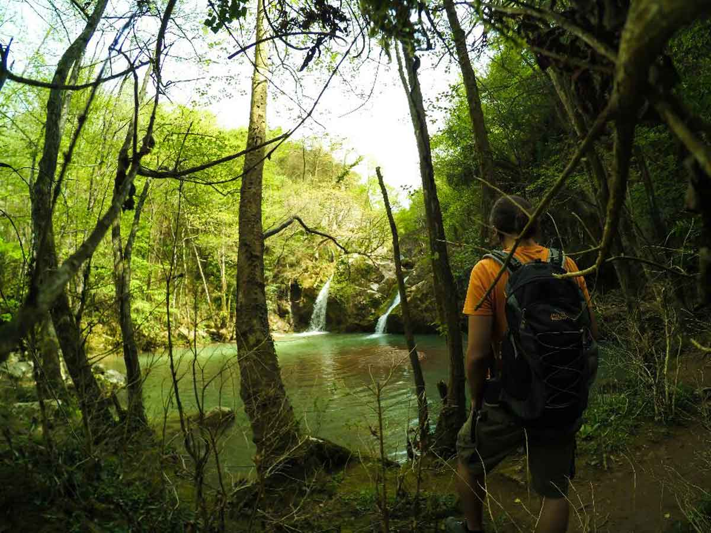
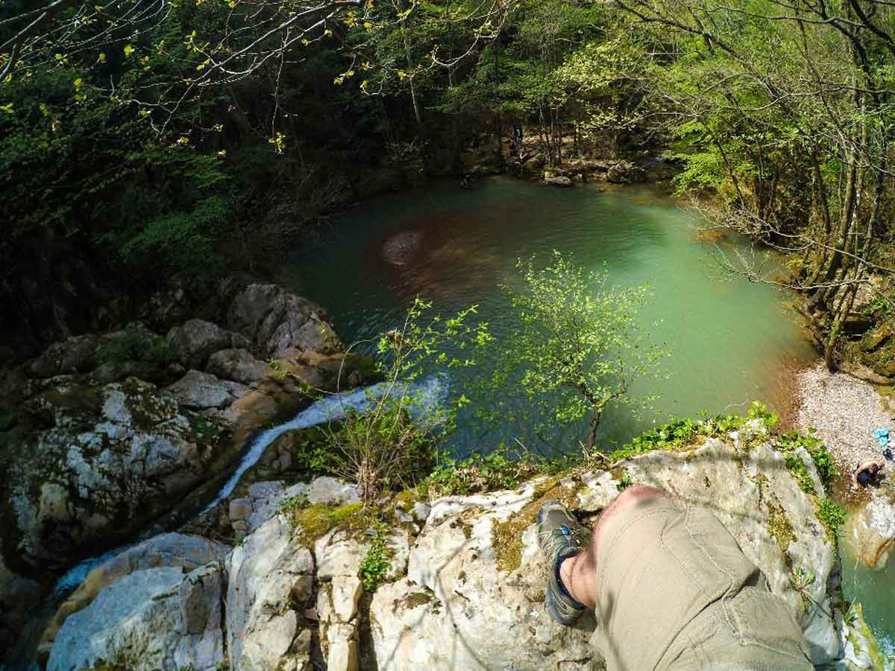

İstanbul’a yakın kamp alanı mı aradınız? Buyurun size Hacıllı köyü kamp alanı ve şelaleleri.

### Hacılı Köyü Şelaleleri nerede ve nasıl gidilir?

İstanbul’dan iki şekilde gelebilirsiniz. Birincisi Şile -> Ağva üzerinden, ikincisi ise Şekerpınar/Gebzer tarafından. Şile tarafından gelmek kolay. Ağva yolunu takip edin. Tekeköy’ü geçtikten sonra Ağva’ya giderken sağa doğru Hacıllı köyü tabelasını takip edin. Diğer yol ise Gebze üzerinden ulaşım. Gebze tarafından gelen yol Şile tarafından gelen yola göre daha iyi. Daha bakımlı ve dolayısıyla daha rahat. Şekerpınar -> Mollafenari -> Yağcılar -> Ahatlı üzerinden Hacıllı köyüne ulaşmak daha rahat olacaktır. Anlatılması güç olacağından altta haritada rota oluşturdum. Onu takip edebilirsiniz.

<iframe
  frameBorder='0'
  scrolling='no'
  src='https://tr.wikiloc.com/wikiloc/spatialArtifacts.do?event=view&id=12880039&measures=on&title=on&near=off&images=on&maptype=H'
  width='100%'
  height='600'
  style={{ borderRadius: '10px 10px' }}
></iframe>

 

### Hacılı Köyü Şelaleleri kamp alanı bilgileri

##### Olanlar;

- Derenin sağında solunda kalan düz, geniş çayırlık alanlarda çadırınızı kurabilirsiniz.
- Otopark (Şelalalerin başladığı geniş alana aracınızı bırakabilirsiniz)
- Kamp yeri için özel bir tesis yok.
- Suyunuzu Hacıllı köyünden almayı unutmayın.
- Yaz aylarında kamp için ideal olmayacaktır. Bunun nedeni gölgelik alan olmadığından.
- İstanbul’a yakın olduğu için hafta sonları kalabalık olma ihtimali yüksek.
- Kalabalık olduğundan etrafta ateş yakmak için odun bulmakta zorlanabilirsiniz.
- Hacıllı köyünde köy bakkalı mevcut.

##### Olmayanlar;

- Mescit, tuvalet (Hacıllı köyünde var, yürüme mesafesiyle 15-20 dk)
- Restoran
- Otel, Pansiyon

Not: Bu bilgiler Nisan 2016 yılına aittir.

### Hacılı Köyü Şelaleleri Yürüyüş Rotaları

#### Hacı köyü kamp alanından şelalelere (1.5 km)

<iframe
  frameBorder='0'
  scrolling='no'
  src='https://tr.wikiloc.com/wikiloc/spatialArtifacts.do?event=view&id=12880041&measures=on&title=on&near=off&images=on&maptype=H'
  width='100%'
  height='600'
  style={{ borderRadius: '10px 10px' }}
></iframe>

- 1.5kmlik zor olmayan bir parkur.
- Yağmurlu havada veya yağmur sonrası gidildiğinde derenin suyu taşmış olabilir.
- Özellikle yağmur sonrası taşlar kayganlaşıyor.
- Parkur üzerinde su noktası yok.
- Şelalelere ulaşmak için patikayı takip etmeniz yeterli.
- 1. veya 2. kamp alanında çadır atabilirsiniz.
- Dere geçişleri var.

