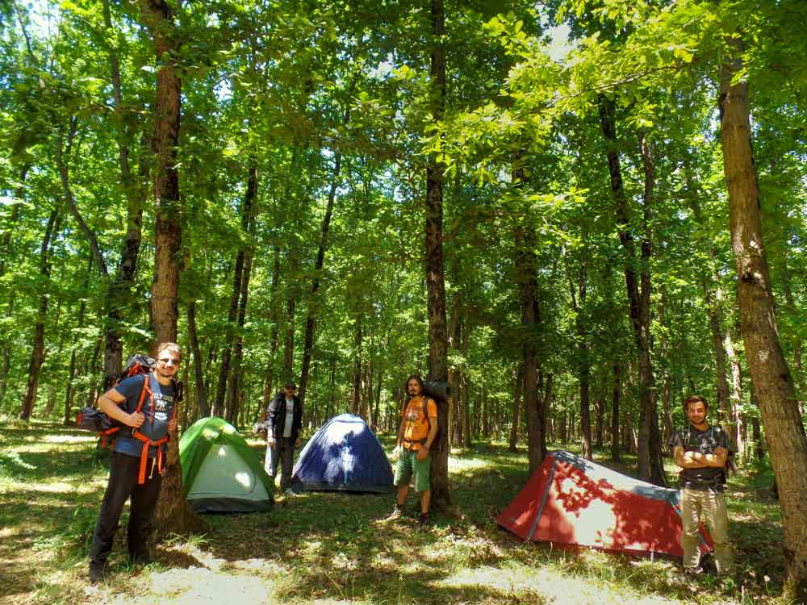
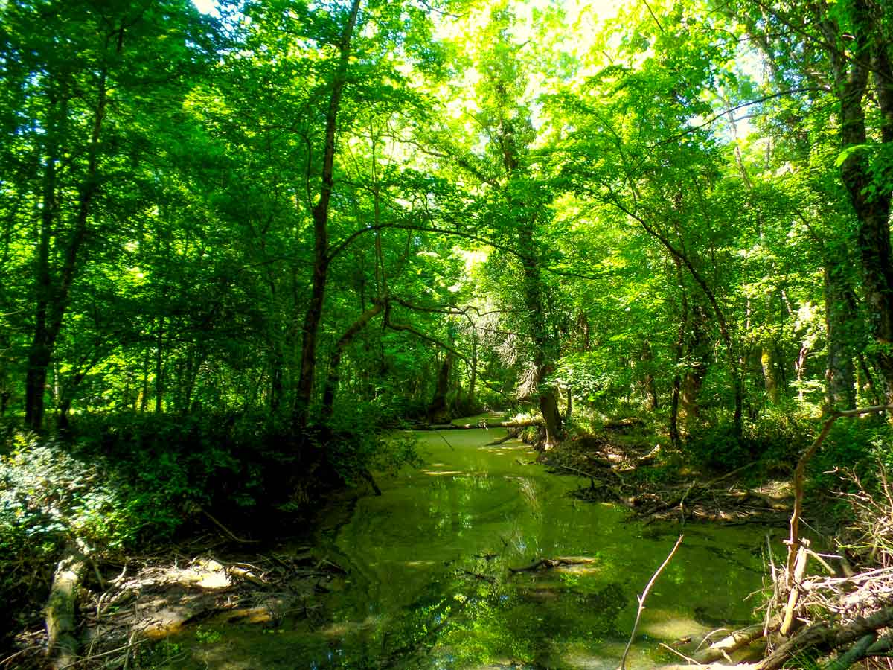

### İğneada Longozlar nerede ve nasıl gidilir?

İstanbul’dan TEM otoyolunu kullanarak Lüleburgaz’a doğru yola çıkın. Lüleburgaz’a geldiğinizde TEM’den Poyralı’ya doğru giden yolu takip edin. Poyralı’ya ulaşınca Demirköy üzerinden İğneada’ya ulaşacaksınız. Diğer bir alternatif yol ise Saray->Vize->Poyralı olarak gözükmekte. Ancak bu yol kötü olduğundan kullanmamanızı tavsiye ederim. En rahatı Lüleburgaz üzerinden gitmek.

<iframe class="mappingFrame" style="border: 0px currentColor;" src="https://www.google.com/maps/embed?pb=!1m26!1m12!1m3!1d381825.410174104!2d27.620637072355983!3d41.61227344687777!2m3!1f0!2f0!3f0!3m2!1i1024!2i768!4f13.1!4m11!3e0!4m3!3m2!1d41.4406439!2d27.4310512!4m5!1s0x40a0e8bc9dc279f1%3A0x77a6840403a3fb88!2zxLDEn25lYWRhLCBEZW1pcmvDtnksIFTDvHJraXll!3m2!1d41.8377154!2d27.948473399999997!5e0!3m2!1str!2s!4v1433954465404" width="300" height="150"></iframe>

  

### İğneada Longozlar kamp alanı bilgileri

##### Olanlar;

* Kamp Yeri(Sahilde özel işletme var.)
* Temiz Su
* WC
* Market
* Restoran
* Pansiyon

Not: Bu bilgiler Haziran 2015 yılına aittir.

### İğneada Longozlar Yürüyüş Rotaları

#### Kıyıköy'den önce İğneada'ya oradan da Beğendik Koyuna (50 km)

<iframe frameBorder="0" scrolling="no" src="https://tr.wikiloc.com/wikiloc/spatialArtifacts.do?event=view&id=6834583&measures=on&title=on&near=off&images=on&maptype=H" width="100%" height="600" style="border-radius: 10px 10px;"></iframe>

* Kıyıköy sahilden başlayıp Longoz ormanları içerisindeki toprak yolu takip ederek önce İğneada’ya ulaşacaksınız. İğneada sonrasında ise tekrar orman içi toprak yoldan Beğendik koyuna varmış olacaksınız.
* Yola çıkmadan suyunuzu alın. Rotada belirtilen kamp yerlerinde ve merkezlerde su takviyesi yapabilirsiniz.
* Baktığınızda kolay bir parkur. Uzun oluşu sizi yorabilir. Bu yüzden tamamı yerine bir kısmını yapmayı tercih edebilirsiniz.
* Bu rotaya Beğendik koyundan başlayarak da takip edebilirsiniz.

#### Mert gölü çevresi (9 km)

<iframe frameBorder="0" scrolling="no" src="https://tr.wikiloc.com/wikiloc/spatialArtifacts.do?event=view&id=9818328&measures=on&title=on&near=off&images=on&maptype=H" width="100%" height="600" style="border-radius: 10px 10px;"></iframe>

* İğneada da evlerin bittiği ormanın başladığı yerden orman içerisine girilir.
* Şort yerine uzun kıyafet giymek bacaklarınızı çizilmekten kurtaracak.
* Bahar aylarında sular yükseleceğinden dere geçişleri zorlayabilir.
* Yola çıkmadan suyunuzu alın. Yol üzerinde temiz su yok.
* Baktığınızda kolay bir parkur gibi gözükebilir. Ancak orman içerisindeki çalılar ve dere geçişleri sizi yoracak. Belirgin bir yürüyüş parkuru olmadığından orman içerisinde yol arayıp durmak sizi yorabilir.