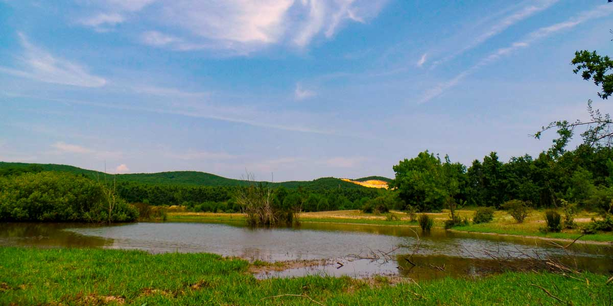
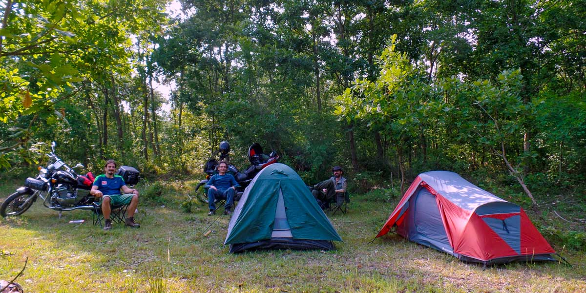

### Karacaköy Göleti nerede ve nasıl gidilir?

İstanbul üzerinden hareket edip Çatalca’yı geçtikten sonra Danamandıra’ya giden yolu takip edeceksiniz. Danamandıra yol ayrımını hemen geçtikten sonra sağa Karamandere’ye giden yola döneceksiniz. Buraya kadar güzel asfalt bir yoldan geleceksiniz. Buradan sonrası da asfalt ama biraz bozuk bir yol. Karamandere ayrımını geçtikten sonra(Karamandere’ye girmiyorsunuz)  Karacaköy’e doğru devam edeceksiniz. Karacaköy göletine yaklaştığınızda bir köprüden geçeceksiniz. Ardından hemen sağa orman içerisine inen yolu takip ederek derenin kenarına geleceksiniz. Göletin yanına gidebilmek için dereden geçmeniz gerekiyor. Aracınızın altı yüksek ise buradan rahatlıkla geçebilirsiniz.

<iframe class="mappingFrame" src="https://www.google.com/maps/embed?pb=!1m22!1m12!1m3!1d11618.123949528164!2d29.86686961981396!3d41.13786220898904!2m3!1f0!2f0!3f0!3m2!1i1024!2i768!4f13.1!4m7!1i0!3e6!4m3!3m2!1d41.140783!2d29.8713052!4m0!5e1!3m2!1str!2s!4v1425898013348" width="300" height="150"></iframe>

  

### Karacaköy Göleti kamp alanı bilgileri

##### Olanlar;

* Kamp Yeri (Bulduğunuz düzlüklere çadırınızı kurabilirsiniz. Özel işletme yok.)
* Alttaki haritada kamp yerimiz ve uygun kamp yeri işaretledim.
* Toprak yoldan göl kenarına inip, göl çevresine de çadır kurabilirsiniz. Günübirlikçi çok geleceğinden burada pek huzuru bulamayabilirsiniz.
* Temiz Su(Karamandere ana yolu üzerinde çeşmeler var)

##### Olmayanlar;

* Market
* Restoran
* Kafeterya

Not: Bu bilgiler Temmuz 2015 yılına aittir.

### Karacaköy Göleti Yürüyüş Rotaları

#### Karacaköy göleti mısır tarlaları (1.6 km)

<iframe frameBorder="0" scrolling="no" src="https://tr.wikiloc.com/wikiloc/spatialArtifacts.do?event=view&id=8966397&measures=on&title=on&near=off&images=on&maptype=H" width="100%" height="600" style="border-radius: 10px 10px;"></iframe>

* Rotaya kamp yaptığımız yerden başladım. Toprak yolu takip ederek orman içerisine girdim. Mısır tarlalarına ulaştıktan sonra kenardan kenardan Karacaköy göletine ulaşmaya çalıştım. Ancak dereyi geçemeyince geri döndüm.
* Parkur kısa ve yol üzerinde içme suyu yok.
* Gece çokça çakal sesi geldi ama pek yaklaşmadılar.

#### Karamandere köyünden Mandıra deresine sonra tekrar köye dönüş (12.5 km)

<iframe frameBorder="0" scrolling="no" src="https://tr.wikiloc.com/wikiloc/spatialArtifacts.do?event=view&id=8966397&measures=on&title=on&near=off&images=on&maptype=H" width="100%" height="600" style="border-radius: 10px 10px;"></iframe>

* Parkur Karamandere köyünü geçtikten sonra başlıyor. Orman içi toprak yoldan devam eden rota Mandıra deresinin yanından geçerek bir yuvarlak çizip tekrar başladığı noktaya dönüyor.
* Kolay bir parkur.
* Parkurda su noktası yok. Yola çıkmadan köyden suyunuzu almalısınız.

#### Karamandere köyünden Mandıra deresine sonra Gümüşpınar köyüne (12.6 km)

<iframe frameBorder="0" scrolling="no" src="https://tr.wikiloc.com/wikiloc/spatialArtifacts.do?event=view&id=8966397&measures=on&title=on&near=off&images=on&maptype=H" width="100%" height="600" style="border-radius: 10px 10px;"></iframe>

* Parkur Karamandere köyünü geçtikten sonra başlıyor. Orman içi toprak yoldan devam eden rota Mandıra deresinin yanından geçerek Gümüşpınar köyünde son buluyor.
* Kolay bir parkur.
* Parkurda su noktası yok. Yola çıkmadan köyden suyunuzu almalısınız.

#### Belgrad köyüne (13.3 km)

<iframe frameBorder="0" scrolling="no" src="https://tr.wikiloc.com/wikiloc/spatialArtifacts.do?event=view&id=8966397&measures=on&title=on&near=off&images=on&maptype=H" width="100%" height="600" style="border-radius: 10px 10px;"></iframe>

* Parkur Belgrat köyünden başlıyor. Orman içi toprak yoldan devam eden yuvarlak çizerek tekrar köye geri dönüyor.
* Kolay bir parkur.
* Parkurda su noktası yok. Yola çıkmadan köyden suyunuzu almalısınız.