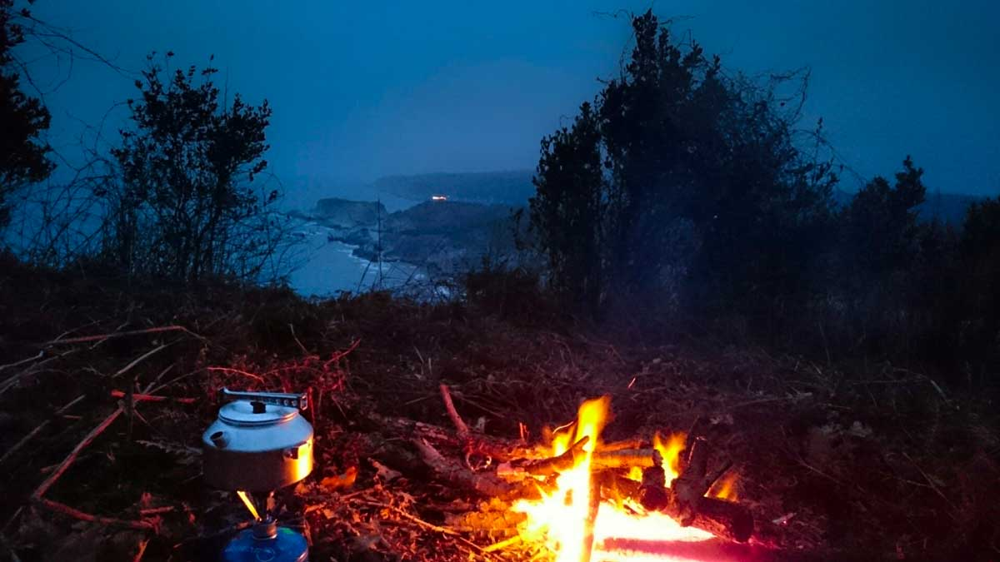

### Kilimli Koyu nerede ve nasıl gidilir?

İstanbul veya Kocaeli üzerinden Ağva’ya geldikten sonra Kilimli Koyuna gelmek çok basit. Ağva’dan Kerpe’ye doğru sahilden giden Dikbucak yolunu takip ettiğinizde Kilimli koyuna ayrılan tabelaları göreceksiniz. Ağva’nın hemen yanıbaşında olan bu güzel koya kısa sürede ulaşmış olacaksınız.

<iframe class="mappingFrame" src="https://www.google.com/maps/embed?pb=!1m22!1m12!1m3!1d11618.123949528164!2d29.86686961981396!3d41.13786220898904!2m3!1f0!2f0!3f0!3m2!1i1024!2i768!4f13.1!4m7!1i0!3e6!4m3!3m2!1d41.140783!2d29.8713052!4m0!5e1!3m2!1str!2s!4v1425898013348" width="300" height="150"></iframe>

  

### Kilimli Koyu kamp alanı bilgileri

##### Olanlar;

* Kilimli Koyunda kamp alanı bulunmamakta. Orman içerisine çadırınızı kurup konaklayabilirsiniz.
* Restoran(Kilimli Restaurant)
* WC(Kilimli Restaurant)

##### Olmayanlar;

* Pansiyon
* Temiz Su (Yanınızda getirmelisiniz)
* Market(Ağva’da halletmelisiniz.)
* Pansiyon

Not: Bu bilgiler Mart 2015 yılına aittir.

### Kilimli Koyu Yürüyüş Rotaları

#### Ağva'dan Kilimli koyuna (11 km)

<iframe frameBorder="0" scrolling="no" src="https://tr.wikiloc.com/wikiloc/spatialArtifacts.do?event=view&id=8966397&measures=on&title=on&near=off&images=on&maptype=H" width="100%" height="600" style="border-radius: 10px 10px;"></iframe>

* Ağva içerisinden başlayarak yol kenarından devam eder. Köprü geçtikten sonra toprak yoldan gidilerek Kilimli koyuna kadar varılır. Sonra orman içerisinden gidilerek orman içerisinden Ağva’nın gözüktüğü yere ulaşılır. Kıyıdan yürüyüş patikasını takip ederek tekrar Kilimli koyuna ulaşılır. Araç yolu üzerinden Ağva’ya geri dönülmüştür.
* Yağmurlu havada veya yağmur sonrası gidildiğinde bolca çamura batacaksınız.
* Kıyıdan giderken kayalıklardan geçtiğiniz tehlikeli bir yer var. Oraya dikkat etmelisiniz. Özellikle yağmur sonrası taşlar kayganlaşıyor.
* Parkur üzerinde su noktası yok.
* Parkur kırmızı beyaz boyalarla ve tabelalarla işaretlenmiş.
* Kilimli koyundaki restaurantta yiyecek ve içecek bulabilirsiniz.
* Keyifli, güzel ve kolay bir parkur.