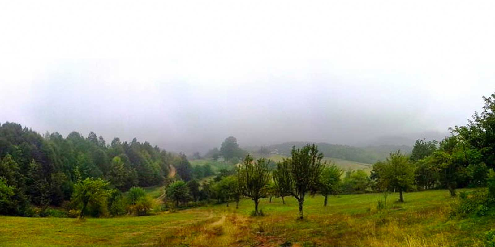

### Menekşe Subatımı yaylası nerede ve nasıl gidilir?

Menekşe Subatımı yaylasına iki farklı yoldan gidebilirsiniz. İlki Kocaeli -> Yuvacık üzerinden Aytepe’ye gidip ardından Menekşe yaylası tabelalarını takip ederek yaylaya ulaşmak. İkincisi ise; Kocaeli -> Gölcük -> Nuzhetiye üzerinden yine Menekşe yaylası tabelalarını takip ederek yaylaya ulaşabilirsiniz. İlk yol Aytepe’den sonra toprak yola dönüyor ve zaman zaman aracınızın altını sürtmemek için yavaş geçmek zorunda kalıyorsunuz. 2.yol ise ilk yola göre daha düzgün. Nüzhetiye sonrasında toprak yola giriyorsunuz. Ama bu yol daha düzgün.

<iframe class="mappingFrame" src="https://www.google.com/maps?q=40.586044,29.89676&amp;num=1&amp;t=h&amp;hl=tr&amp;ie=UTF8&amp;ll=40.586924,29.903476&amp;spn=0.012238,0.022724&amp;z=14&amp;output=embed" width="300" height="150"></iframe>

  

### Menekşe Subatımı yaylası kamp alanı bilgileri

##### Olanlar;

* Kamp Yeri (Bulduğunuz düzlüklere çadırınızı kurabilirsiniz. Özel işletme yok.)
* Temiz Su

##### Olmayanlar;

* Market
* Restoran
* Kafeterya

Not: Bu bilgiler 2013 yılına aittir.

### Menekşe Subatımı yaylası Yürüyüş Rotaları

#### Aytepe ve Soğukpınar'dan Papaz çayırını geçerek Menekşe subatımı yaylasına sonrasında Servetiye Karşı köyüne (22 km)

<iframe frameBorder="0" scrolling="no" src="https://tr.wikiloc.com/wikiloc/spatialArtifacts.do?event=view&id=4037382&measures=on&title=on&near=off&images=on&maptype=H" width="100%" height="600" style="border-radius: 10px 10px;"></iframe>

* Rotaya Aytepe’den başlayarak önce Soğukpınar’a iniyorsunuz. Sonra buradan dik bir orman içi patika çıkarak önce Papaz Çayırına ardından da Menekşe yaylasına ulaşıyorsunuz. Sonrasında ise orman içi yoldan Servetiye Karşı köyüne iniyorsunuz.
* Soğukpınar, Papaz Çayırı ve Menekşe yaylasında su var.
* Soğukpınar – Kayaklıklar arasındaki orman içi patika sizi biraz yorabilir. Orta seviyede bir parkur. Uzun oluşu da sizi yorabilir.

#### Kırıntı köyünden Menekşe Subatımı yaylasına (18 km)

<iframe frameBorder="0" scrolling="no" src="https://tr.wikiloc.com/wikiloc/spatialArtifacts.do?event=view&id=7162797&measures=on&title=on&near=off&images=on&maptype=H" width="100%" height="600" style="border-radius: 10px 10px;"></iframe>

* Rotaya Kırıntı köyünden başlayarak toprak yoldan önce Menekşe-Subatımı yaylasına Menekşe yaylasının yanından geçerek zirve noktaya ulaşıp tekrar aynı rotadan geri dönen bir parkur.
* Zirve noktasının güzel bir manzarası var.
* Kırıntı köyü ve Menekşe yaylasında su var.
* Genel itibariyle kolay bir parkur.

#### Aytepe'den Menekşe Subatımı yaylasına (18 km)

<iframe frameBorder="0" scrolling="no" src="https://tr.wikiloc.com/wikiloc/spatialArtifacts.do?event=view&id=557748&measures=on&title=on&near=off&images=on&maptype=H" width="100%" height="600" style="border-radius: 10px 10px;"></iframe>

* Parkur üzerinde su noktaları var.
* Aytepe’den başlayan yolculuk önce Soğukpınar’a ardından Papaz Çayırına uzanıyor. Soğukpınar’dan Papaz çayırına orman içi patikadan dik bir çıkış yapıyorsunuz. Burada biraz yorulabilirsiniz. Sonrasında orman içi toprak yoldan Menekşe Subatımı yaylasının yanından geçerek orman içerisine daha çok girerek Nüzhetiye’ye doğru inişe geçeceksiniz.
* Orta zorlukta bir parkur. Yeni başlayanları zorlayabilir.