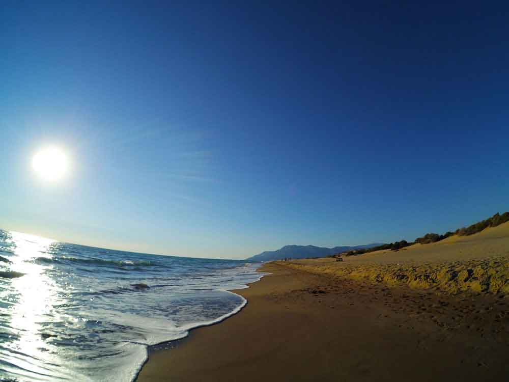

Patara plajı 18kmlik uzunluk ile Akdeniz’in en uzun plajıdır. Kumsal’ın yarısı Antalya diğer yarısı ise Muğla sınırlarında kalmaktadır. Patara tarafı daha güzeldir. Denizi sürekli dalgalı olsa da kumsalı çok güzel. 18kmlik kumsalı ise yürü yürü bitiremiyor insan. Denize sırtımı dönüp kum tepeleri üzerinde yürüdüğümde çöldeymiş hissine kapılmıştım. Kışın gün batımlarında güneşin kızıllığıyla birlikte çok güzel bir manzara oluşuyor. Aynı zamanda Caretta Caretta’ların yumurtalarını bıraktığı kumsaldır. Gündüzleri insanlara geceleri ise onlara açıktır. Onlar yumurta bırakınca biz üstüne basıyor muyuz kısmını bilmiyorum. Mayıs ayında yumurtalarını bıraktıkları bilgisine sahibim. Merak edenler [Patara’nın Yavru ‘Caretta’ları Denizle Buluşuyor](http://www.haberler.com/patara-nin-yavru-caretta-lari-denizle-bulusuyor-4994792-haberi/) haberini okuyabilir.

Patara, Likya uygarlığına başkentlik yapmış bir şehirdir. Kumsaldan hemen önce Patara antik kenti yer almaktadır. Patara’ya geldiğinizde saatlerce antik kenti gezebilirsiniz. Kocaman bir kent, gezmek bir kaç saatinizi alacaktır. Kazı ve restorasyon çalışmaları halen devam etmekte. Antik kent sevicilerin görmesi gereken bir yer. 

### Patara Plajı nerede ve nasıl gidilir?

Antalya -> Fethiye istikametinde giderken Kalkan’ı geçtikten sonra sola doğru Patara tabelasını göreceksiniz. Buradan içeriye girdiğinizde yaklaşık 5-6dk içerisinde Gelemiş köyünü geçtikten sonra Patara antik kentine ulaşacaksınız. Antik kente ve plaja giriş ücretlidir. Müze kartınız varsa ücret ödemeden geçebilirsiniz.

<iframe class="mappingFrame" src="https://www.google.com/maps/embed?pb=!1m26!1m12!1m3!1d41475.49134071756!2d29.326969579978517!3d36.27501370364359!2m3!1f0!2f0!3f0!3m2!1i1024!2i768!4f13.1!4m11!3e0!4m3!3m2!1d36.269559699999995!2d29.400693999999998!4m5!1s0x14c02ead63170a3f%3A0x35a9c0a15ea8e437!2zUGF0YXJhIFBsYWrEsSwgMDc5NzUgS2HFny9BbnRhbHlh!3m2!1d36.254314!2d29.313651999999998!5e0!3m2!1str!2str!4v1475766241613" width="300" height="150" allowfullscreen="allowfullscreen"></iframe>

  

### Patara  Plajı Dolmuş Saatleri

Patara plajından Kalkan, Kaputaş, Kaş, Fethiye ve  Patara(Gelemiş) köyüne giden dolmuşların kalkış saatleri alttaki gibidir. Sorularınızla ilgili 0242-843-51-17 numaralı telefondan bilgi alabilirsiniz.

| Kalkan-Kaputaş-Kaş                        | Fethiye                       | Patara(Gelemiş) Köyü                                        |
| ----------------------------------------- | ----------------------------- | ----------------------------------------------------------- |
| 12:40 14:00 15:05 16:05 17:05 17:35 18:45 | 12:40 14:00 16:00 17:00 18:45 | 12:40 14:00 15:00 16:00 17:00 17:30 18:00 18:30 19:00 19:30 |

### Patara Plajı kamp alanı bilgileri

##### Olanlar;

* Patara(Gelemiş) köyünde campingler var. Medusa campingi önerebilirim.
* Köyün girişinde birisine ait olmayan yani özel mülk olmayan bir yer bulursanız çadır kurabilirsiniz.
* Plajda çadır kurabilir miyim diye merak ediyorsanız, yer yer ağaçlık alanlar var. Sit alanı olduğu için gece dolaşan bekçi büyük ihtimalle sizi kapı dışarı edecektir.
* Köyde bir çok market, pansiyon, otel ve restoran var.
* Plaj alanında otopark var.
* Plajda bir kafeterya var.
* Plaj’da duş/wc var. Ücreti 1 TL
* Plajda şezlong var.

Not: Bu bilgiler Eylül 2016 yılına aittir.

### Patara Plajı Yürüyüş Rotaları

Yakın yerlerde Likya yolu patikaları var. Yürümek isterseniz alttaki linklerden buralara göz atabilirsiniz. Veya alttaki rotalardan birini takip edebilirsiniz.

* [Kalkan Bezirgan Yürüyüş Rotası](/likya-yolu-rotasi-uzumluden-bezirgan-koyune/)

#### Gelemiş köyünden Patara Plajının bir ucundan Eşen çayına (9.1 km)

<iframe frameBorder="0" scrolling="no" src="https://tr.wikiloc.com/wikiloc/spatialArtifacts.do?event=view&id=15002635&measures=on&title=on&near=off&images=on&maptype=H" width="100%" height="600" style="border-radius: 10px 10px;"></iframe>

* Kolay bir parkur.
* Gelemiş köyünden başlayan parkur hafif yokuş inişiyle 2.5km sonra Patara’nın muhteşem kumsalına varıyor.
* Sonrasında kumsal üzerinden yaklaşık 7km deniz kenarından veya kum tepelerinden yürüyerek Eşen çayına ulaşıyorsunuz.
* Yola çıkarken yanınıza su almalısınız. Kumda yürümek biraz zordur. Daha rahat yürümek istiyorsanız deniz kenarını takip etmelisiniz.
* Eşen çayında suyun fazla olmasından dolayı kumsalın devamına ilerleyemiyorsunuz. Yüzerek veya çay üzerinden geçerek 18kmlik Patara kumsalını yürüyebilirsiniz.
* Kumsala ilk giriş yaptığınızda bir kafeterya bulunuyor. Yine aynı şekilde wc ve duş imkanı var.

#### Gelemiş Köyünden Delikkemer'e (6.3 km)

<iframe frameBorder="0" scrolling="no" src="https://tr.wikiloc.com/wikiloc/spatialArtifacts.do?event=view&id=8830975&measures=on&title=on&near=off&images=on&maptype=H" width="100%" height="600" style="border-radius: 10px 10px;"></iframe>

* Gelemiş köyünden başlayan parkur patikadan devam ederek Delik Kemer’e ulaşıyor.
* Yola çıkarken yanınıza su almalısınız. Rota üzerinde su yok.
* Kolay-Orta arası bir parkur. 6.3km yürüyüp Delik Kemer’e varınca geriye nasıl döneceğizin sorusu olabilir. Yürüdüğünüz yolu geri dönebilirsiniz veya Delik Kemer’den yukarı yürüyerek ana yola ulaşırsınız. Ana yoldan Patara’ya geçen Kaş dolmuşlarına binip Patara kavşağında indikten sonra Patara’nın içine giden ve yine bu kavşaktan kalkan dolmuşlara binebilirsiniz.

#### Kaş dolmuşlarından inip Gelemiş köyüne ulaştıktan sonra Patara plajına geçiş (14 km)

<iframe frameBorder="0" scrolling="no" src="https://tr.wikiloc.com/wikiloc/spatialArtifacts.do?event=view&id=2843888&measures=on&title=on&near=off&images=on&maptype=H" width="100%" height="600" style="border-radius: 10px 10px;"></iframe>

* Gelemiş köyünden başlayan parkur hafif yokuş inişiyle 2.5km sonra Patara’nın muhteşem kumsalına varıyor.
* Sonrasında kumsalda biraz devam ederek kum tepeleri üzerinden tekrar Gelemiş köyüne geliyor. Buradan da araç yolu takip edilerek Kaş dolmuşlarının kalktığı ana yola ulaşıyor.
* Yola çıkarken yanınıza su almalısınız, tekrar Gelemiş köyüne gelince buradan su temin edebilirsiniz. Kumda yürümek biraz zordur. Sadece kum olan bölümü sizi biraz yorabilir. Sürekli yürüyen adama bir şey yapmaz tabi :)

#### Gelemiş köyünden Patara plajına sonra Delikkemer üzerinden Kalkan'a (25.2 km)

<iframe frameBorder="0" scrolling="no" src="https://tr.wikiloc.com/wikiloc/spatialArtifacts.do?event=view&id=9460421&measures=on&title=on&near=off&images=on&maptype=H" width="100%" height="600" style="border-radius: 10px 10px;"></iframe>

* Gelemiş köyünden başlayan parkur hafif yokuş inişiyle 2.5km sonra Patara’nın muhteşem kumsalına varıyor.
* Kumsaldaki kafeterya sonrasında tepe üzerinden patikadan önce Delik Kemer’e sonra Kalkan’a varıyor.
* Yola çıkarken yanınıza su almalısınız. Bu rota üzerine plajdaki kafeteryadan Kalkan’a kadar su yok. Ciddi susuzluk yaşamış biri olarak en az 3lt su almanızı öneririm.
* Delik Kemer’den Kalkan’a olan bölümde ciddi kaya inişleri var. Burada sakatlık yaşama riski yüksek. Çok dikkatli olmalısınız.
* Hafife alınmayacak 25kmlik zorlu bir bölüm. Kaya inişleri ve su olmaması bu rotayı zorlu hale getiriyor.

#### Gelemiş köyünden Delikkemer'e sonrasında Kalkan üzeirnden Üzümlü köyüne (26 km)

<iframe frameBorder="0" scrolling="no" src="https://tr.wikiloc.com/wikiloc/spatialArtifacts.do?event=view&id=9469903&measures=on&title=on&near=off&images=on&maptype=H" width="100%" height="600" style="border-radius: 10px 10px;"></iframe>

* Bir üstteki rota ile sadece 2 farkı var. Gelemiş köyünden kumsala inmeden patikayı kullanarak Delik Kemer’e ulaşması ve Kalkan’a hiç girmeden Üzümlü köyüne varması.
* Bunun haricinde aynı rota ve dikkat edilmesi gerekenler aynıdır.