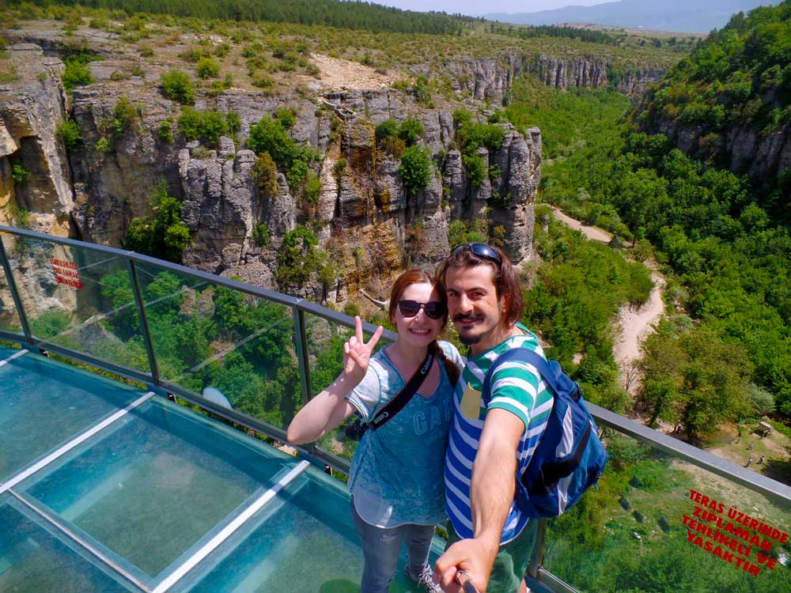

### Safranbolu Tokatlı Kanyonu nerede ve nasıl gidilir?

Safranbolu’ya geldikten sonra kanyona gitmek çok kolay. Bir çok tabela sizi kanyona ulaştıracaktır. Fırsatınız varsa hafta içi bir gün gitmenizi öneririm. Daha sakin olur.

<iframe class="mappingFrame" src="https://www.google.com/maps/embed?pb=!1m28!1m12!1m3!1d29832.82665601972!2d32.66038227242936!3d41.2674688837699!2m3!1f0!2f0!3f0!3m2!1i1024!2i768!4f13.1!4m13!3e6!4m5!1s0x409caa9d5ee9f88d%3A0xada7f397a3f8f371!2sTokatl%C4%B1+Kanyonu%2C+Safranbolu%2C+T%C3%BCrkiye!3m2!1d41.2813331!2d32.684698499999996!4m5!1s0x409caac51abbad83%3A0x6b7db3ac7a87e93d!2zU2FmcmFuYm9sdSwgS2FyYWLDvGssIFTDvHJraXll!3m2!1d41.249306!2d32.683127999999996!5e1!3m2!1str!2s!4v1437208700287" width="300" height="150"></iframe>

  

### Safranbolu Tokatlı Kanyonu kamp alanı bilgileri

##### Olanlar;

* Kamp Yeri olarak özel işletme bulunmamakta.
* Kanyon içerisinde düzlük yerler var. Çadır kurabilirsiniz gibi geldi. Etrafınızda yürüyüş yapan ve piknik yapmaya gelen insanlar olacaktır. Bunu gözardı ediyorsanız kalabilirsiniz.
* Temiz Su(Kanyona inmeden önce suyunuzu alın. Kanyon içerisinde su yok.)
* Market (Kanyon girişinde var)
* Restoran(Kanyon girişinde var)
* Otopark(Kanyon girişinde var)

Not: Bu bilgiler Mayıs 2015 yılına aittir.

### Safranbolu Tokatlı Kanyonu yürüyüş rotaları

#### Kanyon yürüyüşü (2.1 km)

<iframe frameBorder="0" scrolling="no" src="https://tr.wikiloc.com/wikiloc/spatialArtifacts.do?event=view&id=9721114&measures=on&title=on&near=off&images=on&maptype=H" width="100%" height="600" style="border-radius: 10px 10px;"></iframe>

* Kanyon girişinde 2 tl’lik ücret ödedikten sonra merdivenleri inerek kanyona giriyorsunuz. Ardından patikayı takip ederek 2.1km sonra vardığınız köprüde yürüyüş sonlanmış oluyor.
* Parkur kısa ve yol üzerinde içme suyu yok. Dere kenarından ilerliyor.
* Kanyona girmeden yanınıza en az 1lt su almalısınız.