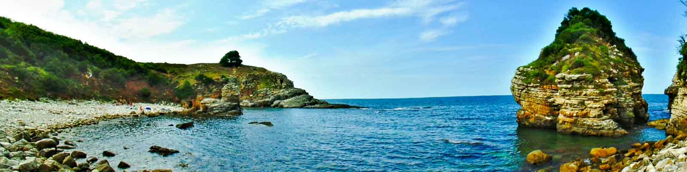
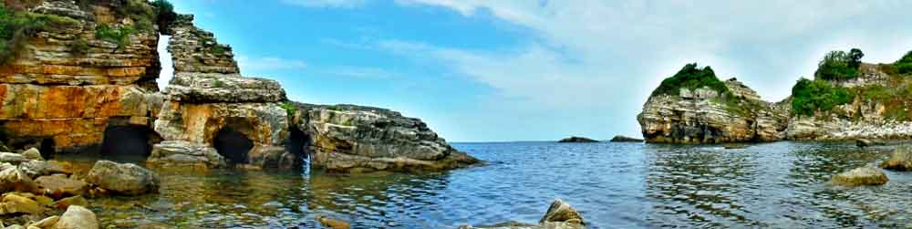
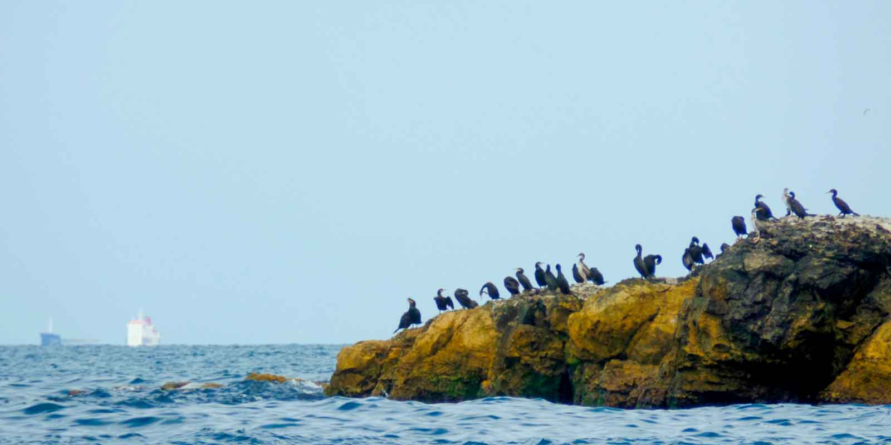
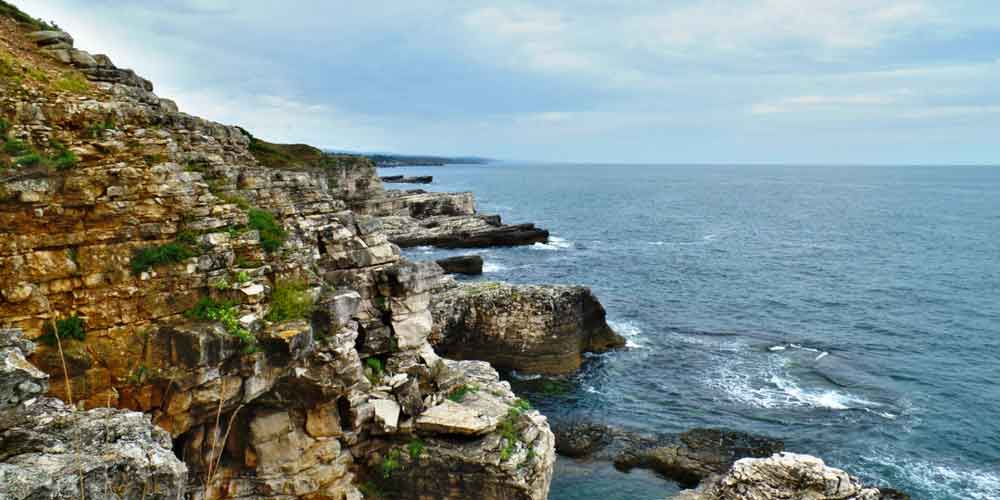

### Saklı Koy nerede ve nasıl gidilir?

Kocaeli’ne geldikten sonra Kandıra tabelası takip edilerek önce buraya ulaşılır. Sonra Çalköy yolu takip edilerek Saklı Koya giden yol ayrımına kadar gelinir. Haritadaki yol ayrımında arabanızı bırakabilirsiniz. Eğer aracını 4×4 ise buradan sahile kadar giden yolu aracınızla devam edebilirsiniz. En fazla 15dklık yürüme ile sahile ulaşacaksınız. Patikadan inerek koya ulaşabilirsiniz.

### Saklı Koy hakkında bilenenler

Saklı koy Sardala koyuna yakın bir yerdedir. Buraya gelmişken [Sardala koyuna](https://www.yolacikmali.com/2014/08/sardala-koyu/) da gidebilirsiniz. Çok bakir bir yer olan bu koyda denize girebilirsiniz. Kayalıklardan suya atlayabilirsiniz. Su yosunlu olduğundan deniz ayakkabısıyla veya paletle girmeniz tavsiye edilir. Burada muhtemelen sizden başka kimse olmayacağı veya çok az kişi olacağından rahat olacaksınızdır. Tek sorun arabayı yol kenarında bıraktıktan sonra 15dklık bu mesafeye tüm eşyalarınızı taşımak olacak. Bu güzel yer için değer doğrusu.

<iframe class="mappingFrame" style="border: 0;" src="https://www.google.com/maps/embed?pb=!1m25!1m12!1m3!1d6331.223629222578!2d30.07961287768872!3d41.13061652863423!2m3!1f0!2f0!3f0!3m2!1i1024!2i768!4f13.1!4m10!1i0!3e0!4m3!3m2!1d40.7850882!2d29.9714982!4m3!3m2!1d41.132140299999996!2d30.0828673!5e1!3m2!1str!2s!4v1408049327624" width="300" height="150"></iframe>

  

### Saklı Koy kamp alanı bilgileri

##### Olanlar;

* Kamp Yeri(Sahildeki tepe alana çadır kurabilirsiniz.)
* Bakir bir yer

##### Olmayanlar;

* Temiz Su
* Bakkal/Market
* Restoran
* Kafeterya
* Pansiyon
* WC

Not: Bu bilgiler Ağustos 2014 yılına aittir.

### Saklı Koy Wikiloc

<iframe frameBorder="0" scrolling="no" src="https://tr.wikiloc.com/wikiloc/spatialArtifacts.do?event=view&id=7462406&measures=on&title=on&near=off&images=on&maptype=H" width="100%" height="600" style="border-radius: 10px 10px;"></iframe>

