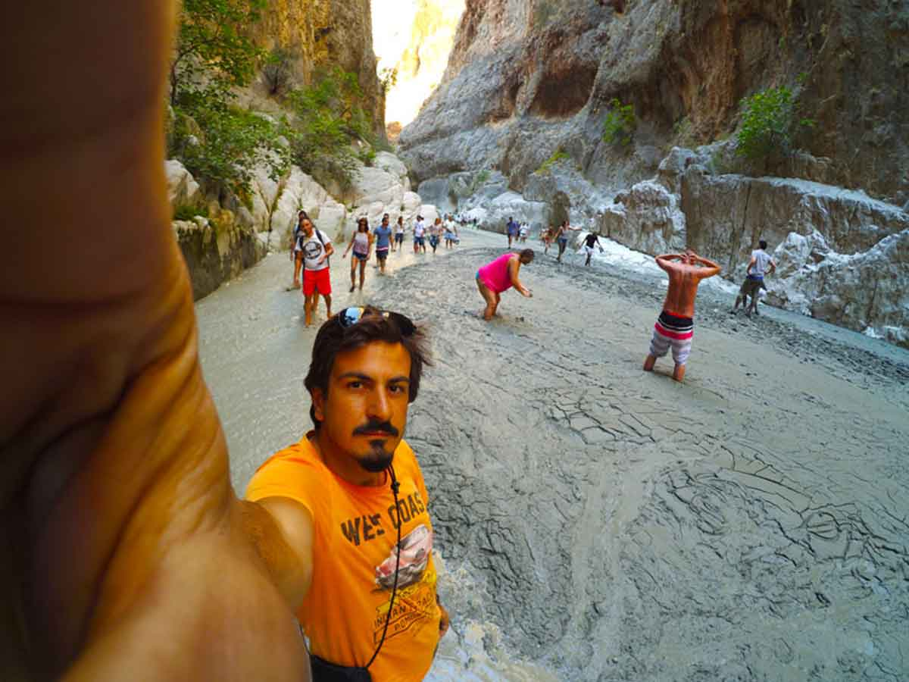
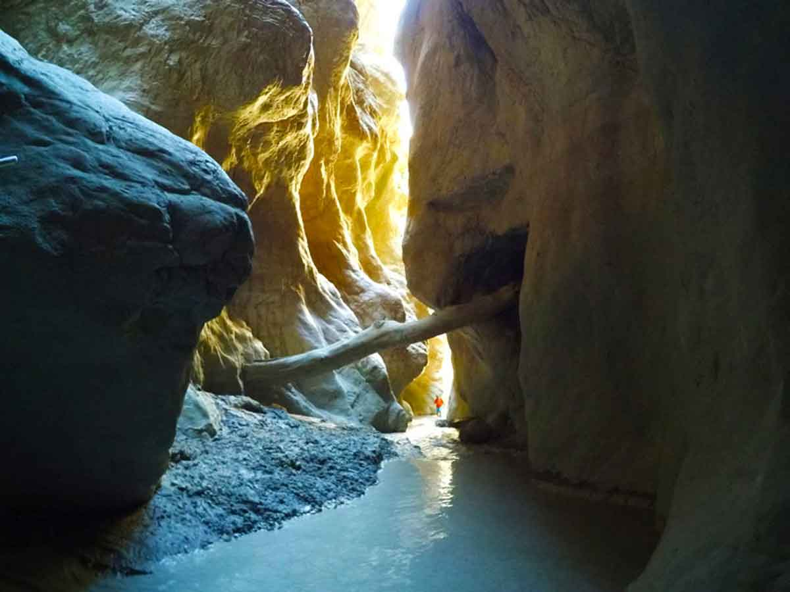

Antalya – Muğla sınırındaki Eşen Çayı üzerinde bulunan Saklıkent Kanyonu bence görülmesi gereken önemli bir güzellik. Fotoğraflarda hep iskele üzerinde yürüyecekmişiz izlenimine kapılmıştım. Meğer sadece giriş kısmı öyleymiş. Sonrası dere içi çamur banyosu olarak devam ediyor. Antalya, Muğla taraflarında yaşayanlar için ulaşımı kolay olan bir bölge. Aynı zamanda milli parklar korumasında bulunmaktadır. Kanyon uzunluğu 18km ve en dar yeri ise yaklaşık 2metre. Gökyüzünü görmekte zorlanabilirsiniz. Kanyonun tamamını yürümeniz şart değil. Bir bölümünü yürüyüp geri dönebilirsiniz.

Ayakkabı ile girmeyin. Bolca çamura batacağınız için ayakkabıya rahat bir yürüyüş olmayacaktır. Sandalet vs iyi ama bu kez de araya sıkışan taşlar sizi rahatsız edecektir. Kanyon girişinde bir sürü terlik kiralamacısı var. Başkasının terliğini giymeyin yanınızda terlik götürün. En mantıklısı ve rahatı bu olur. Yalnız terlikte de ayağınız çamura battığında ve ayağınızı çektiğinizde terlik çamur içerisinde kaybolabilir. Buna dikkat etmelisiniz. Yürüyüş sonrası kanyon girişindeki yerlerde çay içip mısır yiyebilirsiniz. Zorlandığınız noktadan geriye dönebilirsiniz. Aksi halde kanyon çok uzun git gel neredeyse bir [Patara Plajı.](/patara-plaji/)

### Saklıkent Kanyonu nerede ve nasıl gidilir?

Antalya -> Fethiye yolu üzerinde ilerlerken Kınık’ı geçtikten sonra Kadıköy yol ayrımından devam eden yol ile Saklıkent Kanyonuna ulaşabilirsiniz. Birden fazla yol alternatifi var ancak en doğrusu tabelaları takip etmeniz olacak. Antalya – Fethiye yolunda devam ederken zaten tabelaları göreceksiniz. Asfalt bir yol ile kanyona ulaşacaksınız. Saklıkent Kanyonu Antalya’ya 50 km Fethiye’ye ise 45 km mesafede bulunmaktadır. Kanyon girişindeki otoparka aracınızı bırakabilirsiniz. Motosiklet için 2 tl(2016) gibi bir rakam ödediğimi hatırlıyorum.

<iframe class="mappingFrame" src="https://www.google.com/maps/embed?pb=!1m26!1m12!1m3!1d145189.2673656542!2d29.320249570478595!3d36.475439250549826!2m3!1f0!2f0!3f0!3m2!1i1024!2i768!4f13.1!4m11!3e0!4m3!3m2!1d36.532934!2d29.343132699999998!4m5!1s0x14c04aa8d2b88d5f%3A0x73cd5e161507819d!2sSakl%C4%B1kent+Milli+Park%C4%B1%2C+48850+Kayadibi%2FFethiye%2FMu%C4%9Fla!3m2!1d36.468839599999995!2d29.405540199999997!5e0!3m2!1str!2str!4v1487257820935" width="300" height="150" allowfullscreen="allowfullscreen"></iframe>

  

### Saklıkent Kanyonu kamp alanı bilgileri

##### Olanlar;

* Kanyon girişinin olduğu yerde bir çok işletmenin yanı sıra otopark da var.
* Kamp alanı için özel işletmeler var. Dilerseniz Milli park içerisinde bulunan yaylalarda da çadır atabilirsiniz.
* Ziyaretçisi çok olan kalabalık bir yer.
* İşletme olduğundan dolayı su ve tuvalet var.

Not: Bu bilgiler Eylül 2016 yılına aittir.
