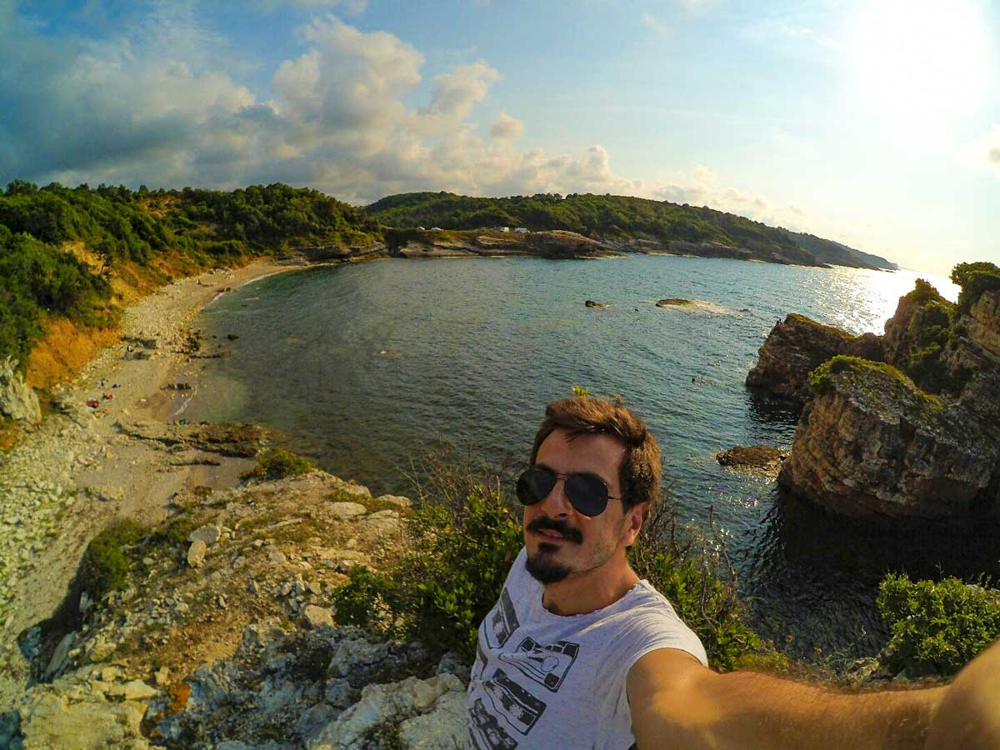
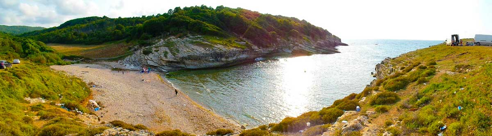
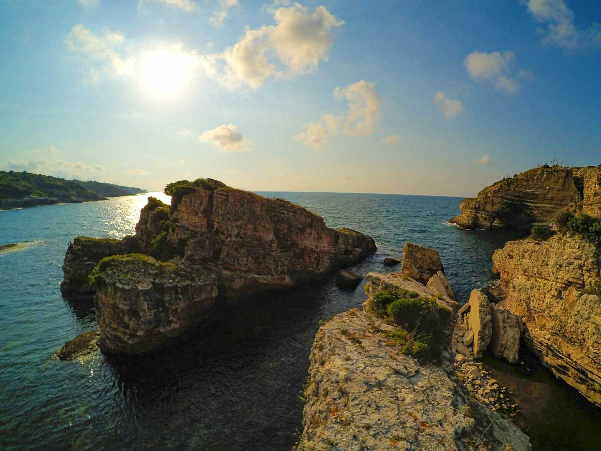
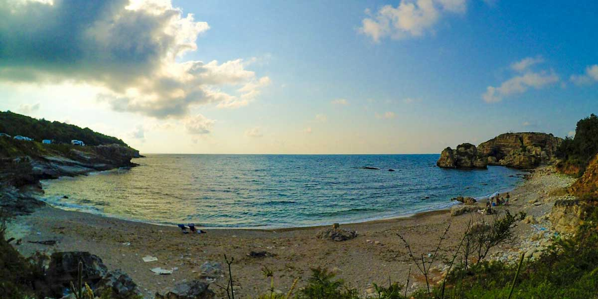

Bu yıl(Temmuz 2016) yeniden bir pazar günü Sardala koyuna gittik. Dolayısıyla bilgileri ve fotoğrafları güncelledim. Koy oldukça güzel ancak her geçen gün biraz daha kirlendiğini fark ettim. Kendi kirlenmemiş tabi  ki sağ olsun insanoğlu o işi güzel yapıyor. Çöpünü yere atmak nedir ya? Atınca kurtulmuş mu oluyorsun anlamıyorum. Bu güzel yerlerin bakirliğini koruması için lütfen çöplerimize sahip olalım. Dönüşte her köyde çöp kutusu var. Götürelim atalım. Yani adam olalım ki bu yerler güzel kalsın. Sardala koyunda sahilde domestos görünce insan biraz kızabiliyor. Bu güzel yerde domestosla ne yapmışlar anlamak mümkün değil. Kendime mantıklı bir açıklama bulamadım. Temiz bırakırsanız temiz bulursunuz.

### Sardala koyu nerede ve nasıl gidilir?

Ağva’ya ulaştıktan sonra Kerpe istikametine doğru giderken önce Bucaklı köyünden ardından Kadıköy ve Pınarlı köyünü geçeceksiniz. Pınarlı köyünü geçtikten 4 km sonra(burası toprak yol)  yol sola orman içerisine girecek. Biraz daha bozuk olan bu yoldan aşağıya doğru devam edince yaklaşık 1 km sonra Sardala koyuna ulaşacaksınız. Sardala koyuna vardığınızda arabanızı bırakabileceğiniz uygun yerler var.

### Sardala koyu hakkında bilinenler

Bir forum sitesindeki kullanıcı tarafından bu isim verilmiştir. Bizce de güzel bir isim ve kullanılmasında bir sakınca yok. Çok bakir bir yer olan bu koyda denize girebilirsiniz. Kayalıklardan suya atlayabilirsiniz. Sahil kumsaldan oluşuyor, denize ilk girdiğiniz yer ise taşlık. Su birden derinleşmiyor ve yer yer yosunlu olduğundan dolayı deniz ayakkabısıyla girmeniz sizi daha fazla rahat ettirecektir. Hafta içi veya Cumartesi gitmeniz tavsiye edilir. Lütfen çöplerinizi yanınızda götürün.

<iframe
  class='mappingFrame'
  style={{ border: 0 }}
  src='https://www.google.com/maps/embed?pb=!1m24!1m12!1m3!1d42388.56091156929!2d29.87394825236767!3d41.12595041367712!2m3!1f0!2f0!3f0!3m2!1i1024!2i768!4f13.1!4m9!3e0!4m3!3m2!1d41.1192233!2d29.8485186!4m3!3m2!1d41.1376148!2d29.960226!5e1!3m2!1str!2str!4v1469218197820'
  width='300'
  height='150'
></iframe>

 

### Sardala koyu kamp alanı bilgileri

<iframe
  frameBorder='0'
  scrolling='no'
  src='https://tr.wikiloc.com/wikiloc/spatialArtifacts.do?event=view&id=14083003&measures=on&title=on&near=off&images=on&maptype=H'
  width='100%'
  height='600'
  style={{ borderRadius: '10px 10px' }}
></iframe>

##### Olanlar;

- Kamp için ideal bir yer yok. Ancak sahile varınca sol tarafta geniş düzlük bir alan göreceksiniz. Burada çadır kurabilirsiniz.
- Bakir bir yer
- Pazar günleri kalabalık olabilir. Cumartesi veya hafta içi gelmeniz daha keyifli kılacaktır.
- Kayalıklar ve manzara fazlasıyla güzel.

##### Olmayanlar;

- Temiz Su
- Bakkal/Market
- Restoran
- Kafeterya
- Pansiyon
- WC

Not: Bu bilgiler Temmuz 2016 yılına aittir.

