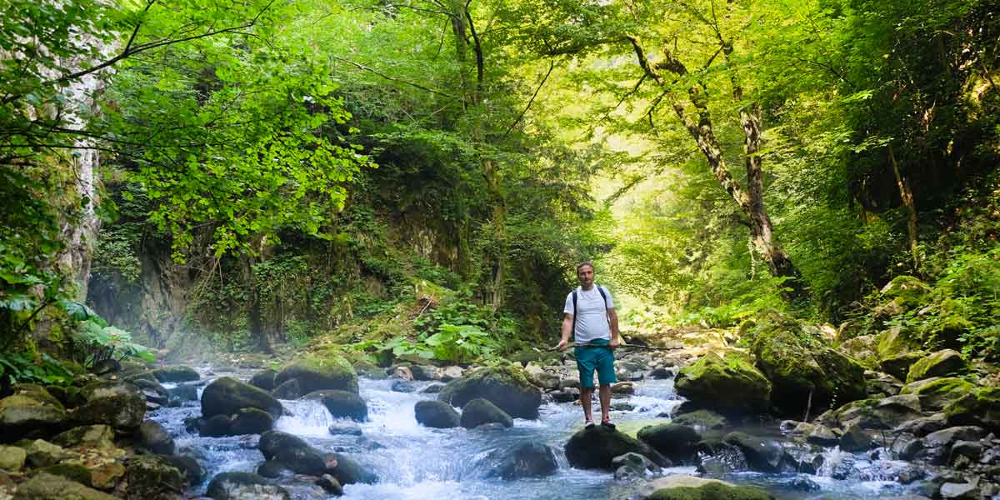
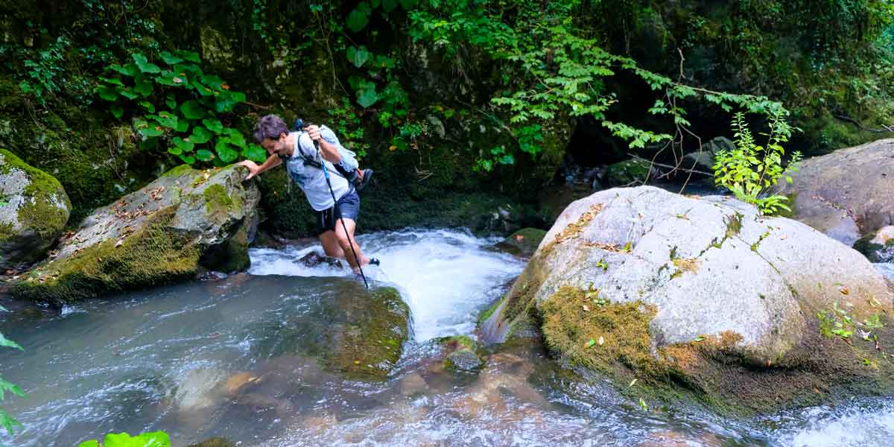
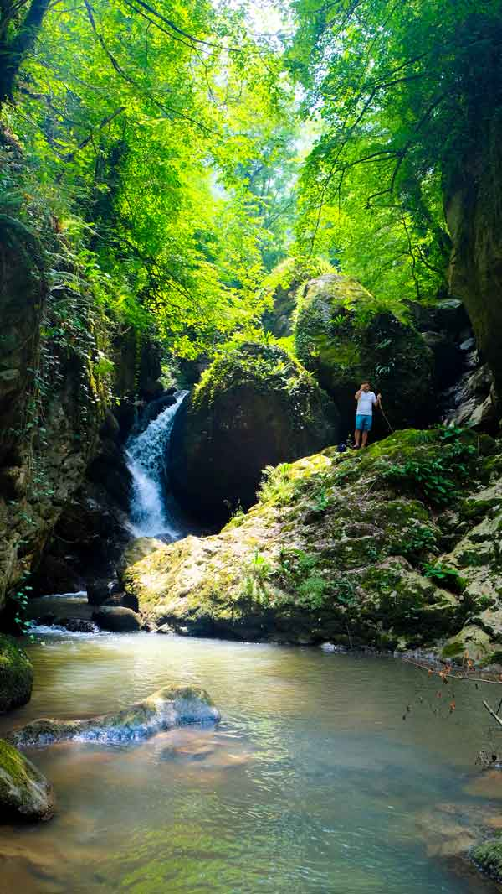

### Sıcakdere Kanyonu nerede ve nasıl gidilir?

Kocaeli’ne geldikten sonra Yuvacık yol ayrımından Yuvacık barajına doğru devam edilir. Barajın en üstünde bulunan Karaaslan kamping’in olduğu yerden veya biraz daha ilerisindeki alabalık tesisinin oradan yürüyüşe başlayabilirsiniz.

<iframe src="https://www.google.com/maps/embed?pb=!1m28!1m12!1m3!1d128040.41649338766!2d29.906677006822584!3d40.7053159831374!2m3!1f0!2f0!3f0!3m2!1i1024!2i768!4f13.1!4m13!3e0!4m5!1s0x14cb4f66644bfb9d%3A0x82690ee7586b7eb9!2s%C4%B0zmit%2C%20Kocaeli%2C%20Turkey!3m2!1d40.7654408!2d29.9408089!4m5!1s0x14cb4257597a1d15%3A0x4fd1e6ce868f3a9c!2zU2VydmV0aXllIEthcsWfxLEsIEJhxZ9pc2tlbGUvS29jYWVsaSwgVMO8cmtpeWU!3m2!1d40.642702899999996!2d29.9220112!5e1!3m2!1str!2suk!4v1618304925819!5m2!1str!2suk" width="300" height="150" style="border:0;" allowfullscreen="" loading="lazy"></iframe>

  

### Sıcakdere Kanyonu kamp alanı bilgileri

##### Olanlar;

* Kamp Yeri olarak Karaaslan Kamping’de ücretsiz çadırınızı kurup konaklayabilirsiniz.
* Temiz Su (Karaaslan Kamping)
* Bakkal(Karaaslan Kamping)
* Restoran(Karaaslan Kamping)
* WC(Karaaslan Kamping)
* Mescit(Karaaslan Kamping)
* Pansiyon(Karaaslan Kamping)

Not: Bu bilgiler 2014 yılına aittir.

### Sıcakdere Kanyonu Yürüyüş Rotaları

#### Sıcakdere kanyon yürüyüşü (8.5 km)

<iframe frameBorder="0" scrolling="no" src="https://tr.wikiloc.com/wikiloc/spatialArtifacts.do?event=view&id=1904554&measures=on&title=on&near=off&images=on&maptype=H" width="100%" height="600" style="border-radius: 10px 10px;"></iframe>

* Karaaslan Kamping’de suyunuzu alıp yola çıkmalısınız. Kanyon içerisinde su noktası yok.
* Dere içi ilerleyen bu parkurda yedek ayakkabı getirmeniz faydanıza olacaktır.
* Kask ve baton kullanmanız faydanıza olacaktır.
* Kanyondaki yosundan dolayı kaygan kaya ve taşlara dikkat ediniz.
* Kocaeli’nin en zor parkurudur.
* Şelaleleri geçiş için ip kullanmak gerekir. Bunun için tırmanış deneyiminizin olması gerekir.
* Keyifli, yorucu ama güzel bir parkur.

