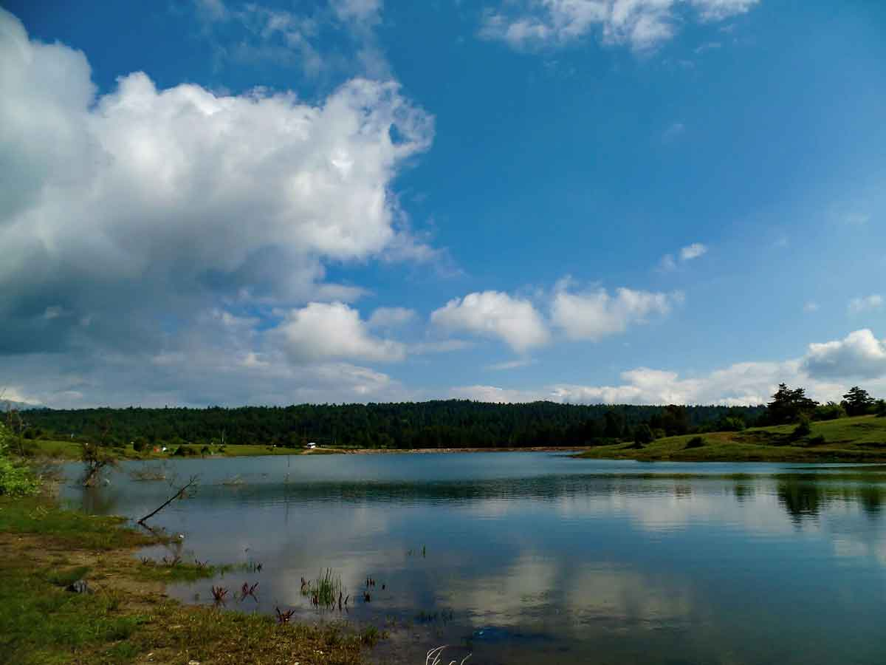
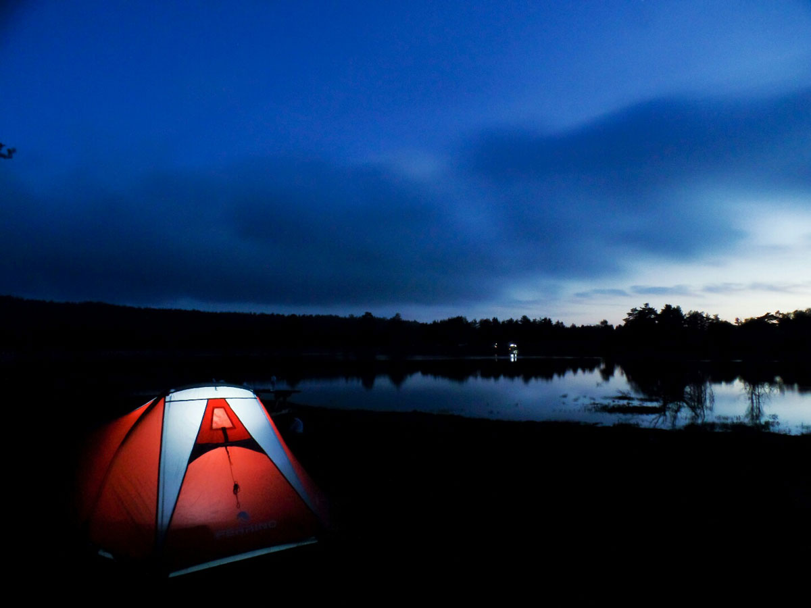

Sakarya’nın Taraklı bölgesinde yeralan Karagöl yaylası ve göleti görülmeye değer ve çok güzel bir doğası olan bir yer. Etrafında bir çok yayla olması da trekking parkurları oluşmasına neden olmuş.

### Taraklı Karagöl Yaylası nerede ve nasıl gidilir?

Tem otoyolu üzerinde gelirken Adapazarı çıkışından çıkıp Eskişehir yönüne doğru devam etmelisiniz. Önce Gevye’ye geleceksiniz ardından Taraklı istikametine devam edeceksiniz. Taraklıyı geçtikten 2-3km sonra sola doğru devam edeceksiniz. Buradaki yol ayrımında Mahdumlar ve Karagöl Yaylası tabelalerını takip edebilirsiniz. Asfalt yoldan çıkmayıp yukarı doğru devam ettiğiniz taktirde göle ulaşacaksınız. Gölün kenarına kadar asfalt yol geliyor. Ulaşımı oldukça rahat ve güzel bir manzarası var.

<iframe class="mappingFrame" src="https://www.google.com/maps/embed?pb=!1m24!1m12!1m3!1d243784.75428969305!2d30.44312133948704!3d40.55218692428643!2m3!1f0!2f0!3f0!3m2!1i1024!2i768!4f13.1!4m9!3e0!4m3!3m2!1d40.7164704!2d30.3966553!4m3!3m2!1d40.499716!2d30.583108499999998!5e1!3m2!1str!2str!4v1465189619392" width="300" height="150" allowfullscreen="allowfullscreen"></iframe>

  

### Taraklı Karagöl Yaylası kamp alanı bilgileri

##### Olanlar;

* Gölün etrafı tel örgüyle çevrilmiş ve koruma altına alınmış. Görevlinin göstereceği yerlere, düzlük alanlara veya çok kalabalıksa yaylanın olduğu taraflarda çadırınızı kurabilirsiniz.
* Giriş ücreti 10 tl olarak alınmaya başlanmış. Akşam traktörle dolaşılıp çöpler toplanıyor.
* Aracınızı göl kenarındaki geniş alanlara veya yol kenarına bırakabilirsiniz.
* Kamp yeri için özel bir tesis yok.
* Çeşme ve tuvalet var. Özel bir işletme olmadığından tuvaletin çok temiz olmasını beklemeyin.
* Yolun asfalt oluşundan dolayı ulaşımı kolay bir yer bu yüzden pazar günleri ziyaretçi sayısı artabiliyor.
* Kamp eksiklerinizi Taraklı’da bulunan market ve diğer iş yerlerinden karşılayabilirsiniz.
* Birkaç noktada piknik masası bulunmakta.

##### Olmayanlar;

* Market
* Restoran
* Otel, Pansiyon

Not: Bu bilgiler Haziran 2016 yılına aittir.

### Taraklı Karagöl Yaylası yürüyüş rotaları

#### 7 yayla 5 gölet turu (28 km)

<iframe frameBorder="0" scrolling="no" src="https://tr.wikiloc.com/wikiloc/spatialArtifacts.do?event=view&id=7242837&measures=on&title=on&near=off&images=on&maptype=H" width="100%" height="600" style="border-radius: 10px 10px;"></iframe>

* Zor olmayan ve güzel manzaralarla dolu bir parkur.
* Parkur yaylalardan geçtiğinden dolayı su sıkıntısı yok.
* 1 günde 28km yürümek yorucu olabilir. Kamp atarak yürüyebilirsiniz.
* Parkurun bir bölümü yollardan bir bölümü ise orman içinden devam etmektedir.

#### Karagöl yaylasından Acelle yaylasına sonra geri dönüş (24 km)

<iframe frameBorder="0" scrolling="no" src="https://tr.wikiloc.com/wikiloc/spatialArtifacts.do?event=view&id=695734&measures=on&title=on&near=off&images=on&maptype=H" width="100%" height="600" style="border-radius: 10px 10px;"></iframe>

* Zor olmayan ve güzel manzaralarla dolu bir parkur.
* Parkur yaylalardan geçtiğinden dolayı su sıkıntısı yok.
* Kamp atarak yürüyebilirsiniz.
* Kışın yürünebilecek bir parkur.
* Parkurun bir bölümü yollardan bir bölümü ise orman içinden devam etmektedir.

#### Karagöl yaylasından Çardacık yaylasına sonrasında Acelle yaylasına (13 km)

<iframe frameBorder="0" scrolling="no" src="https://tr.wikiloc.com/wikiloc/spatialArtifacts.do?event=view&id=12569075&measures=on&title=on&near=off&images=on&maptype=H" width="100%" height="600" style="border-radius: 10px 10px;"></iframe>

* Zor olmayan ve güzel manzaralarla dolu bir parkur.
* Parkur yaylalardan geçtiğinden dolayı su sıkıntısı yok.
* Kış veya yağmur sonrası Karagöl yaylasında oluşan su çukurları görülmeye değer.
* Parkurun bir bölümü yollardan bir bölümü ise orman içinden devam etmektedir.