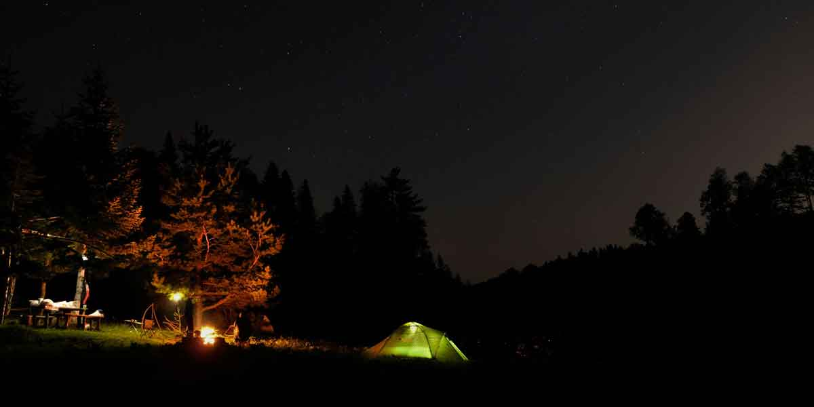
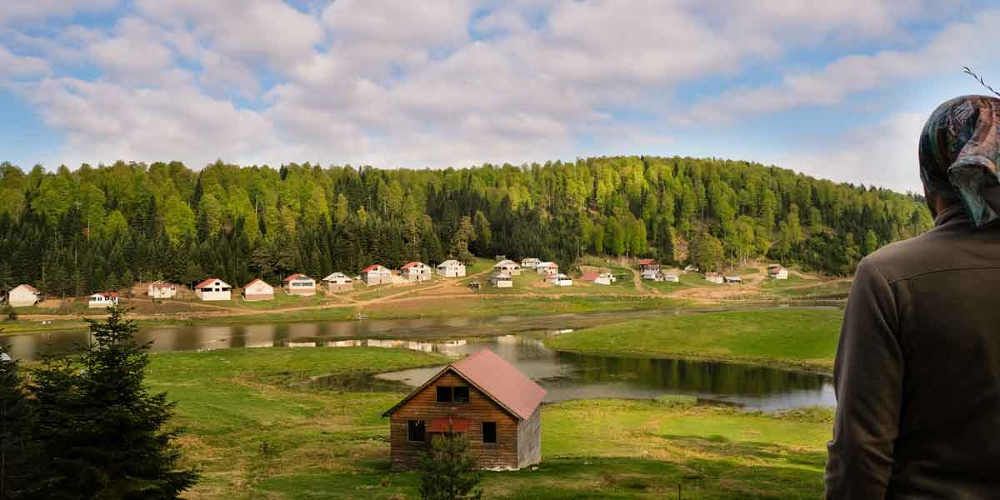

Sakarya’nın Akyazı taraflarında kalan hatta Düzce, Bolu, Sakarya sınır kesişiminde bulunan Turnalık yaylasına Hendek üzerinden Çiğdem yaylasına gelen yolu takip ederek ulaşabilirsiniz. Aynı zamanda Sakarya’dan Mengen tarafına ayrılan yolu takip ederek de gelebilirsiniz. Mengen tarafından gelmek için Sülüklü göl yol ayrımının olduğu Dokurcun ilçesinden toprak yoldan gelmeniz gerekmekte. Çiğdem yaylası ve Turnalık yaylası arasındaki yol biraz bozuk. Binek araçlarınızla da gelebilirsiniz ancak arabanın altını vurmamanız için dikkatli kullanmalısınız. Motor ve 4*4 için ise sıkıntı yok.

### Turnalık Yaylası nerede ve nasıl gidilir?

İstanbul’dan Tem otoyolu üzerinden gelirken Adapazarı’nı geçtikten sonra Akyazı yönüne doğru devam edeceksiniz. Mengen istikametine devam ederken Dokurcun ilçesinden toprak yola bağlanıp sola yukarı doğru tırmanacaksınız. Harita detayları alttaki gibi.

<iframe frameBorder="0" scrolling="no" src="https://tr.wikiloc.com/wikiloc/spatialArtifacts.do?event=view&id=17832443&measures=on&title=on&near=off&images=on&maptype=H" width="100%" height="600" style="border-radius: 10px 10px;"></iframe>

Bir diğer alternatif ise Hendek üzerinden Çiğdem Yaylasına ulaşmak ve bağlantı yoluyla buraya gelmek. Çiğdem yaylasına kadar olan yol çok güzel. Sadece aradaki bağlantı yolu biraz bozuk. Dikkatli gidildiği taktirde gidilir.

<iframe class="mappingFrame" src="https://www.google.com/maps/embed?pb=!1m26!1m12!1m3!1d134609.45134831854!2d30.759703623632618!3d40.69942364192254!2m3!1f0!2f0!3f0!3m2!1i1024!2i768!4f13.1!4m11!3e0!4m5!1s0x409d8e1302209831%3A0xa364e1f493354341!2sHendek%2C+Sakarya!3m2!1d40.795052999999996!2d30.744705999999997!4m3!3m2!1d40.634106599999996!2d30.8327247!5e1!3m2!1str!2str!4v1495292972539" width="300" height="150" allowfullscreen="allowfullscreen"></iframe>

  

### Turnalık Yaylası kamp alanı bilgileri

##### Olanlar;

* Gölün etrafındaki düzlük alanlara veya yaylanın arka tarafındaki geniş alana çadırınızı kurabilirsiniz.
* Göl etrafı açık alan olduğundan dolayı rüzgara ve kurbağa sesine maruz kalabilirsiniz.
* Kamp yeri için özel bir tesis yok. Ağaçların olduğu yerler genellikle yamaç olduğundan çadır kurulamıyor. Sadece yaylanın arka tarafında kalan genişlik alanda düzlükler bulabilirsiniz.
* Yaylada bolca çeşme var. Tuvalet yakında yok. Caminin tuvaleti olabilir. Çok sıkışırsanız oraya bakabilirsiniz.
* Kamp eksiklerinizi Akyazı’da veya Hendek’de bulunan market ve diğer iş yerlerinden karşılamalısınız.
* Burası da Çiğdem yaylası gibi garip bir şekilde çok fazla kara sinek barındırıyor. Ateş yakınca bu dertten kurtarabiliyorsunuz.

##### Olmayanlar;

* Restoran, Otel, Pansiyon gibi şeyler yok tabi.
* Market vs. de göremedik.

Not: Bu bilgiler Mayıs 2017 yılına aittir.

### Turnalık Yaylası yürüyüş rotaları

#### Turnalık yaylası gölet yürüyüşü (2.8 km)

<iframe frameBorder="0" scrolling="no" src="https://tr.wikiloc.com/wikiloc/spatialArtifacts.do?event=view&id=17726553&measures=on&title=on&near=off&images=on&maptype=H" width="100%" height="600" style="border-radius: 10px 10px;"></iframe>

* Turnalık yaylasında gölet etrafında gezindiğimiz kolay bir parkur.
* Göletin ve manzaranın tadını çıkarabilirsiniz. Güzel fotoğraflar çekebilirsiniz.

#### Kurtuluş mahallesinden Çiğdem yaylasına ve son durak Turnalık yaylası (11.8 km)

<iframe frameBorder="0" scrolling="no" src="https://tr.wikiloc.com/wikiloc/spatialArtifacts.do?event=view&id=2866888&measures=on&title=on&near=off&images=on&maptype=H" width="100%" height="600" style="border-radius: 10px 10px;"></iframe>

* Kurtuluş mahallesinden başlayan rota yükselerek Çiğdem yaylasına varıyor. Sonrasında Turnalık yaylasına ulaşan rota ardından tekrar Kurtuluş’a geri dönüyor.
* Zor olmayan ve orman içi toprak yollardan giden bir parkur.
* Parkur yaylalardan geçtiğinden dolayı su sıkıntısı yok.