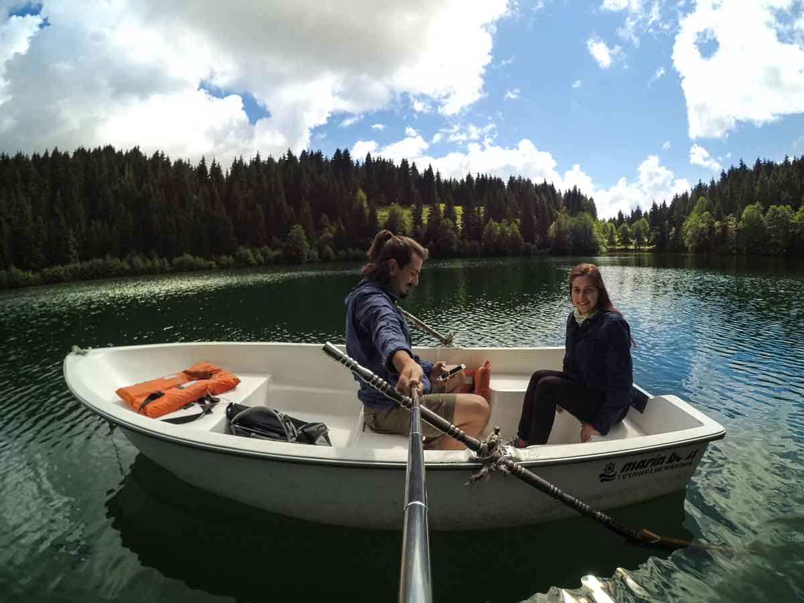
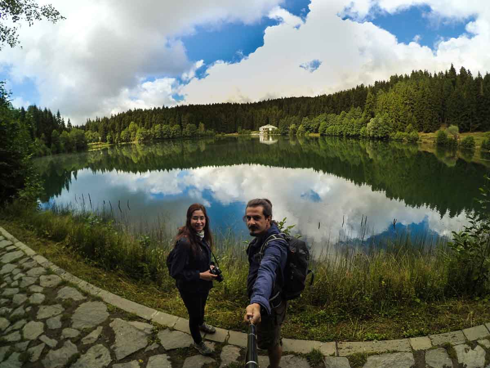

Şavşat Karagöl, Artvin’in Şavşat ilçesine yaklaşık 22 km uzaklıktadır. Şavşat’tan Ciritdüzü ve Veliköy yönünü takip eden asfalt yol göle ulaşır; güzergâhta yönlendirme tabelaları bulunur. Karagöl, tekrar gitmek istediğim, ormanla çevrili en etkileyici göllerden biri.

> **Bilgi tarihi:** Yol, kamp, ücret ve tesis bilgileri Ağustos 2015 deneyimime dayanıyor. Milli park kuralları ve ücretleri değişebileceği için gitmeden önce güncel bilgileri doğrulayın.

## Şavşat Karagöl nerede ve nasıl gidilir?

Şavşat’a yaklaşık olarak 22km mesafede bulunan bu güzel göl ulaşılması zor bir yerde ve koruma altında olduğundan dolayı güzelliğini korumaktadır. Artvin’de veya o bölgede yaşayan biri için ulaşımı kolay olsa da ta İstanbul’da yaşayan bir adamın önce Artvin’e sonra Şavşat’a sonra Ciritdüzü üzerindne Veliköy yolunu takip ederek Karagöl’e ulaşması zor bir mevzu. Oraya kadar gittiyseniz eğer kesinlikle gidin görün. Yolu asfalt ve yönlendirici tabelalar var. Sadece bulunduğu lokasyon olarak ters bir yerde.

<iframe
  frameBorder='0'
  scrolling='no'
  src='https://tr.wikiloc.com/wikiloc/spatialArtifacts.do?event=view&id=17997193&measures=on&title=on&near=off&images=on&maptype=H'
  width='100%'
  height='600'
  style={{ borderRadius: '10px 10px' }}
></iframe>

Şavşat üzerinden birden fazla yol tarifi gözükse de Veliköy yolunucu takip ederek önce Ciritdüzüne sonra Veliköy’ün içine girmeden asfalt yoldan yaklaşık 22km sonra Karagöl’e ulaşabilirsiniz. Yukarıda wikiloc üzerinden altta ise google maps üzerinden yol tarifini bulabilirsiniz. Farklı bir yol denediyseniz veya denerseniz haber edin yazalım.

<iframe
  class='mappingFrame'
  src='https://www.google.com/maps/embed?pb=!1m24!1m12!1m3!1d48210.91497945503!2d42.373408848693764!3d41.279172677693445!2m3!1f0!2f0!3f0!3m2!1i1024!2i768!4f13.1!4m9!3e0!4m3!3m2!1d41.253766299999995!2d42.353563099999995!4m3!3m2!1d41.304381899999996!2d42.479111599999996!5e1!3m2!1str!2str!4v1496121811555'
  width='300'
  height='150'
  allowfullscreen='allowfullscreen'
></iframe>

 

## Şavşat Karagöl kamp alanı bilgileri

### Olanlar

- Şavşat Karagöl milli park korumasında olduğundan dolayı alana giriş ve kamp için ücret ödemeniz gerekiyor.

  - 2015 verilerine göre Kişi 2.5, Motosiklet 5, Araba 8, Küçük Minibüs 25, Büyük Minibüs 40, Otobüs 70 tl ücret alınıyordu.

- Gölün yanıbaşında bulunan tesiste de konaklayabilirsiniz. Bir pansiyon bulunmakta. Sadece gece uyumalık bir yer olarak düşünün. Çok bir beklentiniz olmasın.
- Doğanın tadını çıkaracağınız huzur dolu bir yer de çadır kurabileceğiniz güzel düzlüklerin yanı sıra tuvalet ve temiz su da bulunuyor.
- Göl yaklaşık olarak 1600 metre yükseklikte olduğundan dolayı gittiğiniz döneme göre tahminlerinizin altında bir sıcaklıkla karşılaşabilirsiniz. Yani biraz soğuk olabilir.
- Bu bölgede yabani hayvan olarak ayı olduğunu unutmayın. Hep aklınızda olsun.

### Olmayanlar

- Market vs. gibi bir işletme de yok.
- Pansiyonda yeme yeme şansınız olabilir. Gelişmiş güzel bir tesis değil. Bu yüzden tüm ihtiyaçlarınızı Şavşat’tayken tamamlayın.

## Şavşat Karagöl yürüyüş rotaları

### Şavşat Karagöl turu (1,1 km)

<iframe
  frameBorder='0'
  scrolling='no'
  src='https://tr.wikiloc.com/wikiloc/spatialArtifacts.do?event=view&id=17981509&measures=on&title=on&near=off&images=on&maptype=H'
  width='100%'
  height='600'
  style={{ borderRadius: '10px 10px' }}
></iframe>

- Göl kenarında yürüyeceğiniz kolay bir parkur. Zaten 1 km. Ne kadar zor olabilir ki?
- Bu rotayı yürüyemeyen buraya gitmesin :)
